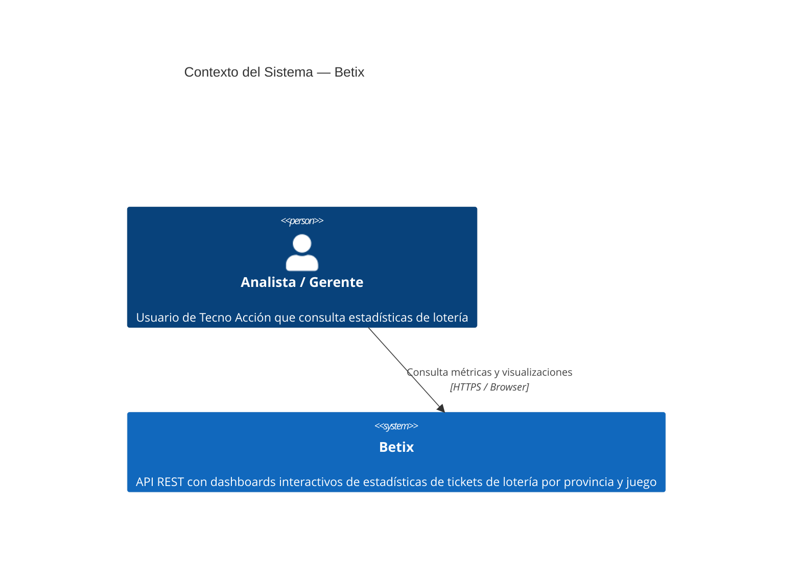
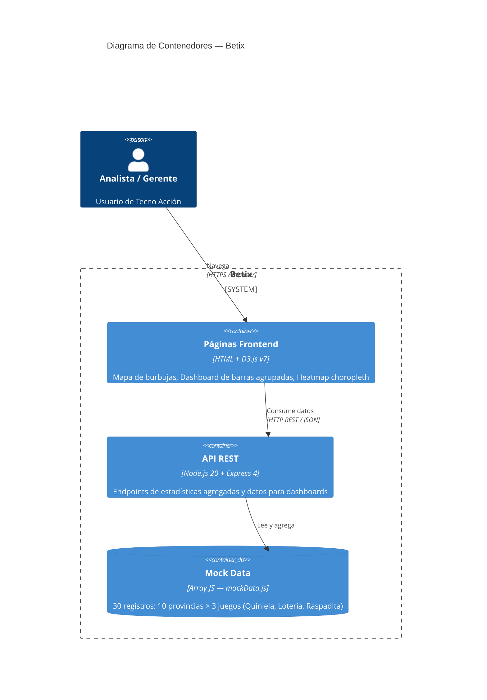

# Betix API

[](https://github.com/Neurus1970/betix/actions/workflows/ci.yml)
[](https://github.com/Neurus1970/betix/actions/workflows/ci.yml)
[](https://sonarcloud.io/dashboard?id=Neurus1970_betix)

API de estadísticas de tickets de lotería por provincia y juego, con dashboards interactivos D3.js.

## Endpoints API

| Método | Ruta | Descripción |
|--------|------|-------------|
| GET | `/health` | Estado del servicio |
| GET | `/api/estadisticas/provincia` | Tickets, ingresos y rentabilidad agrupados por provincia |
| GET | `/api/estadisticas/juego` | Tickets, ingresos y rentabilidad agrupados por juego |
| GET | `/api/estadisticas/resumen` | Resumen general consolidado |
| GET | ~~`/api/mapa-estadisticas/datos`~~ | ⚠️ **DEPRECADO** — retorna `410 Gone`. Migrar a `/api/datos/geodata` (campo `data.geo`) |
| GET | ~~`/api/dashboard/datos`~~ | ⚠️ **DEPRECADO** — retorna `410 Gone`. Migrar a `/api/datos/geodata` (campo `data.detail`) |
| GET | `/api/datos/geodata` | Datos combinados: `data.geo` (lat/lng por provincia) + `data.detail` (provincia × juego) |

## Páginas Frontend

| Ruta | Descripción |
|------|-------------|
| `/mapa-estadisticas` | Mapa de burbujas interactivo por provincia (D3.js) |
| `/dashboard-rendimiento` | Gráfico de barras agrupadas por juego y provincia (D3.js) |
| `/heatmap-apuestas` | Heatmap choropleth de Argentina por métrica (D3.js) |

## Ejemplo de respuesta `/api/estadisticas/provincia`

```json
{
  "status": "ok",
  "data": [
    {
      "provincia": "Salta",
      "totalTickets": 12600,
      "totalIngresos": 411000,
      "totalCosto": 237000,
      "rentabilidad": 42.34
    }
  ]
}
```

## Ejemplo de respuesta `/api/dashboard/datos`

```json
{
  "status": "ok",
  "data": [
    { "provincia": "Salta", "juego": "Quiniela", "cantidad": 4800, "importe": 144000, "beneficio": 39000 },
    { "provincia": "Salta", "juego": "Lotería",  "cantidad": 2100, "importe": 210000, "beneficio": 126000 }
  ]
}
```

## Ejemplo de respuesta `/api/datos/geodata`

```json
{
  "status": "ok",
  "data": {
    "geo": [
      { "provincia": "Salta", "cantidad": 3750, "importe": 432000, "beneficio": 135000, "lat": -24.7859, "lng": -65.4117 }
    ],
    "detail": [
      { "provincia": "Salta", "juego": "Quiniela", "cantidad": 1200, "importe": 144000, "beneficio": 39000 }
    ]
  }
}
```

## Desarrollo local

```bash
npm install
npm run dev       # servidor con nodemon en puerto 3000
```

## Tests

```bash
npm test                # Jest (35 tests) + Cucumber (26 scenarios)
npm run test:functional # Solo Cucumber en modo verbose
npm run test:ci         # Solo Jest con cobertura (para CI)
npm run lint            # ESLint
```

## Pipeline CI/CD

Cada Pull Request hacia `main` ejecuta automáticamente:
1. **Lint** — Verificación de estilo de código (ESLint)
2. **Tests** — Jest con cobertura (~97%) + reporte JUnit
3. **SonarCloud** — Análisis de calidad y security hotspots
4. **AI Review** — Revisión automática y documentación generada por Claude

Al crear un branch con código de ticket (ej. `feature/BETIX-4-...`) el ticket Jira pasa a **In Progress** automáticamente. Al hacer merge de la PR pasa a **Done**.

## Arquitectura

### C4 Level 1 — Contexto del sistema



### C4 Level 2 — Contenedores


