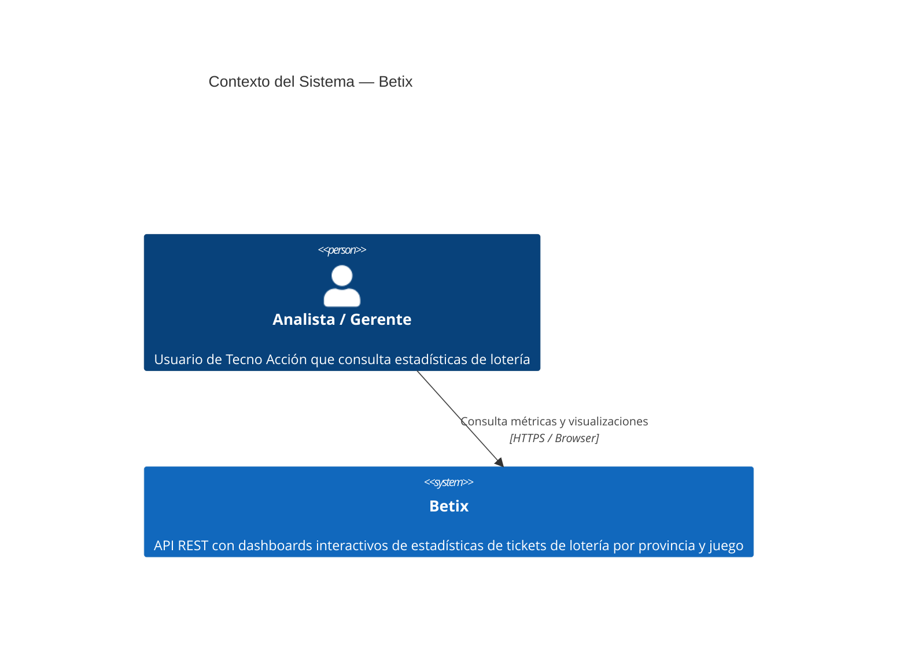
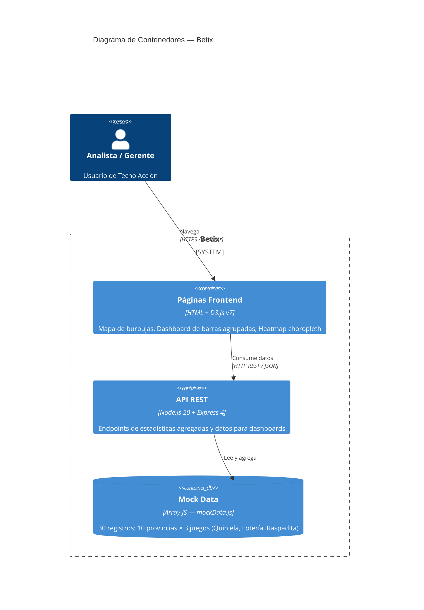

# Betix API

[](https://github.com/Neurus1970/betix/actions/workflows/ci.yml)
[](https://github.com/Neurus1970/betix/actions/workflows/ci.yml)
[](https://sonarcloud.io/dashboard?id=Neurus1970_betix)

API de estadísticas de tickets de lotería por provincia y juego, con dashboards interactivos D3.js.

## Endpoints API

### Estadísticas

| Método | Ruta | Descripción |
|--------|------|-------------|
| GET | `/health` | Verifica que el servicio está activo y responde. |
| GET | `/api/estadisticas/provincia` | Devuelve el total de tickets, ingresos, costos y rentabilidad agrupados por provincia. Útil para comparar el rendimiento entre regiones. |
| GET | `/api/estadisticas/juego` | Devuelve el total de tickets, ingresos, costos y rentabilidad agrupados por tipo de juego (Quiniela, Lotería, Raspadita). Permite comparar qué juego genera más volumen o margen. |
| GET | `/api/estadisticas/resumen` | Devuelve los totales consolidados del negocio: cantidad total de tickets, ingresos, costos y rentabilidad global. Pensado para vistas ejecutivas. |

### Geodata unificada

| Método | Ruta | Descripción |
|--------|------|-------------|
| GET | `/api/datos/geodata` | Endpoint principal que combina en una sola respuesta los totales globales del negocio, los datos georreferenciados por provincia (coordenadas + métricas agregadas) y el detalle de cada juego dentro de cada provincia. Diseñado para alimentar todos los dashboards del frontend. |
| GET | ~~`/api/mapa-estadisticas/datos`~~ | ⚠️ **DEPRECADO** — retorna `410 Gone`. Migrar a `/api/datos/geodata`. |
| GET | ~~`/api/dashboard/datos`~~ | ⚠️ **DEPRECADO** — retorna `410 Gone`. Migrar a `/api/datos/geodata`. |

## Páginas Frontend

| Ruta | Descripción |
|------|-------------|
| `/mapa-estadisticas` | Mapa de burbujas interactivo: muestra el volumen de la métrica seleccionada en cada provincia mediante burbujas proporcionales sobre el mapa de Argentina. |
| `/dashboard-rendimiento` | Gráfico de barras agrupadas: compara las métricas (cantidad, importe o beneficio) entre juegos para cada provincia seleccionada. Permite filtrar por juego y provincias. |
| `/heatmap-apuestas` | Heatmap choropleth: colorea el mapa de Argentina según la intensidad de la métrica elegida, con soporte de zoom/pan, tooltip y leyenda de escala. |
| `/dashboard-interactivo` | Mapa choropleth + gráfico de torta interactivos side-by-side: hover en una provincia muestra su distribución por juego en la torta; click en un segmento resalta la provincia correspondiente en el mapa. Filtrable por juego y métrica. |

## Desarrollo local

```bash
npm install
npm run dev       # servidor con nodemon en puerto 3000
```

## Tests

```bash
npm test                # Jest (35 tests) + Cucumber (26 scenarios)
npm run test:functional # Solo Cucumber en modo verbose
npm run test:ci         # Solo Jest con cobertura (para CI)
npm run lint            # ESLint
```

## Pipeline CI/CD

Cada Pull Request hacia `main` ejecuta automáticamente:
1. **Lint** — Verificación de estilo de código (ESLint)
2. **Tests** — Jest con cobertura (~97%) + reporte JUnit
3. **SonarCloud** — Análisis de calidad y security hotspots
4. **AI Review** — Revisión automática y documentación generada por Claude

Al crear un branch con código de ticket (ej. `feature/BETIX-4-...`) el ticket Jira pasa a **In Progress** automáticamente. Al hacer merge de la PR pasa a **Done**.

## Arquitectura

### C4 Level 1 — Contexto del sistema



### C4 Level 2 — Contenedores


