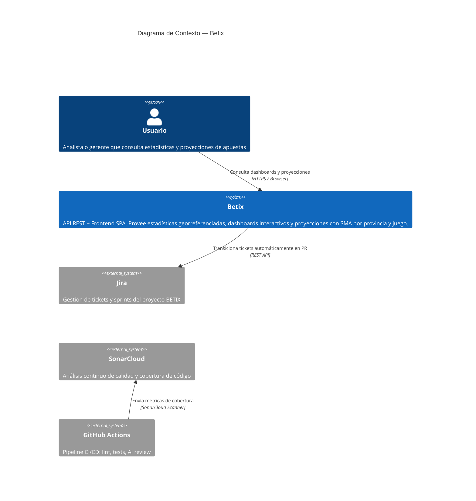
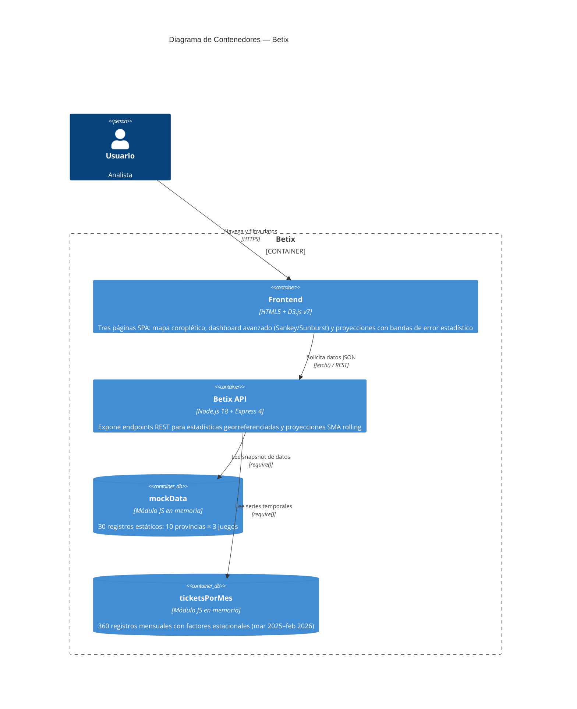
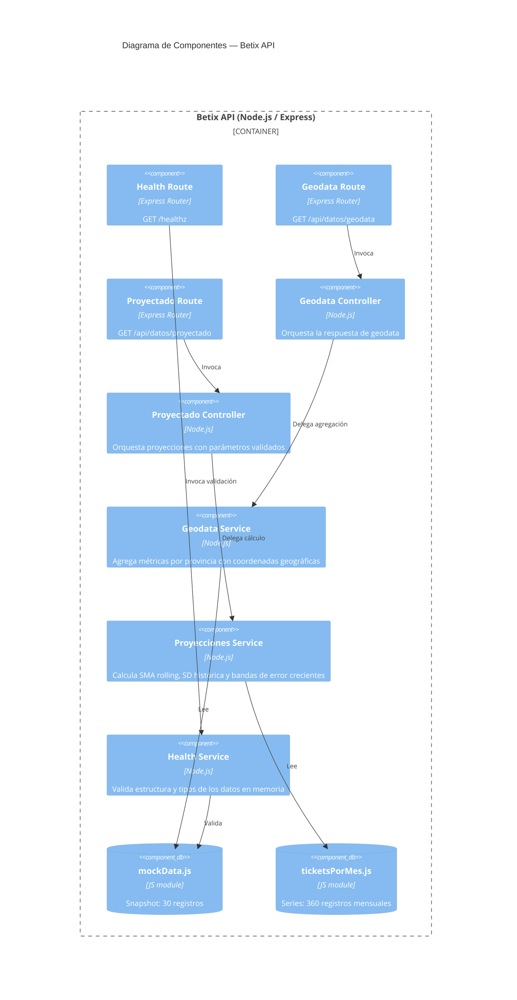

# Betix API

[](https://github.com/Neurus1970/betix/actions/workflows/ci.yml)
[](https://github.com/Neurus1970/betix/actions/workflows/ci.yml)
[](https://sonarcloud.io/dashboard?id=Neurus1970_betix)

API de estadísticas de tickets de lotería por provincia y juego, con dashboard interactivo y proyecciones estadísticas D3.js.

## Endpoints API

| Método | Ruta | Descripción |
|--------|------|-------------|
| GET | `/healthz` | Verifica que el servicio está activo y que los datos estadísticos son accesibles y estructuralmente válidos. Devuelve `{"status":"healthy"}` (200) o `{"error":"..."}` (500). |
| GET | `/api/datos/geodata` | Combina en una sola respuesta los totales globales del negocio, los datos georreferenciados por provincia (coordenadas + métricas agregadas) y el detalle de cada juego dentro de cada provincia. Fuente única de datos para el dashboard. |
| GET | `/api/datos/proyectado` | Devuelve series históricas mensuales (12 meses) y proyecciones futuras calculadas con SMA rolling para una provincia y juego dados. Incluye bandas de error (±SD) que crecen con cada mes proyectado. |

**Parámetros de `/api/datos/proyectado`:**

| Parámetro | Tipo | Default | Descripción |
|-----------|------|---------|-------------|
| `provincia` | string | primera (alfabético) | Nombre de la provincia |
| `juego` | string | primero (alfabético) | `Lotería`, `Quiniela` o `Raspadita` |
| `meses` | number | `1` | Meses a proyectar (1–4) |

## Páginas Frontend

| Ruta | Descripción |
|------|-------------|
| `/dashboard-interactivo` | Mapa coroplético + gráfico de torta side-by-side con D3.js. Hover en provincia filtra la torta; click en segmento resalta la provincia. Filtros por juego y métrica (cantidad, importe, beneficio). |
| `/dashboard` | Dashboard avanzado con pestañas: Mapa, Diagrama Sankey, Sunburst y Tabla de datos. KPIs globales. |
| `/proyectado` | Proyecciones estadísticas por provincia y juego. Gráfico de líneas D3.js con segmento histórico (sólido) y proyectado (punteado), banda de confianza ±SD, tooltip interactivo y tabla de valores numéricos. |

## Arquitectura (C4)

### Nivel 1 — Contexto del sistema


```mermaid
C4Context
    title Diagrama de Contexto — Betix

    Person(usuario, "Usuario", "Analista o gerente que consulta estadísticas y proyecciones de apuestas")

    System(betix, "Betix", "API REST + Frontend SPA. Provee estadísticas georreferenciadas, dashboards interactivos y proyecciones con SMA por provincia y juego.")

    System_Ext(jira, "Jira", "Gestión de tickets y sprints del proyecto BETIX")
    System_Ext(sonar, "SonarCloud", "Análisis continuo de calidad y cobertura de código")
    System_Ext(github, "GitHub Actions", "Pipeline CI/CD: lint, tests, AI review")

    Rel(usuario, betix, "Consulta dashboards y proyecciones", "HTTPS / Browser")
    Rel(betix, jira, "Transiciona tickets automáticamente en PR", "REST API")
    Rel(github, sonar, "Envía métricas de cobertura", "SonarCloud Scanner")
```

### Nivel 2 — Contenedores


```mermaid
C4Container
    title Diagrama de Contenedores — Betix

    Person(usuario, "Usuario", "Analista")

    Container_Boundary(betix, "Betix") {
        Container(frontend, "Frontend", "HTML5 + D3.js v7", "Tres páginas SPA: mapa coroplético, dashboard avanzado (Sankey/Sunburst) y proyecciones con bandas de error estadístico")
        Container(api, "Betix API", "Node.js 18 + Express 4", "Expone endpoints REST para estadísticas georreferenciadas y proyecciones SMA rolling")
        ContainerDb(dataStatic, "mockData", "Módulo JS en memoria", "30 registros estáticos: 10 provincias × 3 juegos")
        ContainerDb(dataMonthly, "ticketsPorMes", "Módulo JS en memoria", "360 registros mensuales con factores estacionales (mar 2025–feb 2026)")
    }

    Rel(usuario, frontend, "Navega y filtra datos", "HTTPS")
    Rel(frontend, api, "Solicita datos JSON", "fetch() / REST")
    Rel(api, dataStatic, "Lee snapshot de datos", "require()")
    Rel(api, dataMonthly, "Lee series temporales", "require()")
```

### Nivel 3 — Componentes de la API


```mermaid
C4Component
    title Diagrama de Componentes — Betix API

    Container_Boundary(api, "Betix API (Node.js / Express)") {
        Component(healthRoute, "Health Route", "Express Router", "GET /healthz")
        Component(geodataRoute, "Geodata Route", "Express Router", "GET /api/datos/geodata")
        Component(proyectadoRoute, "Proyectado Route", "Express Router", "GET /api/datos/proyectado")

        Component(geodataCtrl, "Geodata Controller", "Node.js", "Orquesta la respuesta de geodata")
        Component(proyectadoCtrl, "Proyectado Controller", "Node.js", "Orquesta proyecciones con parámetros validados")

        Component(geodataSvc, "Geodata Service", "Node.js", "Agrega métricas por provincia con coordenadas geográficas")
        Component(proyeccionesSvc, "Proyecciones Service", "Node.js", "Calcula SMA rolling, SD histórica y bandas de error crecientes")
        Component(healthSvc, "Health Service", "Node.js", "Valida estructura y tipos de los datos en memoria")

        ComponentDb(mockData, "mockData.js", "JS module", "Snapshot: 30 registros")
        ComponentDb(ticketsPorMes, "ticketsPorMes.js", "JS module", "Series: 360 registros mensuales")
    }

    Rel(healthRoute, healthSvc, "Invoca validación")
    Rel(geodataRoute, geodataCtrl, "Invoca")
    Rel(proyectadoRoute, proyectadoCtrl, "Invoca")
    Rel(geodataCtrl, geodataSvc, "Delega agregación")
    Rel(proyectadoCtrl, proyeccionesSvc, "Delega cálculo")
    Rel(geodataSvc, mockData, "Lee")
    Rel(proyeccionesSvc, ticketsPorMes, "Lee")
    Rel(healthSvc, mockData, "Valida")
```

## Desarrollo local

```bash
npm install
npm run dev       # servidor con nodemon en puerto 3000
```

El perfil activo se controla con `NODE_ENV`. Hay un archivo por entorno incluido en el repo:

| `NODE_ENV` | Archivo | Log level | Salida |
|------------|---------|-----------|--------|
| `dev` (default) | `.env.dev` | `debug` | consola |
| `uat` | `.env.uat` | `info` | consola + archivo |
| `pro` | `.env.pro` | `warn` | archivo |

```bash
# Desarrollo local (default)
npm run dev

# UAT
NODE_ENV=uat npm run dev

# Producción
NODE_ENV=pro npm start
```

Todas las variables usan el prefijo `BETIX_`. Ver `.env.example` para la referencia completa.

## Tests

```bash

npm test                # Jest + Cucumber
npm run test:functional # Solo Cucumber en modo verbose
npm run test:ci         # Solo Jest con cobertura (para CI)
npm run lint            # ESLint
```

## Pipeline CI/CD

Cada Pull Request hacia `main` ejecuta automáticamente:
1. **Lint** — Verificación de estilo de código (ESLint)
2. **Tests** — Jest con cobertura + reporte JUnit
3. **SonarCloud** — Análisis de calidad y security hotspots
4. **AI Review** — Revisión automática y documentación generada por Claude

Al crear un branch con código de ticket (ej. `feature/BETIX-7-...`) el ticket Jira pasa a **In Progress** automáticamente. Al hacer merge de la PR pasa a **Done**.
