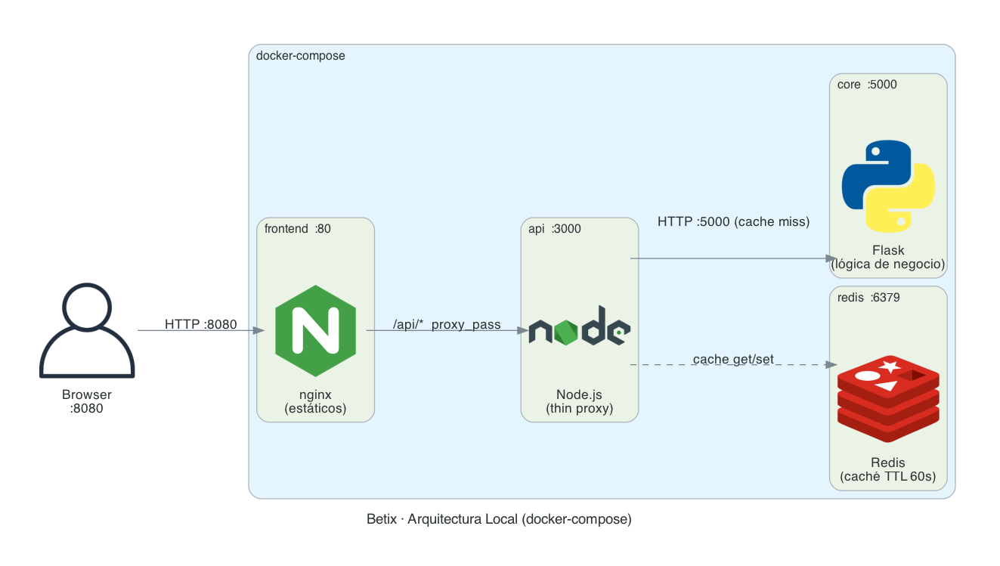
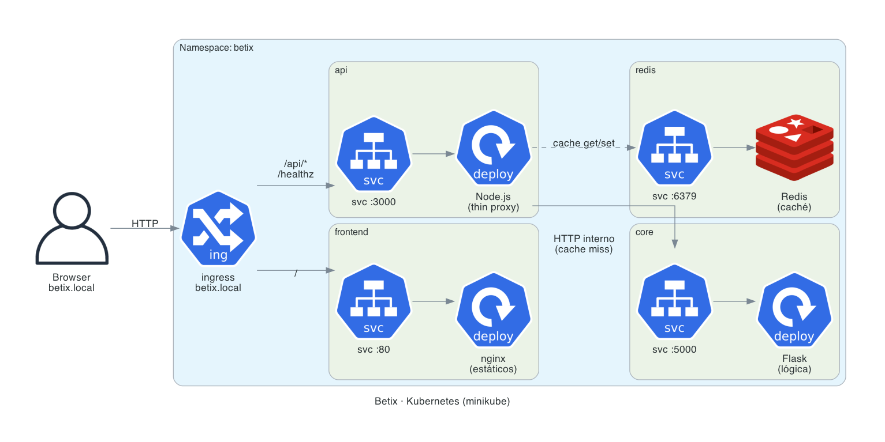
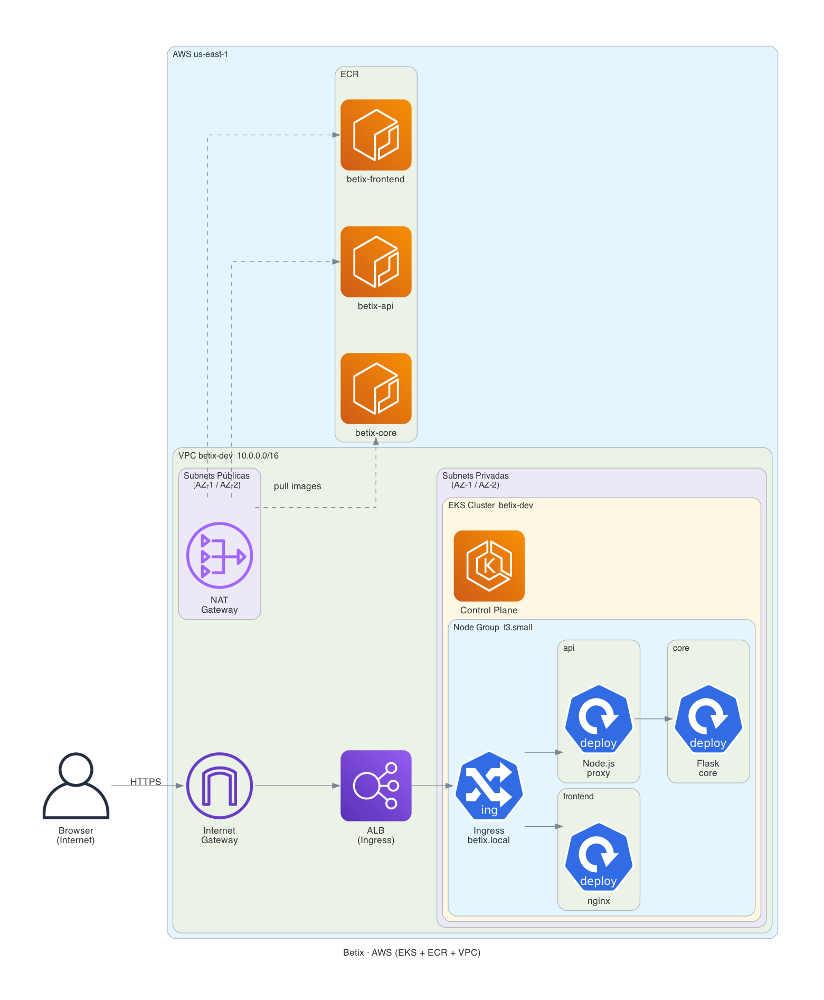

# Betix API

[](https://github.com/Neurus1970/betix/actions/workflows/ci-api.yml)
[](https://github.com/Neurus1970/betix/actions/workflows/ci-api.yml)
[](https://github.com/Neurus1970/betix/actions/workflows/ci-core.yml)
[](https://sonarcloud.io/dashboard?id=Neurus1970_betix)

Plataforma de estadísticas de tickets de lotería por provincia y juego, con dashboards interactivos D3.js y proyecciones estadísticas con SMA rolling. Arquitectura de microservicios: Python Flask core, Node.js thin proxy y nginx frontend, desplegable con docker-compose o Kubernetes.

---

## Inicio rápido

Guía para tener el proyecto corriendo en local y empezar a colaborar.

### Requisitos previos

| Herramienta | Versión mínima | Verificar |
|---|---|---|
| [Docker Desktop](https://www.docker.com/products/docker-desktop/) | 24+ | `docker --version` |
| [Node.js](https://nodejs.org/) | 18+ | `node --version` |
| [Python](https://www.python.org/) | 3.12+ | `python3 --version` |
| [Make](https://www.gnu.org/software/make/) | cualquiera | `make --version` |

> En macOS: `brew install node python make`. Docker Desktop se instala desde su sitio oficial.

### 1. Clonar el repositorio

```bash
git clone https://github.com/Neurus1970/betix.git
cd betix
git checkout develop   # rama de integración activa
```

### 2. Levantar el entorno (camino más corto)

```bash
make up
```

Esto ejecuta `docker-compose up --build` y levanta los tres servicios. La primera vez tarda unos minutos en descargar imágenes base.

| Servicio | URL |
|---|---|
| Frontend (nginx) | http://localhost:8080 |
| API (Node.js proxy) | http://localhost:3000 |
| Core (Flask) | http://localhost:5001 |

Abrí http://localhost:8080/dashboard para verificar que todo funciona.

### 3. Correr los tests

```bash
make test          # todos los tests: pytest + Jest + Cucumber
make test-core     # solo tests Python (pytest)
make test-api      # solo tests Node.js (Jest + Cucumber)
make lint          # ESLint
```

Los tests de Node.js **no requieren que el servidor esté corriendo** — usan `nock` para interceptar las llamadas HTTP al core.

### 4. Próximos pasos

- Flujo de ramas, convenciones y comandos del `Makefile` → [docs/monorepo-guide.md](docs/monorepo-guide.md)
- Arquitectura del sistema (modelo C4) → [docs/ArquitecturaC4.md](docs/ArquitecturaC4.md)
- Bajar el entorno: `make down`

---

## Componentes

| Componente | Tecnología | Puerto | Responsabilidad |
|---|---|---|---|
| `core/` | Python 3.12 + Flask | 5000 | Toda la lógica de negocio (geodata, proyecciones SMA, health) |
| `src/` (api) | Node.js 18 + Express | 3000 | Thin HTTP proxy hacia core |
| `frontend/` | nginx | 80 | Sirve archivos estáticos (HTML + D3.js) |

---

## Endpoints API

| Método | Ruta | Descripción |
|--------|------|-------------|
| GET | `/healthz` | Estado del servicio. Devuelve `{"status":"healthy"}` (200) o error (500). |
| GET | `/api/datos/geodata` | Totales globales + datos georreferenciados por provincia con detalle de juegos. |
| GET | `/api/datos/proyectado` | Series históricas (12 meses) y proyecciones SMA con bandas de error (±SD). |

**Parámetros de `/api/datos/proyectado`:**

| Parámetro | Tipo | Default | Descripción |
|-----------|------|---------|-------------|
| `provincia` | string | primera (alfabético) | Nombre de la provincia |
| `juego` | string | primero (alfabético) | `Lotería`, `Quiniela` o `Raspadita` |
| `meses` | number | `1` | Meses a proyectar (1–4) |

---

## Páginas Frontend

| Ruta | Descripción |
|------|-------------|
| `/dashboard-interactivo` | Mapa coroplético + gráfico de torta con D3.js. Filtros por juego y métrica. |
| `/dashboard` | Dashboard avanzado: Mapa, Sankey, Sunburst y Tabla. KPIs globales. |
| `/proyectado` | Proyecciones por provincia y juego. Gráfico de líneas con banda de confianza ±SD. |

---

## Desarrollo local

### Con docker-compose (recomendado)

```bash
docker-compose up --build
```

| Servicio | URL |
|---|---|
| Frontend (nginx) | http://localhost:8080 |
| API (Node.js) | http://localhost:3000 |
| Core (Flask) | http://localhost:5001 |

### Sin Docker (dos terminales)

**Terminal 1 — Python core:**
```bash
pip3 install -r core/requirements.txt
python3 -m flask --app core.main run --host 0.0.0.0 --port 5000
```

**Terminal 2 — Node.js API + Frontend:**
```bash
npm install
npm run dev   # puerto 3000
```

El perfil activo se controla con `NODE_ENV`. Variables con prefijo `BETIX_` en `.env.dev` / `.env.uat` / `.env.pro`.

| `NODE_ENV` | Archivo | Log level |
|------------|---------|-----------|
| `dev` (default) | `.env.dev` | `debug` |
| `uat` | `.env.uat` | `info` |
| `pro` | `.env.pro` | `warn` |

### Kubernetes (minikube)

```bash
minikube start
kubectl apply -f k8s/
# Acceso en http://betix.local (requiere entrada en /etc/hosts)
```

---

## Tests

```bash
# Node.js (Jest + Cucumber) — no requiere core corriendo, usa nock
npm test                  # Jest verbose + Cucumber summary
npm run test:functional   # Solo Cucumber en modo pretty
npm run test:ci           # Jest con cobertura (para CI)

# Python core
python3 -m pytest core/tests/ -v

# Lint
npm run lint
```

| Suite | Herramienta | Tests |
|---|---|---|
| Unit / Integration (Node.js) | Jest + Supertest + nock | 41 |
| Functional / BDD | Cucumber | 33 escenarios / 80 steps |
| Unit (Python core) | pytest | 27 |

---

## Git repo | Guía de uso & Buenas prácticas

Este repositorio sigue una estructura de monorepo con tres microservicios independientes (`core/`, `src/`, `frontend/`), cada uno con su propio versionado semántico, pipeline de CI con path filters y comandos unificados a través de un `Makefile`. La guía documenta las convenciones de ramas (Git Flow), el flujo de trabajo recomendado para desarrollo y releases, y cómo operar el repo de forma eficiente en local y en CI/CD.

→ [docs/monorepo-guide.md](docs/monorepo-guide.md)

---

## Arquitectura

La arquitectura de Betix está documentada siguiendo el modelo **C4** (Context, Containers, Components, Code), un estándar creado por Simon Brown que organiza la descripción de un sistema en cuatro niveles de zoom progresivo: desde la visión de negocio hasta los detalles internos de cada microservicio. Los diagramas están expresados en Mermaid y versionados junto al código, lo que garantiza que la documentación evoluciona con el sistema.

→ [docs/ArquitecturaC4.md](docs/ArquitecturaC4.md)

---

## Caché

El proxy Node.js incorpora una capa de caché sobre Redis que se interpone antes de cada llamada al core Python. Si la respuesta ya está almacenada, se devuelve directamente sin invocar Flask, ahorrando el procesamiento de negocio (cálculos de geodata, proyecciones SMA, etc.) en cada petición repetida.

→ [docs/caching.md](docs/caching.md)

---

## Pipeline CI/CD

Cada Pull Request hacia `main` ejecuta automáticamente (jobs en paralelo):

| Job | Descripción |
|---|---|
| `diagrams` | Genera PNGs de arquitectura con diagrams-mingrammer + Graphviz |
| `test-core` | pytest con cobertura para el microservicio Python Flask |
| `lint-and-test` | ESLint + Jest (cobertura) + Cucumber BDD |

Al crear un branch con código de ticket (ej. `feature/BETIX-7-...`) el ticket Jira pasa a **In Progress** automáticamente. Al hacer merge de la PR pasa a **Done**.

---

## Infraestructura (IaC) Terraform

La infraestructura de Betix en AWS está definida completamente como código con **Terraform** (`terraform/`), siguiendo el principio de Infrastructure as Code: cualquier cambio en la infraestructura pasa por revisión de código y queda versionado en git.

Los diagramas a continuación se generan automáticamente desde código Python usando [diagrams-mingrammer](https://diagrams.mingrammer.com/), una librería que convierte código en PNGs de arquitectura sin herramientas de diseño. Las fuentes viven en [`docs/diagrams/`](docs/diagrams/) y se actualizan en cada PR que toca ese directorio mediante el workflow `ci-diagrams.yml`. Para regenerarlos en local: `make diagrams`.

### Local — docker-compose

Representa los tres contenedores corriendo en la máquina del developer: **nginx** sirve los estáticos y proxea `/api/*` hacia el **API Node.js**, que a su vez delega toda la lógica hacia el **core Flask**. Los puertos expuestos son :8080, :3000 y :5001.



### Kubernetes — minikube

Muestra el mismo stack desplegado en un cluster Kubernetes local. Un **Ingress** enruta el tráfico por path hacia los tres **Services**, cada uno respaldado por un **Deployment** independiente dentro del namespace `betix`. Este diagrama es fiel a los manifests de `k8s/`.



### AWS — EKS + ECR + VPC

Representa el despliegue productivo en AWS: una **VPC** con subnets públicas (ALB + NAT Gateway) y privadas (EKS cluster), donde corre el node group con los tres microservicios. Las imágenes se almacenan en tres repositorios **ECR** independientes (`betix-core`, `betix-api`, `betix-frontend`), uno por servicio, con política de retención de las últimas 10 versiones.


