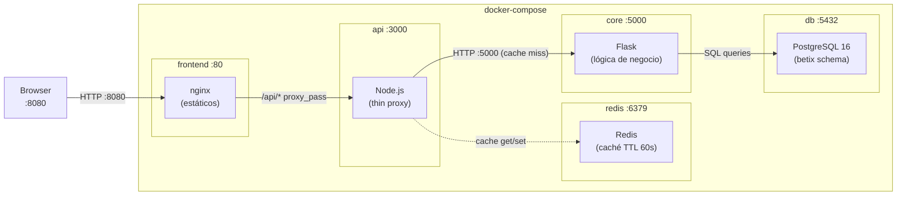

# Betix API

[](https://github.com/Neurus1970/betix/actions/workflows/ci-api.yml)
[](https://github.com/Neurus1970/betix/actions/workflows/ci-api.yml)
[](https://github.com/Neurus1970/betix/actions/workflows/ci-core.yml)
[](https://sonarcloud.io/dashboard?id=Neurus1970_betix)

Plataforma de estadísticas de tickets de lotería por provincia y juego, con dashboards interactivos D3.js y proyecciones estadísticas con SMA rolling. Arquitectura de microservicios: Python Flask core, Node.js thin proxy y nginx frontend, desplegable con docker-compose o Kubernetes.

---

## Onboarding a la plataforma

Este repositorio es el **proyecto de referencia** de nuestra plataforma corporativa de desarrollo. Antes de sumarte a un proyecto productivo, el recorrido recomendado es practicar el ciclo completo aquí:

```
Ticket → Branch → Código → Tests → PR → CI → Review → Merge → Release
```

1. **Ticket** — Tomás un ticket del sprint activo en Jira. El ID del ticket (`BETIX-XX`) va en el nombre de tu rama.
2. **Branch** — Creás una rama desde `develop` con el prefijo correcto (`feature/`, `fix/`, `refactor/`). Esto mueve el ticket a *In Progress* automáticamente.
3. **Código** — Desarrollás el cambio siguiendo las convenciones del proyecto (ver [CLAUDE.md](CLAUDE.md)).
4. **Tests** — Escribís tests que cubran el comportamiento nuevo. El umbral mínimo de cobertura se valida en CI.
5. **PR** — Abrís un Pull Request contra `develop`. La IA genera una revisión automatizada; un humano aprueba.
6. **CI** — GitHub Actions ejecuta lint, tests y análisis de SonarCloud. Todo debe estar en verde.
7. **Review** — El revisor humano aprueba o solicita cambios. Solo se mergea con aprobación + CI verde.
8. **Merge** — Al mergear, el ticket pasa a *Done* automáticamente en Jira.
9. **Release** — Al acumular cambios en `main`, Release Please genera el tag de versión y el CHANGELOG de forma automática.

Para una descripción exhaustiva de cada etapa y las herramientas que la soportan → [docs/SDLC.md](docs/SDLC.md)

---

## Inicio rápido

Guía para tener el proyecto corriendo en local y empezar a colaborar.

### Requisitos previos

| Herramienta | Versión mínima | Verificar |
|---|---|---|
| [Docker Desktop](https://www.docker.com/products/docker-desktop/) | 24+ | `docker --version` |
| [Node.js](https://nodejs.org/) | 18+ | `node --version` |
| [Python](https://www.python.org/) | 3.12+ | `python3 --version` |
| [Make](https://www.gnu.org/software/make/) | cualquiera | `make --version` |

> En macOS: `brew install node python make`. Docker Desktop se instala desde su sitio oficial.

### 1. Clonar el repositorio

```bash
git clone https://github.com/Neurus1970/betix.git
cd betix
git checkout develop   # rama de integración activa
```

### 2. Levantar el entorno (camino más corto)

```bash
make up
```

Esto ejecuta `docker-compose up --build` y levanta los tres servicios. La primera vez tarda unos minutos en descargar imágenes base.

| Servicio | URL |
|---|---|
| Frontend (nginx) | http://localhost:8080 |
| API (Node.js proxy) | http://localhost:3000 |
| Core (Flask) | http://localhost:5001 |

Abrí http://localhost:8080/dashboard para verificar que todo funciona.

### 3. Correr los tests

```bash
make test          # todos los tests: pytest + Jest + Cucumber
make test-core     # solo tests Python (pytest)
make test-api      # solo tests Node.js (Jest + Cucumber)
make lint          # ESLint
```

Los tests de Node.js **no requieren que el servidor esté corriendo** — usan `nock` para interceptar las llamadas HTTP al core.

### 4. Próximos pasos

- Flujo de ramas, convenciones y comandos del `Makefile` → [docs/monorepo-guide.md](docs/monorepo-guide.md)
- Arquitectura del sistema (modelo C4) → [docs/ArquitecturaC4.md](docs/ArquitecturaC4.md)
- Bajar el entorno: `make down`

---

## Componentes

| Componente | Tecnología | Puerto | Responsabilidad |
|---|---|---|---|
| `core/` | Python 3.12 + Flask | 5000 | Toda la lógica de negocio (geodata, proyecciones SMA, health) |
| `src/` (api) | Node.js 18 + Express | 3000 | Thin HTTP proxy hacia core |
| `frontend/` | nginx | 80 | Sirve archivos estáticos (HTML + D3.js) |
| PostgreSQL | postgres:16-alpine | 5432 | Base de datos principal — schema `betix` (provincias, juegos, tickets_mensuales) |
| Redis | redis:7-alpine | 6379 | Caché de respuestas del core (TTL configurable) |

La conexión a la base de datos se configura con `BETIX_DB_URL` (DSN estándar PostgreSQL). Ver [docs/database.md](docs/database.md) para el modelo de datos, los seeds y el script de carga.

---

## Endpoints API

| Método | Ruta | Descripción |
|--------|------|-------------|
| GET | `/healthz` | Estado del servicio. Devuelve `{"status":"healthy"}` (200) o error (500). |
| GET | `/api/datos/geodata` | Totales globales + datos georreferenciados por provincia con detalle de juegos. |
| GET | `/api/datos/proyectado` | Series históricas (12 meses) y proyecciones SMA con bandas de error (±SD). |

**Parámetros de `/api/datos/proyectado`:**

| Parámetro | Tipo | Default | Descripción |
|-----------|------|---------|-------------|
| `provincia` | string | primera (alfabético) | Nombre de la provincia |
| `juego` | string | primero (alfabético) | `Lotería`, `Quiniela` o `Raspadita` |
| `meses` | number | `1` | Meses a proyectar (1–6) |

---

## Páginas Frontend

| Ruta | Descripción |
|------|-------------|
| `/dashboard` | Dashboard principal con 5 tabs: Mapa & Torta, Sunburst, Sankey, Tabla y Proyecciones. KPIs globales. Teclas `1`–`5` para navegar entre tabs. |
| `/proyectado` | Vista standalone de proyecciones por provincia y juego. Gráfico de líneas con banda de confianza ±SD. |

---

## Desarrollo local

### Con docker-compose (recomendado)

```bash
docker-compose up --build
```

| Servicio | URL |
|---|---|
| Frontend (nginx) | http://localhost:8080 |
| API (Node.js) | http://localhost:3000 |
| Core (Flask) | http://localhost:5001 |

### Sin Docker (dos terminales)

**Terminal 1 — Python core:**
```bash
pip3 install -r core/requirements.txt
python3 -m flask --app core.main run --host 0.0.0.0 --port 5000
```

**Terminal 2 — Node.js API + Frontend:**
```bash
npm install
npm run dev   # puerto 3000
```

El perfil activo se controla con `NODE_ENV`. Variables con prefijo `BETIX_` en `.env.dev` / `.env.uat` / `.env.pro`.

| `NODE_ENV` | Archivo | Log level |
|------------|---------|-----------|
| `dev` (default) | `.env.dev` | `debug` |
| `uat` | `.env.uat` | `info` |
| `pro` | `.env.pro` | `warn` |

### Kubernetes (minikube)

```bash
minikube start
kubectl apply -f k8s/
# Acceso en http://betix.local (requiere entrada en /etc/hosts)
```

---

## Tests

```bash
# Node.js (Jest + Cucumber) — no requiere core corriendo, usa nock
npm test                  # Jest verbose + Cucumber summary
npm run test:functional   # Solo Cucumber en modo pretty
npm run test:ci           # Jest con cobertura (para CI)

# Python core
python3 -m pytest core/tests/ -v

# Lint
npm run lint
```

| Suite | Herramienta | Tests |
|---|---|---|
| Unit / Integration (Node.js) | Jest + Supertest + nock | 41 |
| Functional / BDD | Cucumber | 33 escenarios / 80 steps |
| Unit (Python core) | pytest | 27 |

---

## Git repo | Guía de uso & Buenas prácticas

Este repositorio sigue una estructura de monorepo con tres microservicios independientes (`core/`, `src/`, `frontend/`), cada uno con su propio versionado semántico, pipeline de CI con path filters y comandos unificados a través de un `Makefile`. La guía documenta las convenciones de ramas (Git Flow), el flujo de trabajo recomendado para desarrollo y releases, y cómo operar el repo de forma eficiente en local y en CI/CD.

→ [docs/monorepo-guide.md](docs/monorepo-guide.md)

### Flujo de trabajo con ramas (Feature Branching)

**`develop` es la rama de integración. Nunca se modifica directamente en local.**

Todo cambio se realiza en una rama dedicada y se integra a `develop` mediante Pull Request:

| Prefijo | Cuándo usarlo |
|---------|--------------|
| `feature/BETIX-XX-descripcion` | nueva funcionalidad |
| `fix/BETIX-XX-descripcion` | corrección de bug |
| `refactor/BETIX-XX-descripcion` | reestructuración sin cambio de comportamiento |

```bash
# Flujo estándar
git checkout develop
git pull origin develop
git checkout -b feature/BETIX-42-nueva-funcionalidad

# ... trabajar, commitear ...

git push origin feature/BETIX-42-nueva-funcionalidad
# → abrir PR contra develop en GitHub
```

> El ID de Jira en el nombre de la rama (`BETIX-XX`) mueve el ticket automáticamente a **In Progress** al crear la rama y a **Done** al hacer merge.

---

## Arquitectura

La arquitectura de Betix está documentada siguiendo el modelo **C4** (Context, Containers, Components, Code), un estándar creado por Simon Brown que organiza la descripción de un sistema en cuatro niveles de zoom progresivo: desde la visión de negocio hasta los detalles internos de cada microservicio. Los diagramas están expresados en Mermaid y versionados junto al código, lo que garantiza que la documentación evoluciona con el sistema.

→ [docs/ArquitecturaC4.md](docs/ArquitecturaC4.md)

### Caché

Las rutas `/api/datos/*` utilizan **Redis** como capa de caché entre el proxy Node.js y el core Python. Esto evita que el core recalcule estadísticas (agregaciones, proyecciones SMA) en cada petición: el primer request procesa y almacena el resultado; los siguientes lo sirven directamente desde memoria. Si Redis no está disponible, las peticiones pasan al core sin interrupciones (degradación elegante).

→ [docs/caching.md](docs/caching.md)

---

## Pipeline CI/CD

Cada Pull Request hacia `main` ejecuta automáticamente (jobs en paralelo):

| Job | Descripción |
|---|---|
| `test-core` | pytest con cobertura para el microservicio Python Flask |
| `lint-and-test` | ESLint + Jest (cobertura) + Cucumber BDD |

Al crear un branch con código de ticket (ej. `feature/BETIX-7-...`) el ticket Jira pasa a **In Progress** automáticamente. Al hacer merge de la PR pasa a **Done**.

---

## Infraestructura (IaC) Terraform

La infraestructura de Betix en AWS está definida completamente como código con **Terraform** (`terraform/`), siguiendo el principio de Infrastructure as Code: cualquier cambio en la infraestructura pasa por revisión de código y queda versionado en git.

Los diagramas están expresados en **Mermaid** y versionados junto al código: se renderizan automáticamente en GitHub sin herramientas externas.

→ [docs/diagrams/infrastructure.md](docs/diagrams/infrastructure.md)

### Local — docker-compose

Representa los contenedores corriendo en la máquina del developer: **nginx** sirve los estáticos y proxea `/api/*` hacia el **API Node.js**, que delega la lógica al **core Flask**. Redis actúa como caché entre el proxy y el core. PostgreSQL persiste los datos del schema `betix`.


```mermaid
flowchart LR
    Browser["Browser\n:8080"]

    subgraph dc["docker-compose"]
        subgraph fe["frontend  :80"]
            nginx["nginx\n(estáticos)"]
        end
        subgraph api["api  :3000"]
            nodejs["Node.js\n(thin proxy)"]
        end
        subgraph cache["redis  :6379"]
            redis["Redis\n(caché TTL 60s)"]
        end
        subgraph core["core  :5000"]
            flask["Flask\n(lógica de negocio)"]
        end
        subgraph db["db  :5432"]
            pg["PostgreSQL 16\n(betix schema)"]
        end
    end

    Browser -->|"HTTP :8080"| nginx
    nginx -->|"/api/*  proxy_pass"| nodejs
    nodejs -. "cache get/set" .-> redis
    nodejs -->|"HTTP :5000 (cache miss)"| flask
    flask -->|"SQL queries"| pg
```

### Kubernetes — minikube

Muestra el mismo stack desplegado en un cluster Kubernetes local. Un **Ingress** enruta el tráfico por path hacia los **Services**, cada uno respaldado por un **Deployment** independiente dentro del namespace `betix`. Este diagrama es fiel a los manifests de `k8s/`.

### AWS — EKS + ECR + RDS + VPC

Representa el despliegue productivo en AWS: una **VPC** con subnets públicas (ALB + NAT Gateway) y privadas (EKS + RDS). Las imágenes se almacenan en tres repositorios **ECR** independientes (`betix-core`, `betix-api`, `betix-frontend`), uno por servicio, con política de retención de las últimas 10 versiones.

→ [Ver diagramas completos](docs/diagrams/infrastructure.md)
