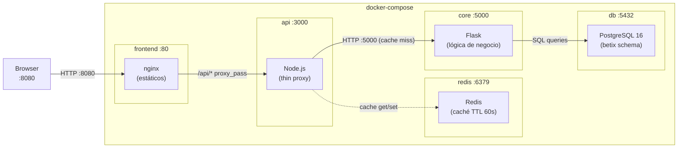

# Betix

[](https://github.com/Neurus1970/betix/actions/workflows/ci-api.yml)
[](https://github.com/Neurus1970/betix/actions/workflows/ci-api.yml)
[](https://github.com/Neurus1970/betix/actions/workflows/ci-core.yml)
[](https://sonarcloud.io/dashboard?id=Neurus1970_betix)

> **Proyecto didáctico — Tecno Acción.**
> Betix es un *playground* de referencia para el [curso de onboarding de desarrolladores](docs/onboarding/TOC.md). Demuestra en la práctica las capacidades de la plataforma corporativa de desarrollo: herramientas, procesos automatizados y estándares de equipo. Los datos, provincias, juegos y estadísticas son sintéticos.

---

## Inicio rápido

### Requisitos previos

| Herramienta | Versión mínima | Verificar |
|---|---|---|
| [Docker Desktop](https://www.docker.com/products/docker-desktop/) | 24+ | `docker --version` |
| [Node.js](https://nodejs.org/) | 18+ | `node --version` |
| [Python](https://www.python.org/) | 3.12+ | `python3 --version` |
| [Make](https://www.gnu.org/software/make/) | cualquiera | `make --version` |

> En macOS: `brew install node python make`. Docker Desktop se instala desde su sitio oficial.

### 1. Clonar el repositorio

```bash
git clone https://github.com/Neurus1970/betix.git
cd betix
git checkout develop   # rama de integración activa
```

### 2. Levantar el entorno

```bash
make up
```

Esto ejecuta `docker-compose up --build` y levanta los tres servicios. La primera vez tarda unos minutos en descargar imágenes base.

| Servicio | URL |
|---|---|
| Frontend (nginx) | http://localhost:8080 |
| API (Node.js proxy) | http://localhost:3000 |
| Core (Flask) | http://localhost:5001 |

Abrí http://localhost:8080/dashboard para verificar que todo funciona. Para bajar el entorno: `make down`.

### 3. Correr los tests

```bash
make test          # todos: pytest + Jest + Cucumber
make test-core     # solo Python (pytest)
make test-api      # solo Node.js (Jest + Cucumber)
make lint          # ESLint
```

Los tests de Node.js **no requieren que el servidor esté corriendo** — usan `nock` para interceptar las llamadas HTTP al core.

### 4. Configurar Claude Code

Claude Code es la IA que el equipo usa como copiloto en todo el ciclo de vida del desarrollo. Al clonar el repositorio ya tenés la configuración completa en `.claude/`:

| Qué incluye | Dónde vive | Para qué sirve |
|-------------|-----------|----------------|
| Instrucciones del proyecto | `CLAUDE.md` | Claude entiende la arquitectura, reglas y convenciones sin que tengas que explicarlas |
| Sub-agentes especializados | `.claude/agents/` | Contexto específico para `microservices`, `testing`, `infra` y `frontend` |
| Playbooks reutilizables | `.claude/skills/` | Flujos paso a paso: `add-endpoint`, `release` |
| Hooks automáticos | `.claude/hooks/` | Ejecutan acciones en eventos del ciclo de trabajo |

**Instalación:** extensión **Claude Code** en VS Code → autenticarse con cuenta Anthropic → abrir el proyecto.

> Lo que está en `.claude/agents/`, `.claude/skills/` y `.claude/hooks/` es código del equipo — se versiona, se revisa en PR y evoluciona con el proyecto. Las preferencias personales van en `.claude/settings.local.json` (en `.gitignore`).

→ Cómo funcionan los sub-agentes y cómo colaboran: [docs/claude-en-betix.md](docs/claude-en-betix.md)

### 5. Acceso y permisos

Betix usa Jira para gestionar tickets. El ID del ticket (`BETIX-XX`) en el nombre de cada rama dispara automáticamente la transición de estado.

1. Solicitá acceso al proyecto **BETIX** en [cristian-f-medrano.atlassian.net](https://cristian-f-medrano.atlassian.net) — pedíselo a tu tech lead.
2. Generá tu API token en [id.atlassian.com/manage-profile/security/api-tokens](https://id.atlassian.com/manage-profile/security/api-tokens).
3. Configurá las credenciales locales siguiendo el [Módulo 1 del curso](docs/onboarding/modulos/1.md#configurar-el-servidor-mcp-de-jira).

---

## Endpoints API

| Método | Ruta | Descripción |
|--------|------|-------------|
| GET | `/healthz` | Estado del servicio. Devuelve `{"status":"healthy"}` (200) o error (500). |
| GET | `/api/datos/geodata` | Totales globales + datos georreferenciados por provincia con detalle de juegos. |
| GET | `/api/datos/proyectado` | Series históricas (12 meses) y proyecciones SMA con bandas de error (±SD). |
| GET | `/api/provincias_juegos` | Lista de asignaciones juego↔provincia. Filtra con `?provincia_id=` o `?juego_id=`. |
| POST | `/api/provincias_juegos` | Crea una asignación. Body: `{"provincia_id": int, "juego_id": int}`. Devuelve 201, 409 si ya existe, 400 si inválido. |
| DELETE | `/api/provincias_juegos/:provincia_id/:juego_id` | Elimina una asignación. Devuelve 204, 404 si no existe. |

**Parámetros de `/api/datos/proyectado`:**

| Parámetro | Tipo | Default | Descripción |
|-----------|------|---------|-------------|
| `provincia` | string | primera (alfabético) | Nombre de la provincia |
| `juego` | string | primero (alfabético) | `Lotería`, `Quiniela` o `Raspadita` |
| `meses` | number | `1` | Meses a proyectar (1–6) |

**Parámetros de `GET /api/provincias_juegos`:**

| Parámetro | Tipo | Descripción |
|-----------|------|-------------|
| `provincia_id` | number | Filtra los juegos habilitados para esa provincia |
| `juego_id` | number | Filtra las provincias que tienen ese juego habilitado |

---

## Páginas Frontend

| Ruta | Descripción |
|------|-------------|
| `/dashboard` | Dashboard principal con 5 tabs: Mapa & Torta, Sunburst, Sankey, Tabla y Proyecciones. KPIs globales. Teclas `1`–`5` para navegar entre tabs. |
| `/backoffice` | Gestión de asignaciones juego↔provincia. Tab Visual (tarjetas kanban) y Tab Lista (matriz de checkboxes). Cambios en tiempo real via API. |

---

## Tests

| Suite | Herramienta | Tests |
|---|---|---|
| Unit / Integration (Node.js) | Jest + Supertest + nock | 156 |
| Functional / BDD | Cucumber | 26 escenarios / 70 steps |
| Unit (Python core) | pytest | 45 |

```bash
# Node.js (no requiere core corriendo, usa nock)
npm test                  # Jest verbose + Cucumber summary
npm run test:functional   # Solo Cucumber en modo pretty
npm run test:ci           # Jest con cobertura (para CI)

# Python core
python3 -m pytest core/tests/ -v
```

Los datos de fixture (provincias, juegos, tickets) tienen **una única fuente de verdad**: los CSVs en `db/seeds/`. Pytest los carga vía PostgreSQL; Jest y Cucumber los leen con `tests/fixtures/csvLoader.js`. Para agregar un nuevo caso de prueba, solo editá los CSVs.

---

## Git y flujo de trabajo

Este repo es un monorepo con tres microservicios independientes (`core/`, `src/`, `frontend/`), cada uno con su propio versionado semántico y pipeline de CI con path filters. → [docs/monorepo-guide.md](docs/monorepo-guide.md)

**`develop` es la rama de integración. Nunca se modifica directamente.**

Todo cambio se realiza en una rama dedicada y se integra a `develop` mediante Pull Request:

| Prefijo | Cuándo usarlo |
|---------|--------------|
| `feature/BETIX-XX-descripcion` | nueva funcionalidad |
| `fix/BETIX-XX-descripcion` | corrección de bug |
| `refactor/BETIX-XX-descripcion` | reestructuración sin cambio de comportamiento |

```bash
git checkout develop && git pull origin develop
git checkout -b feature/BETIX-42-nueva-funcionalidad
# ... trabajar, commitear ...
git push origin feature/BETIX-42-nueva-funcionalidad
# → abrir PR contra develop en GitHub
```

> El ID de Jira en el nombre de la rama (`BETIX-XX`) mueve el ticket automáticamente a **In Progress** al crear la rama y a **Done** al hacer merge.

---

## CI/CD y flujo automatizado

```
Ticket → Branch → Código → Tests → PR → CI → Review → Merge → Release
```

1. **Ticket** — Tomás un ticket del sprint activo en Jira. El ID va en el nombre de la rama.
2. **Branch** — Creás una rama desde `develop` con el prefijo correcto. El ticket pasa a *In Progress* automáticamente.
3. **Código** — Desarrollás el cambio siguiendo las convenciones del proyecto (ver [CLAUDE.md](CLAUDE.md)).
4. **Tests** — Escribís tests que cubran el comportamiento nuevo. El umbral de cobertura se valida en CI.
5. **PR** — Abrís un Pull Request contra `develop`. La IA genera una revisión automatizada; un humano aprueba.
6. **CI** — GitHub Actions ejecuta lint, tests y análisis de SonarCloud. Todo debe estar en verde.
7. **Review** — El revisor humano aprueba o solicita cambios. Solo se mergea con aprobación + CI verde.
8. **Merge** — Al mergear, el ticket pasa a *Done* en Jira automáticamente.
9. **Release** — Al acumular cambios en `main`, Release Please genera el tag de versión y el CHANGELOG.

Cada PR dispara dos jobs en paralelo:

| Job | Descripción |
|---|---|
| `test-core` | pytest con cobertura para el microservicio Python Flask |
| `lint-and-test` | ESLint + Jest (cobertura) + Cucumber BDD |

→ [docs/SDLC.md](docs/SDLC.md)

---

## Arquitectura

Betix está compuesto por tres servicios independientes. Cada uno tiene su propia imagen Docker, versionado semántico y pipeline de CI.

| Componente | Tecnología | Puerto | Responsabilidad |
|---|---|---|---|
| `core/` | Python 3.12 + Flask | 5000 | Toda la lógica de negocio (geodata, proyecciones SMA, health) |
| `src/` (api) | Node.js 18 + Express | 3000 | Thin HTTP proxy hacia core + caché Redis |
| `frontend/` | nginx | 8080 | Sirve archivos estáticos (HTML + D3.js) |
| PostgreSQL | postgres:16-alpine | 5432 | Base de datos principal — schema `betix` |
| Redis | redis:7-alpine | 6379 | Caché de respuestas del core (TTL configurable) |

Las rutas `/api/datos/*` usan **Redis** como caché entre el proxy Node.js y el core Python: el primer request procesa y almacena; los siguientes lo sirven desde memoria. Si Redis no está disponible, las peticiones pasan al core sin interrupciones (degradación elegante).

→ Modelo C4 completo: [docs/ArquitecturaC4.md](docs/ArquitecturaC4.md) | Caché: [docs/caching.md](docs/caching.md) | DB: [docs/database.md](docs/database.md)

---

## Infraestructura

### Local — docker-compose


```mermaid
flowchart LR
    Browser["Browser\n:8080"]

    subgraph dc["docker-compose"]
        subgraph fe["frontend  :80"]
            nginx["nginx\n(estáticos)"]
        end
        subgraph api["api  :3000"]
            nodejs["Node.js\n(thin proxy)"]
        end
        subgraph cache["redis  :6379"]
            redis["Redis\n(caché TTL 60s)"]
        end
        subgraph core["core  :5000"]
            flask["Flask\n(lógica de negocio)"]
        end
        subgraph db["db  :5432"]
            pg["PostgreSQL 16\n(betix schema)"]
        end
    end

    Browser -->|"HTTP :8080"| nginx
    nginx -->|"/api/*  proxy_pass"| nodejs
    nodejs -. "cache get/set" .-> redis
    nodejs -->|"HTTP :5000 (cache miss)"| flask
    flask -->|"SQL queries"| pg
```

### Sin Docker (dos terminales)

**Terminal 1 — Python core:**
```bash
pip3 install -r core/requirements.txt
python3 -m flask --app core.main run --host 0.0.0.0 --port 5000
```

**Terminal 2 — Node.js API:**
```bash
npm install
npm run dev   # puerto 3000
```

El perfil activo se controla con `NODE_ENV`. Variables con prefijo `BETIX_` en `.env.dev` / `.env.uat` / `.env.pro`.

| `NODE_ENV` | Archivo | Log level |
|------------|---------|-----------|
| `dev` (default) | `.env.dev` | `debug` |
| `uat` | `.env.uat` | `info` |
| `pro` | `.env.pro` | `warn` |

### Kubernetes — minikube

```bash
minikube start
kubectl apply -f k8s/
# Acceso en http://betix.local (requiere entrada en /etc/hosts)
```

Un **Ingress** enruta el tráfico por path hacia los **Services**, cada uno respaldado por un **Deployment** independiente dentro del namespace `betix`.

### AWS — EKS + ECR + RDS + VPC (producción)

La infraestructura en AWS está definida con **Terraform** (`terraform/`): VPC con subnets públicas (ALB + NAT Gateway) y privadas (EKS + RDS). Las imágenes se almacenan en tres repositorios **ECR** independientes (`betix-core`, `betix-api`, `betix-frontend`) con política de retención de las últimas 10 versiones.

El control de costos sigue la estrategia **FinOps**: 5 tags obligatorios en todos los recursos, presupuestos por entorno (dev/uat/prod) con alertas al 70/80/90%, y validación automática en CI. La fuente única de verdad es `finops/tagging-taxonomy.yaml`.

→ [docs/diagrams/infrastructure.md](docs/diagrams/infrastructure.md) | [docs/finops/tagging-strategy.md](docs/finops/tagging-strategy.md)

---

## Documentación

| Documento | Contenido |
|-----------|-----------|
| [docs/onboarding/TOC.md](docs/onboarding/TOC.md) | Curso de onboarding — punto de entrada para nuevos desarrolladores |
| [docs/principios-fundamentales.md](docs/principios-fundamentales.md) | Los 5 principios que guían las decisiones de arquitectura y proceso |
| [docs/ArquitecturaC4.md](docs/ArquitecturaC4.md) | Modelo C4 completo (contexto, contenedores, componentes) con diagramas Mermaid |
| [docs/claude-en-betix.md](docs/claude-en-betix.md) | Cómo está configurado Claude: sub-agentes, hooks y skills |
| [CLAUDE.md](CLAUDE.md) | Instrucciones del proyecto para Claude (convenciones, reglas críticas, mapa del repo) |
| [docs/SDLC.md](docs/SDLC.md) | Ciclo de vida completo del desarrollo en este proyecto |
| [docs/monorepo-guide.md](docs/monorepo-guide.md) | Versionado independiente por servicio, path filters de CI, Makefile |
| [docs/caching.md](docs/caching.md) | Estrategia de caché Redis entre Node.js proxy y Python core |
| [docs/database.md](docs/database.md) | Schema PostgreSQL, migraciones y seeds |
| [docs/diagrams/infrastructure.md](docs/diagrams/infrastructure.md) | Diagramas de infraestructura local, Kubernetes y AWS |
| [docs/finops/tagging-strategy.md](docs/finops/tagging-strategy.md) | Estrategia FinOps: tags obligatorios, presupuestos por entorno y validación en CI |
