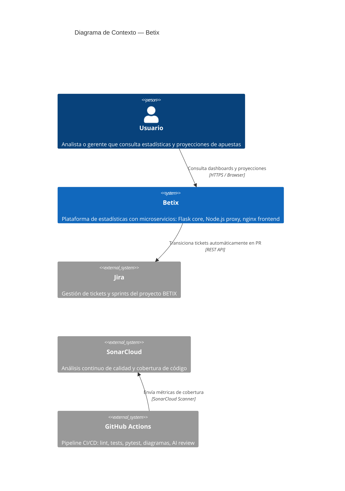
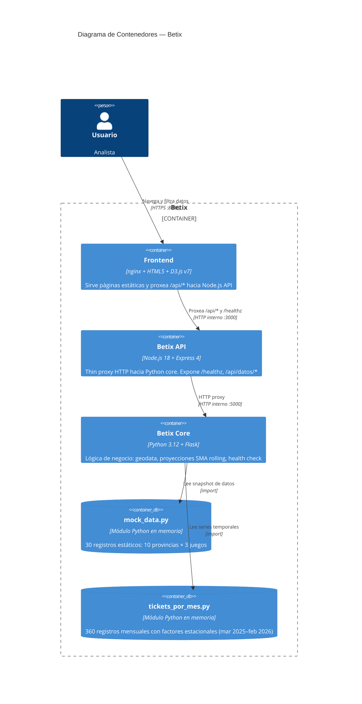
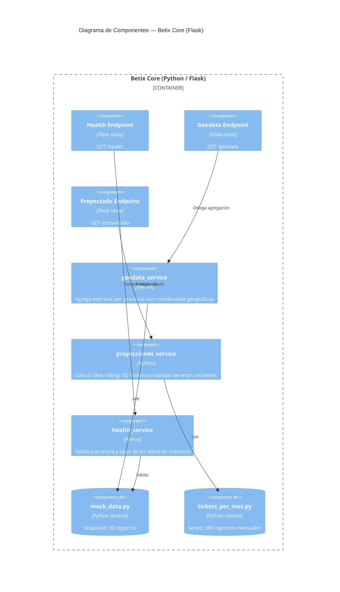

# Betix API

[](https://github.com/Neurus1970/betix/actions/workflows/ci.yml)
[](https://github.com/Neurus1970/betix/actions/workflows/ci.yml)
[](https://sonarcloud.io/dashboard?id=Neurus1970_betix)

Plataforma de estadísticas de tickets de lotería por provincia y juego, con dashboards interactivos D3.js y proyecciones estadísticas con SMA rolling. Arquitectura de microservicios: Python Flask core, Node.js thin proxy y nginx frontend, desplegable con docker-compose o Kubernetes.

---

## Arquitectura

### Local (docker-compose)


### Kubernetes (minikube)


> Los diagramas se generan automáticamente desde código Python con [diagrams-mingrammer](https://diagrams.mingrammer.com/). Fuentes en [`docs/diagrams/`](docs/diagrams/).

---

## Componentes

| Componente | Tecnología | Puerto | Responsabilidad |
|---|---|---|---|
| `core/` | Python 3.12 + Flask | 5000 | Toda la lógica de negocio (geodata, proyecciones SMA, health) |
| `src/` (api) | Node.js 18 + Express | 3000 | Thin HTTP proxy hacia core |
| `frontend/` | nginx | 80 | Sirve archivos estáticos (HTML + D3.js) |

---

## Endpoints API

| Método | Ruta | Descripción |
|--------|------|-------------|
| GET | `/healthz` | Estado del servicio. Devuelve `{"status":"healthy"}` (200) o error (500). |
| GET | `/api/datos/geodata` | Totales globales + datos georreferenciados por provincia con detalle de juegos. |
| GET | `/api/datos/proyectado` | Series históricas (12 meses) y proyecciones SMA con bandas de error (±SD). |

**Parámetros de `/api/datos/proyectado`:**

| Parámetro | Tipo | Default | Descripción |
|-----------|------|---------|-------------|
| `provincia` | string | primera (alfabético) | Nombre de la provincia |
| `juego` | string | primero (alfabético) | `Lotería`, `Quiniela` o `Raspadita` |
| `meses` | number | `1` | Meses a proyectar (1–4) |

---

## Páginas Frontend

| Ruta | Descripción |
|------|-------------|
| `/dashboard-interactivo` | Mapa coroplético + gráfico de torta con D3.js. Filtros por juego y métrica. |
| `/dashboard` | Dashboard avanzado: Mapa, Sankey, Sunburst y Tabla. KPIs globales. |
| `/proyectado` | Proyecciones por provincia y juego. Gráfico de líneas con banda de confianza ±SD. |

---

## Desarrollo local

### Con docker-compose (recomendado)

```bash
docker-compose up --build
```

| Servicio | URL |
|---|---|
| Frontend (nginx) | http://localhost:8080 |
| API (Node.js) | http://localhost:3000 |
| Core (Flask) | http://localhost:5001 |

### Sin Docker (dos terminales)

**Terminal 1 — Python core:**
```bash
pip3 install -r core/requirements.txt
python3 -m flask --app core.main run --host 0.0.0.0 --port 5000
```

**Terminal 2 — Node.js API + Frontend:**
```bash
npm install
npm run dev   # puerto 3000
```

El perfil activo se controla con `NODE_ENV`. Variables con prefijo `BETIX_` en `.env.dev` / `.env.uat` / `.env.pro`.

| `NODE_ENV` | Archivo | Log level |
|------------|---------|-----------|
| `dev` (default) | `.env.dev` | `debug` |
| `uat` | `.env.uat` | `info` |
| `pro` | `.env.pro` | `warn` |

### Kubernetes (minikube)

```bash
minikube start
kubectl apply -f k8s/
# Acceso en http://betix.local (requiere entrada en /etc/hosts)
```

---

## Tests

```bash
# Node.js (Jest + Cucumber) — no requiere core corriendo, usa nock
npm test                  # Jest verbose + Cucumber summary
npm run test:functional   # Solo Cucumber en modo pretty
npm run test:ci           # Jest con cobertura (para CI)

# Python core
python3 -m pytest core/tests/ -v

# Lint
npm run lint
```

| Suite | Herramienta | Tests |
|---|---|---|
| Unit / Integration (Node.js) | Jest + Supertest + nock | 41 |
| Functional / BDD | Cucumber | 33 escenarios / 80 steps |
| Unit (Python core) | pytest | 27 |

---

## Diagramas como código

Los diagramas de arquitectura se generan desde código Python:

```bash
pip3 install -r docs/diagrams/requirements.txt
python3 docs/diagrams/architecture_local.py   # → docs/diagrams/betix_local.png
python3 docs/diagrams/architecture_k8s.py     # → docs/diagrams/betix_k8s.png
```

---

## Arquitectura C4 (Mermaid)

### Nivel 1 — Contexto del sistema


```mermaid
C4Context
    title Diagrama de Contexto — Betix

    Person(usuario, "Usuario", "Analista o gerente que consulta estadísticas y proyecciones de apuestas")

    System(betix, "Betix", "Plataforma de estadísticas con microservicios: Flask core, Node.js proxy, nginx frontend")

    System_Ext(jira, "Jira", "Gestión de tickets y sprints del proyecto BETIX")
    System_Ext(sonar, "SonarCloud", "Análisis continuo de calidad y cobertura de código")
    System_Ext(github, "GitHub Actions", "Pipeline CI/CD: lint, tests, pytest, diagramas, AI review")

    Rel(usuario, betix, "Consulta dashboards y proyecciones", "HTTPS / Browser")
    Rel(betix, jira, "Transiciona tickets automáticamente en PR", "REST API")
    Rel(github, sonar, "Envía métricas de cobertura", "SonarCloud Scanner")
```

### Nivel 2 — Contenedores


```mermaid
C4Container
    title Diagrama de Contenedores — Betix

    Person(usuario, "Usuario", "Analista")

    Container_Boundary(betix, "Betix") {
        Container(frontend, "Frontend", "nginx + HTML5 + D3.js v7", "Sirve páginas estáticas y proxea /api/* hacia Node.js API")
        Container(api, "Betix API", "Node.js 18 + Express 4", "Thin proxy HTTP hacia Python core. Expone /healthz, /api/datos/*")
        Container(core, "Betix Core", "Python 3.12 + Flask", "Lógica de negocio: geodata, proyecciones SMA rolling, health check")
        ContainerDb(dataStatic, "mock_data.py", "Módulo Python en memoria", "30 registros estáticos: 10 provincias × 3 juegos")
        ContainerDb(dataMonthly, "tickets_por_mes.py", "Módulo Python en memoria", "360 registros mensuales con factores estacionales (mar 2025–feb 2026)")
    }

    Rel(usuario, frontend, "Navega y filtra datos", "HTTPS :8080")
    Rel(frontend, api, "Proxea /api/* y /healthz", "HTTP interno :3000")
    Rel(api, core, "HTTP proxy", "HTTP interno :5000")
    Rel(core, dataStatic, "Lee snapshot de datos", "import")
    Rel(core, dataMonthly, "Lee series temporales", "import")
```

### Nivel 3 — Componentes del Core (Python Flask)


```mermaid
C4Component
    title Diagrama de Componentes — Betix Core (Flask)

    Container_Boundary(core, "Betix Core (Python / Flask)") {
        Component(healthEp, "Health Endpoint", "Flask route", "GET /health")
        Component(geodataEp, "Geodata Endpoint", "Flask route", "GET /geodata")
        Component(proyectadoEp, "Proyectado Endpoint", "Flask route", "GET /proyectado")

        Component(geodataSvc, "geodata_service", "Python", "Agrega métricas por provincia con coordenadas geográficas")
        Component(proyeccionesSvc, "proyecciones_service", "Python", "Calcula SMA rolling, SD histórica y bandas de error crecientes")
        Component(healthSvc, "health_service", "Python", "Valida estructura y tipos de los datos en memoria")

        ComponentDb(mockData, "mock_data.py", "Python module", "Snapshot: 30 registros")
        ComponentDb(ticketsPorMes, "tickets_por_mes.py", "Python module", "Series: 360 registros mensuales")
    }

    Rel(healthEp, healthSvc, "Invoca validación")
    Rel(geodataEp, geodataSvc, "Delega agregación")
    Rel(proyectadoEp, proyeccionesSvc, "Delega cálculo")
    Rel(geodataSvc, mockData, "Lee")
    Rel(proyeccionesSvc, ticketsPorMes, "Lee")
    Rel(healthSvc, mockData, "Valida")
```

---

## Pipeline CI/CD

Cada Pull Request hacia `main` ejecuta automáticamente (jobs en paralelo):

| Job | Descripción |
|---|---|
| `diagrams` | Genera PNGs de arquitectura con diagrams-mingrammer + Graphviz |
| `test-core` | pytest con cobertura para el microservicio Python Flask |
| `lint-and-test` | ESLint + Jest (cobertura) + Cucumber BDD |

Al crear un branch con código de ticket (ej. `feature/BETIX-7-...`) el ticket Jira pasa a **In Progress** automáticamente. Al hacer merge de la PR pasa a **Done**.
