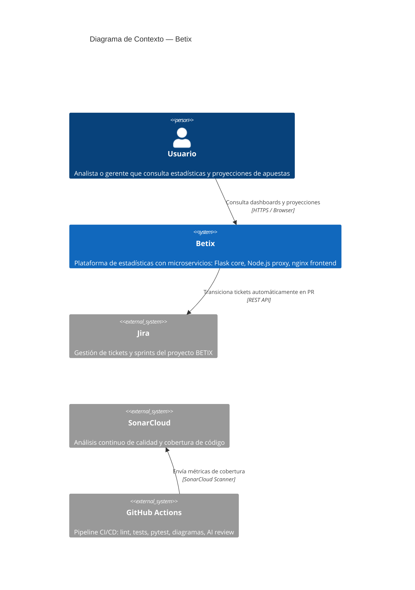
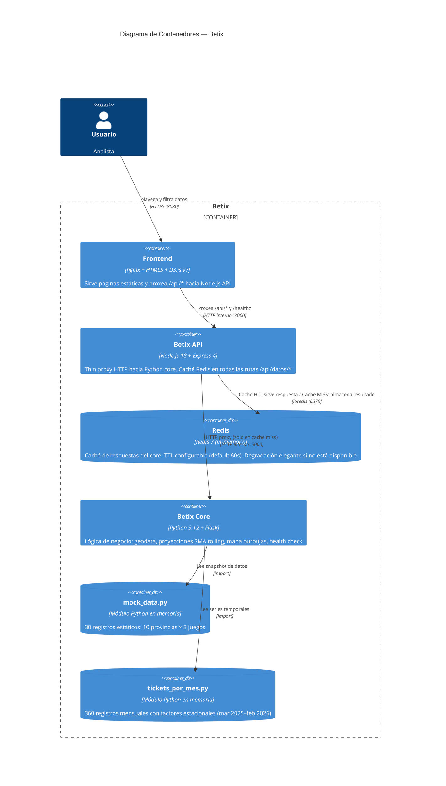
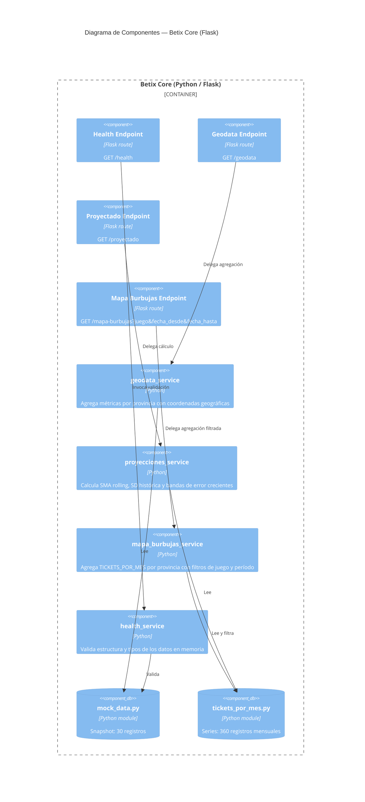

# Arquitectura C4 — Betix

## Qué es el modelo C4

C4 (Context, Containers, Components, Code) es un modelo de documentación de arquitectura de software creado por Simon Brown. Propone cuatro niveles de abstracción progresiva, de lo más general a lo más detallado, de forma similar a cómo un mapa tiene distintos niveles de zoom. Cada nivel responde a una audiencia distinta: negocio, arquitectura, desarrollo e implementación.

Los diagramas de Betix están expresados en **Mermaid** con la sintaxis C4, lo que permite mantenerlos como código dentro del repositorio, versionarlos con git y renderizarlos automáticamente en GitHub.

---

## Nivel 1 — Contexto del sistema

Muestra Betix como caja negra y sus relaciones con usuarios y sistemas externos. Audiencia: stakeholders de negocio y arquitectos.

---

## Nivel 2 — Contenedores

Desglosa Betix en sus procesos ejecutables e interfaces. Audiencia: arquitectos y desarrolladores.

---

## Nivel 3 — Componentes del Core (Python Flask)

Muestra los componentes internos del microservicio `core/` y sus responsabilidades. Audiencia: desarrolladores del servicio.

---

## Referencias

- [C4 Model — simon brown](https://c4model.com/)
- [Mermaid C4 Diagram Syntax](https://mermaid.js.org/syntax/c4.html)
