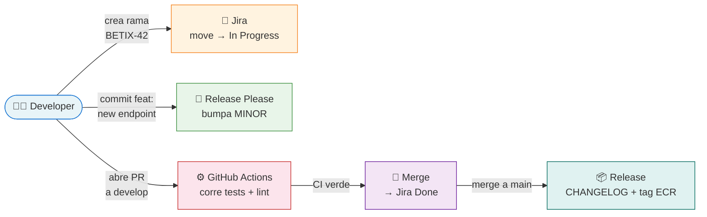
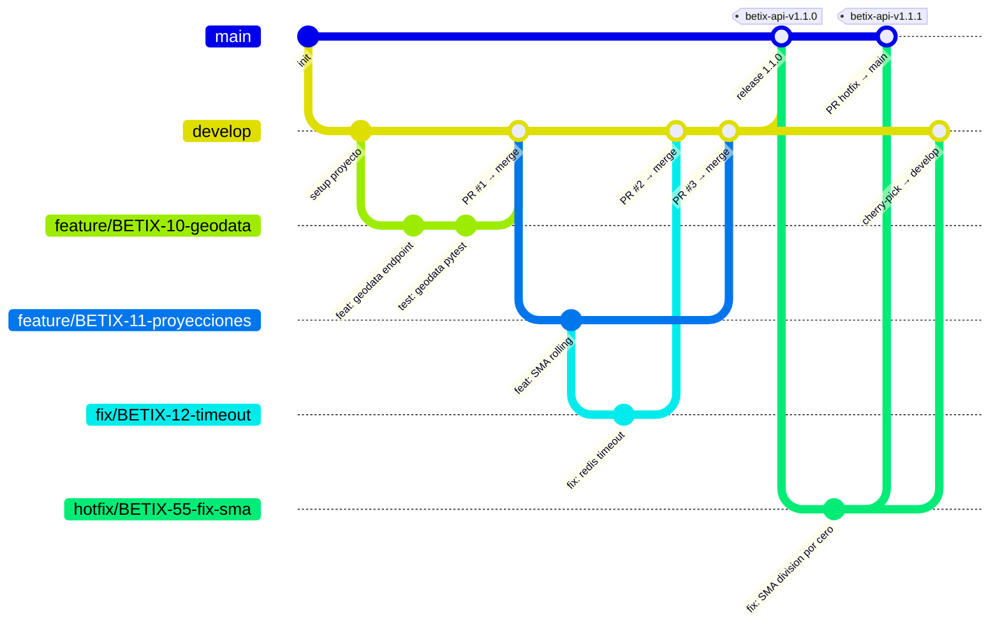
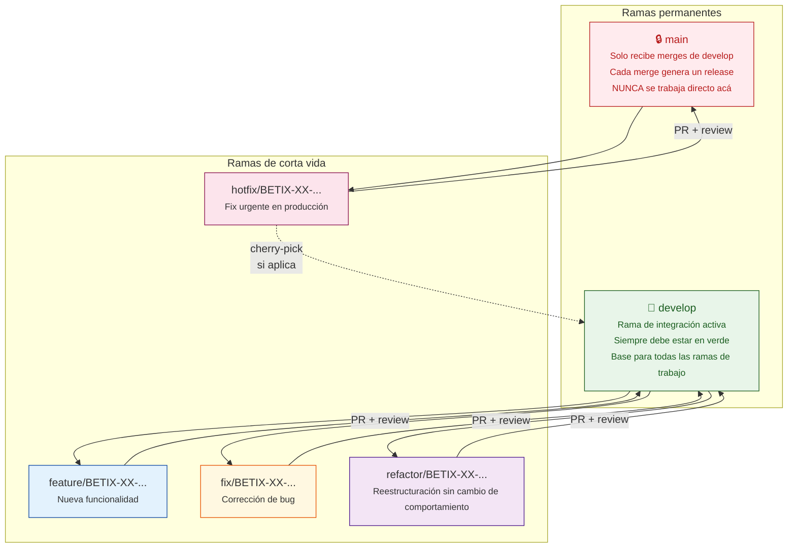
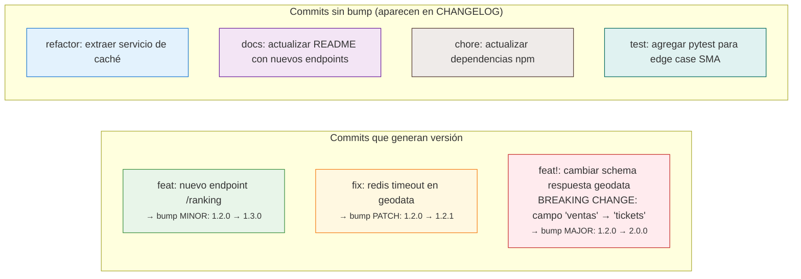
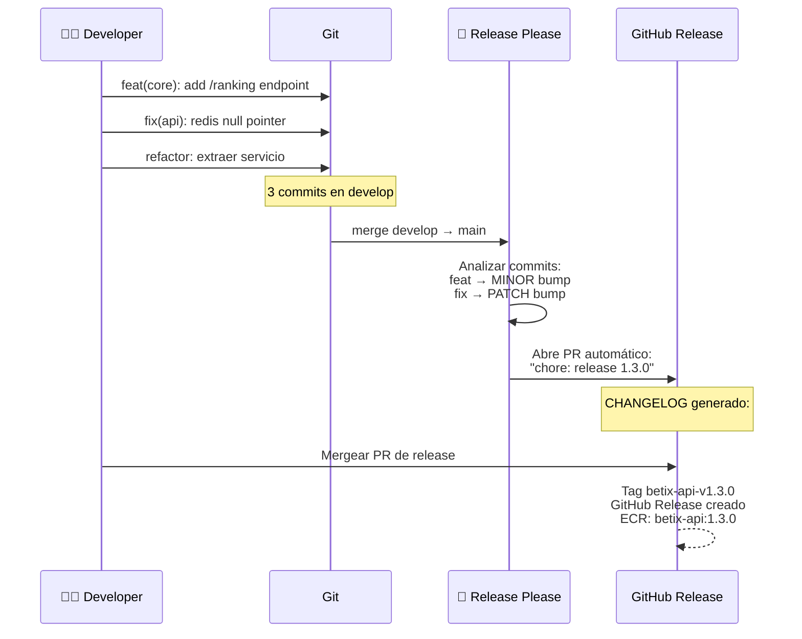
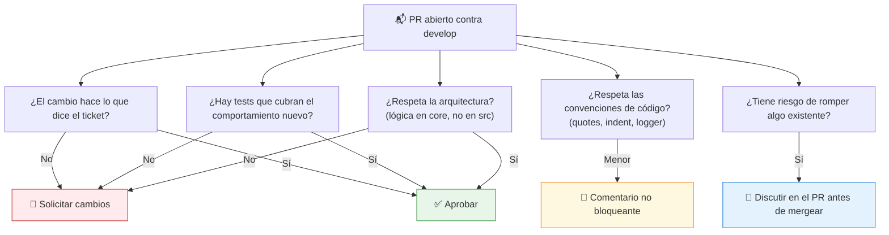
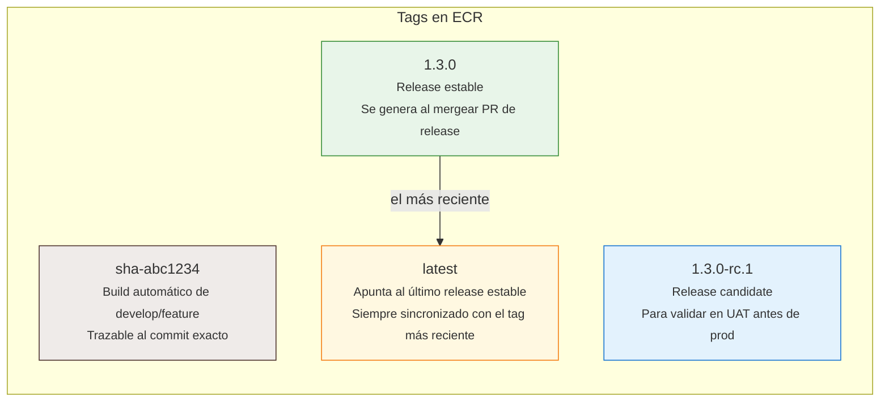
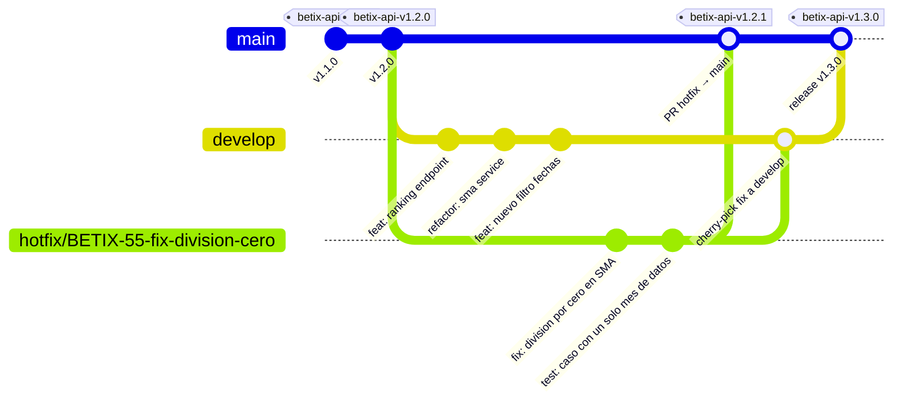
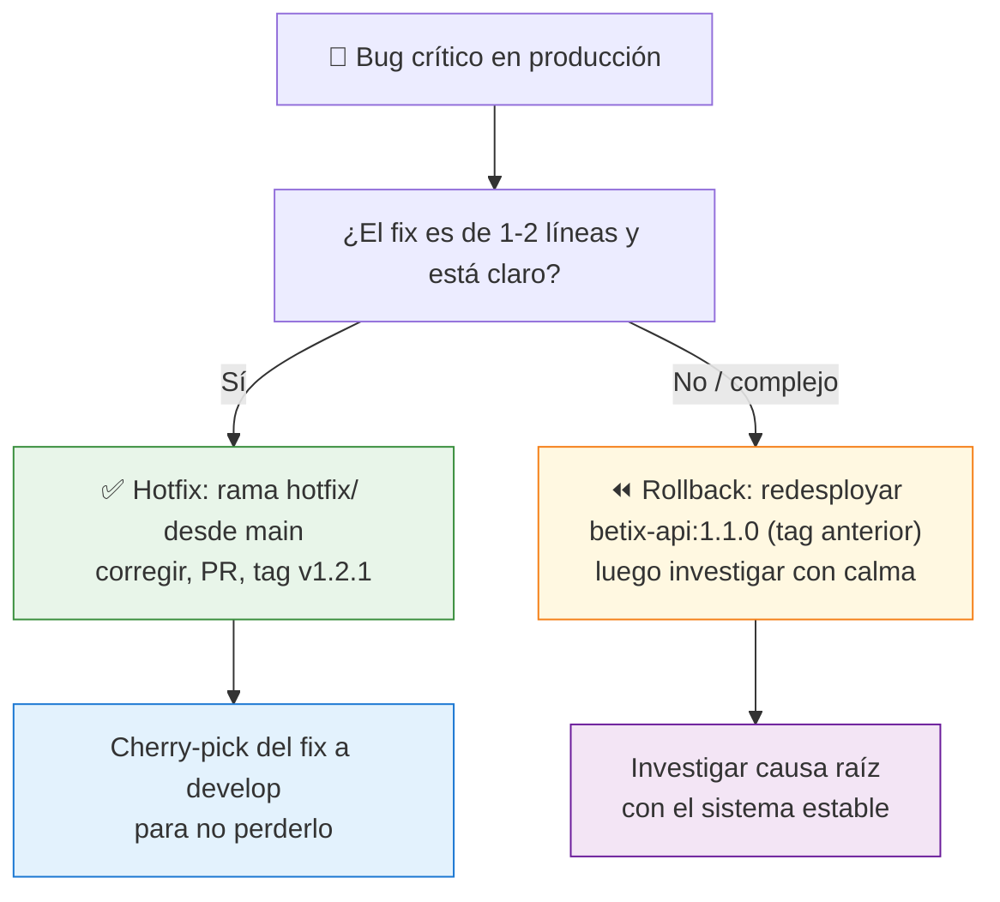
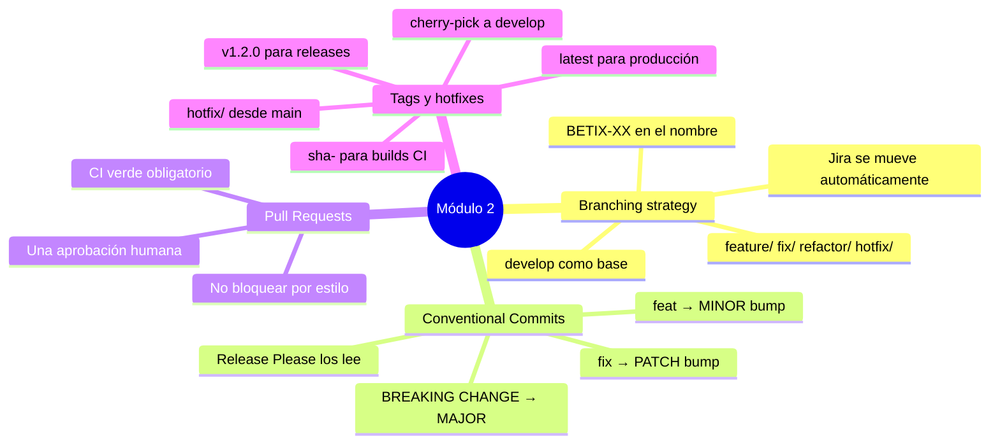

# Módulo 2 — Git como contrato de equipo

← [Volver al temario](../temario.md) | ← [Módulo 1](1.md)

---

## Objetivos de este módulo

Al terminar este módulo vas a poder:
- Entender el flujo de branches de Betix y por qué está diseñado así
- Crear ramas con el nombre correcto y vincularlas a tickets de Jira
- Escribir commits que Release Please entienda para generar versiones automáticas
- Abrir Pull Requests que sean revisables y no bloqueen el flujo del equipo
- Aplicar hotfixes sobre versiones en producción sin romper el historial

---

## 1. ¿Por qué Git es un contrato, no una herramienta?

Git no es solo "donde guardás código". En Betix, Git es la fuente de verdad de **qué cambió, cuándo, por qué y quién lo autorizó**.

Cuando el nombre de una rama incluye `BETIX-42`, Jira mueve el ticket a *In Progress* automáticamente. Cuando el mensaje del commit empieza con `feat:`, Release Please sabe que debe bumpar el minor. Cuando el PR llega a `develop`, el CI verifica que nada se rompió. Todo esto funciona **solo si el equipo respeta las convenciones**.



> **Cada convención tiene una razón**. No son reglas arbitrarias — cada una dispara una automatización que le ahorra trabajo al equipo.

---

## 2. La estrategia de branches de Betix

Betix usa una versión simplificada de **Git Flow**: dos ramas permanentes y ramas de corta vida por tarea.



### Las dos ramas permanentes



### Regla de oro

> `main` solo recibe merges de `develop`. **Nunca** se pushea directamente a `main`.

La única excepción es un fix urgente en producción. En ese caso el flujo es:

1. Crear `hotfix/BETIX-XX-...` **desde `main`** (no desde `develop`)
2. Aplicar el fix mínimo y abrí PR contra `main`
3. Una vez mergeado y taggeado, **cherry-pick** del fix a `develop` para que no se pierda

> El hotfix sale de `main` porque `develop` puede tener cambios no validados que no querés llevar a producción. Ver el flujo completo con ejemplos en la [sección 6 de este módulo](#6-versionado-con-tags--hotfixes-en-versiones-en-producción).

---

## 3. Anatomía de un nombre de rama

```
feature / BETIX-42 / nueva-visualizacion-sunburst
   │           │                │
   │           │                └── descripción corta en kebab-case
   │           │                    (qué hace, no cómo lo hace)
   │           │
   │           └── ID del ticket en Jira
   │               (dispara la automatización Jira ↔ GitHub)
   │
   └── prefijo que define el tipo de cambio
       (define el tono del commit message y el tipo de bump)
```

| Prefijo | Cuándo usarlo | Bump de versión asociado |
|---------|--------------|--------------------------|
| `feature/` | Nueva funcionalidad | `feat:` → minor bump |
| `fix/` | Corrección de bug | `fix:` → patch bump |
| `refactor/` | Reestructuración sin cambio de comportamiento | `refactor:` → sin bump |
| `hotfix/` | Fix urgente directamente sobre producción | `fix:` → patch bump en main |

**Ejemplos válidos:**
```bash
feature/BETIX-42-dashboard-sunburst
fix/BETIX-17-redis-timeout-null-pointer
refactor/BETIX-33-extraer-servicio-geodata
hotfix/BETIX-55-fix-division-por-cero-sma
```

**Ejemplos inválidos:**
```bash
mi-rama              # sin prefijo ni Jira ID — no dispara automatizaciones
feature/nueva-cosa   # sin Jira ID — el ticket no se mueve en Jira
BETIX-42             # sin prefijo — ambiguo, CI no puede inferir el tipo
```

### Flujo completo desde cero

```bash
# 1. Siempre partir desde develop actualizado
git checkout develop
git pull origin develop

# 2. Crear la rama con el nombre correcto
git checkout -b feature/BETIX-42-dashboard-sunburst

# 3. Trabajar, commitear (ver siguiente sección)
# ...

# 4. Push y abrir PR
git push origin feature/BETIX-42-dashboard-sunburst
# → En GitHub: abrir PR contra develop
```

---

## 4. Conventional Commits — el mensaje que trabaja por vos

El mensaje de un commit no es solo documentación. En Betix, **Release Please lee los mensajes para decidir qué versión asignar y qué entra en el CHANGELOG**.

### El formato

```
<tipo>[alcance opcional]: <descripción en imperativo>

[cuerpo opcional — explicar el "por qué", no el "qué"]

[footer opcional — BREAKING CHANGE o refs a issues]
```

### Los tipos y su impacto



### Ejemplos reales del proyecto

```bash
# Nueva funcionalidad — bumpa MINOR
feat(core): add /ranking endpoint with top 5 provinces by revenue

# Corrección — bumpa PATCH
fix(api): handle null redis response in geodata cache

# Refactor — sin bump, aparece en CHANGELOG
refactor(core): extract SMA calculation to services/sma.py

# Documentación — sin bump
docs: add C4 architecture diagrams to docs/

# Tests — sin bump (pero IMPORTANTE para CI)
test(core): add pytest for SMA edge cases with single data point

# Breaking change — bumpa MAJOR
feat(api)!: rename /datos/geodata response field ventas → tickets_totales

BREAKING CHANGE: el campo 'ventas' en la respuesta de /api/datos/geodata
fue renombrado a 'tickets_totales' para consistencia con el schema de DB.
Actualizar cualquier cliente que dependa de ese campo.
```

> **Tip:** Si no sabés qué tipo usar, preguntale a Claude: _"Este cambio que hice en `core/services/sma.py` es un fix o un refactor? Te paso el diff..."_

### ¿Por qué el mensaje importa tanto?



---

## 5. Pull Requests — qué revisar, qué no bloquear

Un Pull Request en Betix no es solo un trámite. Es el momento donde el equipo verifica que el cambio es correcto y seguro antes de integrarlo.

### Checklist del autor (antes de abrir el PR)

```
[ ] La rama sale de develop actualizado (git pull origin develop)
[ ] El nombre de la rama tiene prefijo + BETIX-XX + descripción
[ ] Todos los commits tienen formato Conventional Commits
[ ] make test pasa en local (o al menos make test-core / make test-api según qué tocaste)
[ ] make lint sin errores
[ ] No hay console.log en código JS de producción
[ ] No hay lógica de negocio en src/ (solo en core/)
[ ] Si agregaste un endpoint: está documentado en README.md
```

### Qué revisar como reviewer



### Qué NO bloquear

- **Estilo personal** en comentarios o nombres de variables que no violan las convenciones documentadas
- **Optimizaciones prematuras** — si el código es correcto y tiene tests, mergear. Refactorear después con su propio ticket
- **Casos edge hipotéticos** — si no hay un test que lo demuestre como bug, no es bloqueante

> **Regla:** un PR con CI verde + tests que cubren el cambio + al menos una aprobación humana → se mergea. No existe el PR "perfecto".

---

## 6. Versionado con tags — hotfixes en versiones en producción

Este es el caso más delicado del ciclo de vida: tenés **v1.2.0 en producción**, el equipo ya avanzó a `develop` con cambios para v1.3.0, y aparece un bug crítico en prod.

### Los tags de versión en ECR



### Escenario: hotfix sobre versión en producción

Situación: `main` está en `v1.2.0`. El equipo tiene 5 commits en `develop` para v1.3.0. Aparece un bug crítico en v1.2.0.

**¿Qué NO hacer?**  Mergear `develop` a `main` — estarías llevando a producción 5 cambios no validados solo para poder deployar el fix.

**El flujo correcto:**



**Paso a paso:**

```bash
# 1. Partir desde el tag de producción (no desde develop)
git checkout main
git pull origin main
git checkout -b hotfix/BETIX-55-fix-division-cero

# 2. Aplicar el fix mínimo necesario
# ... editar solo lo necesario ...
git add core/services/sma.py core/tests/test_sma.py
git commit -m "fix(core): avoid division by zero in SMA with single data point"

# 3. PR a main (no a develop)
git push origin hotfix/BETIX-55-fix-division-cero
# → Abrir PR contra main en GitHub

# 4. Una vez mergeado y taggeado como v1.2.1,
#    llevar el fix a develop para que no se pierda
git checkout develop
git cherry-pick <hash-del-fix-commit>
git push origin develop
```

### ¿Cuándo hacer rollback en lugar de hotfix?



> **Regla:** si no podés corregir y testear el fix en menos de una hora, hacé rollback primero. Los tags de ECR hacen que eso sea trivial: `kubectl set image deployment/betix-api api=betix-api:1.1.0`.

---

## 7. Ejercicio — Crear una rama y escribir el commit con Claude

En este ejercicio vas a simular el inicio de una tarea real en Betix.

### Contexto del ticket ficticio

> **BETIX-99:** Como analista, quiero que el endpoint `/healthz` incluya la versión del servicio en la respuesta, para poder verificar qué imagen está corriendo sin acceder a los logs.

### Paso 1: Crear la rama correctamente

```bash
git checkout develop
git pull origin develop
git checkout -b feature/BETIX-99-healthz-version-info
```

### Paso 2: Hacer el cambio mínimo

El endpoint `/healthz` está en `core/main.py`. Abrí el archivo y localizá la función que responde ese endpoint.

```bash
# En lugar de buscar manualmente, preguntale a Claude:
```

Prompt para Claude:

```
Estoy implementando el ticket BETIX-99: agregar la versión del servicio
a la respuesta del endpoint /healthz en core/main.py.

1. Encontrá la función que maneja ese endpoint
2. Mostrarne cómo leer el contenido del archivo core/VERSION
3. Sugerí la mínima modificación para incluir {"status": "ok", "version": "1.2.0"}
   sin romper los tests existentes
```

### Paso 3: Escribir el commit message con ayuda de Claude

Una vez que hiciste el cambio:

```bash
git diff core/main.py
```

Prompt para Claude:

```
Hice el siguiente cambio en core/main.py (te paso el diff).
Necesito escribir un Conventional Commit message para este cambio
en el proyecto Betix. Recordá que:
- feat: bumpa MINOR
- fix: bumpa PATCH
- Los mensajes van en inglés
- Formato: tipo(scope): descripción en imperativo

¿Cuál sería el mensaje correcto y por qué?
```

### Paso 4: Commitear y pushear

```bash
git add core/main.py
git commit -m "feat(core): include service version in /healthz response"

git push origin feature/BETIX-99-healthz-version-info
# → Abrir PR contra develop en GitHub
```

### Paso 5: Reflexión

Respondé estas preguntas antes de continuar:

1. Si este cambio llega a `main`, ¿qué tag de versión se va a generar para `betix-core`? ¿Por qué?
2. ¿Debería correr `ci-core.yml` o `ci-api.yml` para este cambio?
3. Si mañana aparece un bug en prod en `betix-core:1.2.0` mientras `develop` ya tiene 3 commits nuevos, ¿cómo lo corregís?

> **Verificá tus respuestas con Claude:** _"Revisá si mi razonamiento sobre el versionado y el hotfix es correcto..."_

---

## Resumen



---

## Recursos del repositorio

| Recurso | Descripción |
|---------|-------------|
| [`CLAUDE.md — Git/Branching`](../../../CLAUDE.md#git--branching) | Reglas de branching del proyecto |
| [`docs/monorepo-guide.md`](../../monorepo-guide.md) | Versionado independiente por servicio y convención de tags ECR |
| [`docs/SDLC.md`](../../SDLC.md) | Ciclo de vida completo del desarrollo |
| [`.github/workflows/`](../../../.github/workflows/) | Los dos workflows de CI y sus path filters |
| [`CHANGELOG.md`](../../../CHANGELOG.md) | Historial generado automáticamente por Release Please |

---

← [Módulo 1](1.md) | **Siguiente módulo →** [Módulo 3 — Claude Code como herramienta de SDLC](3.md)
