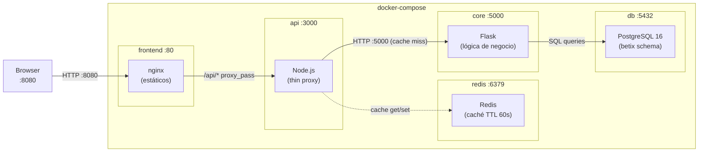
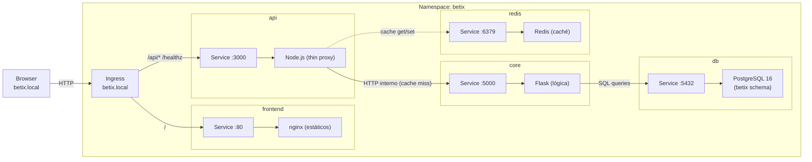
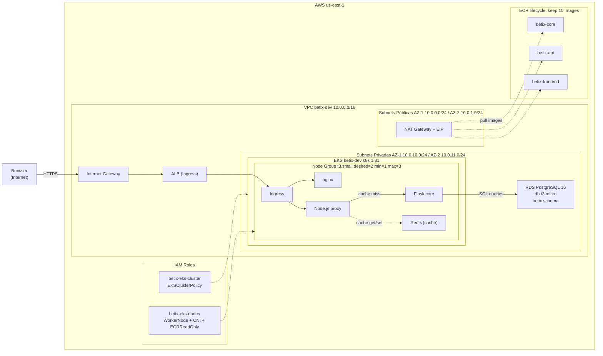

# Diagramas de Infraestructura — Betix

Diagramas expresados en **Mermaid**, versionados junto al código. Se renderizan automáticamente en GitHub.

---

## Local — docker-compose

Representa los contenedores corriendo en la máquina del developer: **nginx** sirve los estáticos y proxea `/api/*` hacia el **API Node.js**, que delega la lógica al **core Flask**. Redis actúa como caché entre el proxy y el core. PostgreSQL persiste los datos del schema `betix`.

---

## Kubernetes — minikube

El mismo stack desplegado en un cluster Kubernetes local. Un **Ingress** enruta el tráfico por path hacia los **Services**, cada uno respaldado por un **Deployment** independiente dentro del namespace `betix`.

---

## AWS — EKS + ECR + RDS + VPC

Despliegue productivo en AWS: **VPC** con subnets públicas (ALB + NAT Gateway) y privadas (EKS + RDS). Las imágenes se almacenan en tres repositorios **ECR** independientes con política de retención de las últimas 10 versiones.

