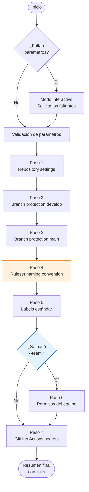

# Manual del Administrador — `init-repo.sh`

Este manual te guía paso a paso para ejecutar `scripts/init-repo.sh`. Antes de correr el script, reuní toda la información de la siguiente checklist. El script tiene modo interactivo — si no pasás todos los flags, te los va a preguntar en la terminal — pero es mejor tener los datos a mano antes de empezar.

---

## Checklist de datos a reunir

### Datos de GitHub

| Dato | Dónde obtenerlo | Ejemplo |
|------|----------------|---------|
| **Nombre del repo** (`owner/repo`) | URL del repo en GitHub | `Neurus1970/betix` |
| **Personal Access Token** | GitHub → Settings → Developer settings → Personal access tokens | `ghp_xxxxxxxxxxxx` |
| **Slug del equipo** *(opcional)* | `github.com/orgs/TU_ORG/teams` | `backend-team` |
| **Nombres de los jobs de CI** | `.github/workflows/*.yml` → claves bajo `jobs:` | `test-core,lint-and-test` |

> **Scopes requeridos del PAT:**
> - `repo` — siempre requerido
> - `admin:org` — solo si se usa `--team`

> **Cómo encontrar los job names:** abrí cualquier archivo en `.github/workflows/` y buscá las claves de primer nivel dentro de `jobs:`. Cada clave es el nombre del check. Ejemplo:
> ```yaml
> jobs:
>   test-core:      ← este es el nombre
>     runs-on: ...
>   lint-and-test:  ← y este
> ```

### Datos de Jira

| Dato | Dónde obtenerlo | Ejemplo |
|------|----------------|---------|
| **URL base de Jira** | Barra de direcciones al abrir Jira | `https://mi-org.atlassian.net` |
| **Clave del proyecto** | Jira → el proyecto → ver el prefijo de los tickets | `BETIX` |
| **Email del admin Jira** | Email con el que entrás a Jira | `admin@mi-empresa.com` |
| **API Token de Jira** | `id.atlassian.com/manage-profile/security/api-tokens` | `ATATT3xFf...` |

### Secrets de GitHub Actions

Estos valores se cargan durante el Paso 7 del script. El script los pide de forma interactiva — los caracteres **no se muestran en pantalla** mientras escribís.

| Secret | Para qué lo usan los workflows | Cómo obtenerlo |
|--------|-------------------------------|----------------|
| `JIRA_USER_EMAIL` | Autenticación básica en la Jira API | El mismo email del admin Jira |
| `JIRA_API_TOKEN` | Autenticación básica en la Jira API | Ver fila Jira arriba |
| `ANTHROPIC_API_KEY` | Workflow de AI PR review (`ai-pr-review.yml`) | `console.anthropic.com` → API Keys |
| `SONAR_TOKEN` | Análisis de calidad con SonarCloud (`build.yml`) | `sonarcloud.io` → Account → Security |
| `AWS_ACCESS_KEY_ID` | Push de imágenes a ECR, deploy en EKS | AWS IAM → Users → Security credentials |
| `AWS_SECRET_ACCESS_KEY` | Ídem | Ídem — solo visible al crear la clave |

> `JIRA_BASE_URL` **no** se pide en los secrets: se toma automáticamente del parámetro `--jira-url` que ya pasaste.

> Podés omitir cualquier secret presionando Enter. El script lo saltea sin error. Podés configurarlos después en `github.com/ORG/REPO/settings/secrets/actions`.

---

## Prerrequisitos en tu máquina

```bash
# 1. Instalar gh CLI
brew install gh          # macOS
sudo apt install gh      # Linux

# 2. Autenticarte
gh auth login

# 3. Verificar
gh auth status
```

Si vas a correr el script en CI/CD o sin interacción, podés pasar el token como flag:

```bash
./scripts/init-repo.sh --github-token ghp_xxx ...
```

---

## Referencia de parámetros

### Requeridos

| Parámetro | Qué es | Ejemplo |
|-----------|--------|---------|
| `--repo` | Repositorio destino en formato `owner/repo` | `--repo Neurus1970/betix` |
| `--jira-project` | Clave del proyecto Jira. Se usa para construir el patrón de nombres de rama: `feature/BETIX-XX-desc` | `--jira-project BETIX` |
| `--jira-url` | URL base de Jira, sin barra final | `--jira-url https://mi-org.atlassian.net` |
| `--ci-checks` | Job names de CI separados por coma. Deben coincidir **exactamente** con las claves bajo `jobs:` en los workflows | `--ci-checks test-core,lint-and-test` |

### Opcionales

| Parámetro | Qué es | Default |
|-----------|--------|---------|
| `--github-token` | PAT de GitHub. Si no se pasa, usa la sesión activa del `gh` CLI | *(sesión activa)* |
| `--develop-branch` | Nombre de la rama de integración | `develop` |
| `--main-branch` | Nombre de la rama de producción | `main` |
| `--required-approvals` | Cuántos approvals se necesitan para mergear a `main` | `1` |
| `--enforce-admins` | `true` = las reglas aplican también a admins. `false` = admins pueden hacer bypass | `false` |
| `--team` | Slug del equipo de GitHub al que se le da permiso `push`. Solo funciona en repos de organizaciones | *(sin equipo)* |

---

## Flujo del script paso a paso



### Paso 1 — Repository settings

Configura las opciones generales del repo una sola vez:

- Squash merge y rebase habilitados, merge commit deshabilitado → historial limpio
- Delete branch on merge → las ramas se borran solas al mergear el PR
- Projects deshabilitado → el tracking se hace en Jira

### Paso 2 — Branch protection: `develop`

- PR obligatorio para todo cambio (nadie pushea directo)
- 0 approvals — el PR es obligatorio como proceso, no como bloqueo
- CI requerido: los checks de `--ci-checks` deben estar en verde
- No force push, no delete, conversations deben estar resueltas

### Paso 3 — Branch protection: `main`

Todo lo del Paso 2 más:

- N approvals requeridos (configurable con `--required-approvals`)
- Dismiss stale reviews: si el PR recibe nuevos commits después de un approval, el approval se invalida

### Paso 4 — Ruleset de naming convention

Valida el nombre de cada rama antes de que se pueda pushear. El patrón generado es:

```
^(feature|fix|refactor|hotfix)/BETIX-[0-9]+-[a-zA-Z0-9-]+$
```

| Rama | Resultado |
|------|-----------|
| `feature/BETIX-41-nueva-feature` | ✅ válido |
| `fix/BETIX-12-corregir-bug` | ✅ válido |
| `hotfix/BETIX-99-prod-fix` | ✅ válido |
| `feat/mi-cambio` | ❌ prefijo inválido |
| `feature/nueva-feature` | ❌ falta ID de Jira |

> Este paso requiere **GitHub Team o Enterprise**. En GitHub Free emite un `[WARN]` con el patrón para configurarlo manualmente, pero no falla el script.

### Paso 5 — Labels estándar

Elimina los labels default de GitHub y crea el set de la plataforma:

| Label | Color |
|-------|-------|
| `feature` | azul |
| `fix` | rojo |
| `hotfix` | rojo oscuro |
| `refactor` | amarillo |
| `dependencies` | azul oscuro |
| `documentation` | gris |
| `infrastructure` | rosa |

### Paso 6 — Permisos de equipo *(solo si se pasó `--team`)*

Otorga permiso `push` al equipo sobre el repo. Si el repo es de un usuario personal (no org), este paso falla — es esperado.

### Paso 7 — GitHub Actions secrets

El script solicita los valores de los secrets de forma interactiva. **Los caracteres no se muestran mientras escribís** (como una contraseña). Presioná Enter para omitir cualquiera.

```
==> Paso 7: GitHub Actions secrets

── Secrets de GitHub Actions ──────────────────────────────────
Los valores se guardan como repository secrets en GitHub Actions.
Presioná Enter en cualquier campo para omitirlo.

JIRA_USER_EMAIL  (email del admin Jira) (oculto — Enter para omitir): ████████
JIRA_API_TOKEN   (token de Atlassian) (oculto — Enter para omitir): ████████
ANTHROPIC_API_KEY (para AI PR review) (oculto — Enter para omitir): ████████
SONAR_TOKEN      (para SonarCloud) (oculto — Enter para omitir):
AWS_ACCESS_KEY_ID (oculto — Enter para omitir): ████████
AWS_SECRET_ACCESS_KEY (oculto — Enter para omitir): ████████

[OK]   Secret 'JIRA_BASE_URL' configurado
[OK]   Secret 'JIRA_USER_EMAIL' configurado
[OK]   Secret 'JIRA_API_TOKEN' configurado
[OK]   Secret 'ANTHROPIC_API_KEY' configurado
[SKIP]  'SONAR_TOKEN' omitido (sin valor)
[OK]   Secret 'AWS_ACCESS_KEY_ID' configurado
[OK]   Secret 'AWS_SECRET_ACCESS_KEY' configurado
```

---

## Ejemplo de ejecución completa

```bash
./scripts/init-repo.sh \
  --repo Neurus1970/betix \
  --github-token ghp_xxxxxxxxxxxxxxxxxxxx \
  --jira-project BETIX \
  --jira-url https://cristian-f-medrano.atlassian.net \
  --ci-checks test-core,lint-and-test \
  --required-approvals 1 \
  --enforce-admins false
```

El script arranca y en el Paso 7 te va a pedir los secrets de forma interactiva.

---

## Verificación post-ejecución

Después de correr el script, verificar:

1. **Branch protection** — `github.com/ORG/REPO/settings/branches`
   - `develop` y `main` deben aparecer con candado

2. **Ruleset** *(GitHub Team/Enterprise)* — `github.com/ORG/REPO/settings/rules`
   - El ruleset `branch-naming-convention` debe estar activo

3. **Labels** — `github.com/ORG/REPO/labels`
   - Los labels de la plataforma deben estar presentes

4. **Secrets** — `github.com/ORG/REPO/settings/secrets/actions`
   - Los secrets configurados deben aparecer en la lista (los valores nunca son visibles)

5. **Ramas iniciales** — si el repo está vacío, crear `develop` y `main` antes de que la protección tenga efecto:

```bash
git checkout -b develop
git push origin develop
git checkout -b main
git push origin main
```

6. **Default branch** — GitHub → Settings → General → Default branch → cambiar a `develop`

---

## Troubleshooting

| Error | Causa | Solución |
|-------|-------|----------|
| `gh CLI no está autenticado` | No hay sesión activa | `gh auth login` o pasar `--github-token` |
| `Branch not found` | La rama no existe en el repo | Crear y pushear las ramas antes de correr el script |
| HTTP 403 `Must have admin rights` | Token sin permisos suficientes | Verificar que el token tiene scope `repo` y que el usuario es admin del repo |
| HTTP 422 en branch protection | Los job names en `--ci-checks` no coinciden con los workflows | Abrir `.github/workflows/*.yml` y verificar el nombre exacto bajo `jobs:` |
| `[WARN]` en Paso 4 (Ruleset) | Plan GitHub Free no soporta rulesets | Es esperado. Configurar manualmente cuando el plan lo permita |
| HTTP 404 en Paso 6 (equipo) | El repo es de un usuario personal, no de una org | No usar `--team` en repos personales |
| Secret `[WARN]` en Paso 7 | El token no tiene permiso para escribir secrets | Verificar que el token tiene scope `repo` (incluye secrets) |
