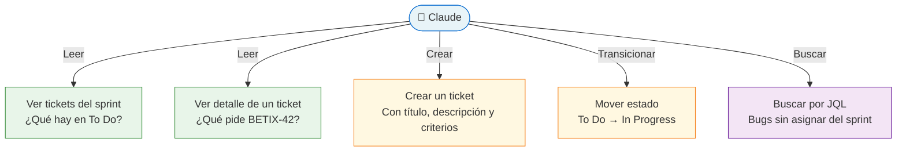
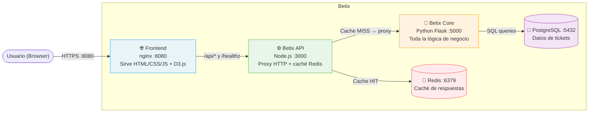
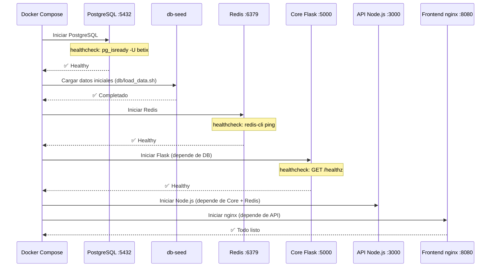
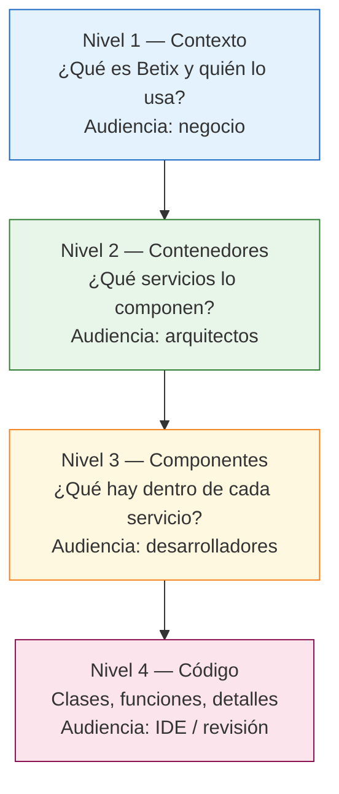
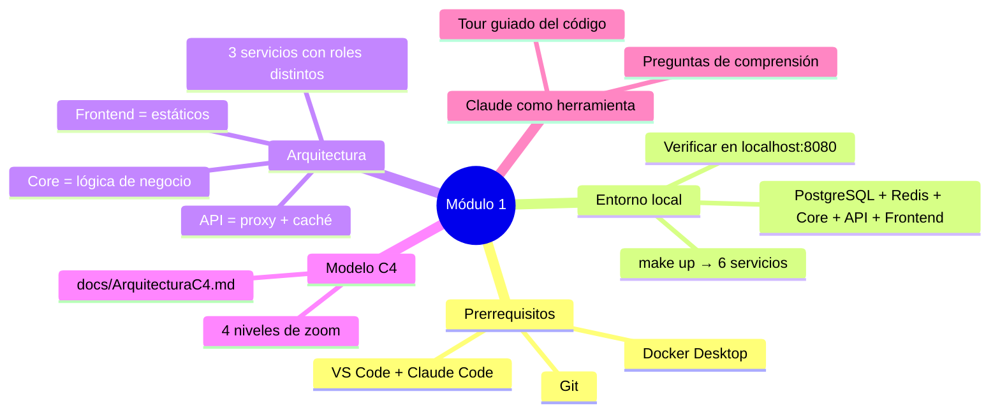

# El entorno local estandarizado

← [Volver al temario](../TOC.md)

---

## Objetivos de este módulo

Al terminar este módulo vas a poder:
- Levantar Betix (el proyecto de referencia de la plataforma) en tu máquina en menos de 10 minutos
- Entender cómo la plataforma organiza un proyecto de múltiples servicios
- Navegar el repositorio con criterio, sabiendo dónde vive cada tipo de código
- Usar Claude para explorar código que no conocés
- Tener Claude conectado a Jira para consultar y crear tickets desde la conversación

---

## 1. Prerrequisitos

Antes de clonar el repositorio, verificá que tenés instaladas las siguientes herramientas. Abrí una terminal y ejecutá cada comando de verificación:

| Herramienta | Versión mínima | Verificar con | Por qué la necesitás |
|-------------|---------------|---------------|----------------------|
| **Git** | 2.x | `git --version` | Control de versiones y branching |
| **Docker Desktop** | 24.x | `docker --version` | Correr los servicios en contenedores |
| **Docker Compose** | 2.x | `docker compose version` | Orquestar los 3 servicios juntos |
| **VS Code** | 1.85+ | `code --version` | Editor con integración nativa de Claude |
| **Claude Code** (extensión) | última | Ver extensiones en VS Code | Copiloto IA integrado al flujo de trabajo |
| **uv** | 0.4+ | `uv --version` | Ejecutar el servidor MCP de Jira (`uvx mcp-atlassian`) |

> **Tip:** Si Docker Desktop está instalado, Docker Compose v2 viene incluido. No necesitás instalarlo por separado.

> **Instalar uv:** `curl -LsSf https://astral.sh/uv/install.sh | sh` (macOS/Linux) o `winget install astral-sh.uv` (Windows)

### Instalar Claude Code en VS Code

1. Abrí VS Code
2. `Ctrl+Shift+X` → buscar **"Claude Code"**
3. Instalar la extensión de Anthropic
4. Autenticarte con tu cuenta de Anthropic cuando se pida

### Configurar el servidor MCP de Jira

**¿Qué es un servidor MCP?** Model Context Protocol (MCP) permite que Claude se conecte a sistemas externos. Con el servidor de Jira, Claude puede consultar tickets, leer el sprint activo, crear issues, y transicionar estados — directamente desde la conversación, sin abrir el navegador.

Al clonar el repositorio, ya recibís la configuración del servidor en [`.mcp.json`](../../../.mcp.json). Este archivo define qué servidor MCP usar y la URL del proyecto Jira del equipo. Solo necesitás configurar tus credenciales personales (no se commitean):

**Paso 1 — Obtener tu API token de Jira:**

1. Ir a [id.atlassian.com/manage-profile/security/api-tokens](https://id.atlassian.com/manage-profile/security/api-tokens)
2. Crear un nuevo token → copiarlo

**Paso 2 — Configurar las credenciales en tu entorno local:**

Abrí `.claude/settings.local.json` (ya existe en el proyecto, está en `.gitignore` — nunca se commitea) y agregá el bloque `mcpServers` con tus datos:

```json
{
  "permissions": {
    "allow": ["Bash(git pull:*)"]
  },
  "mcpServers": {
    "jira": {
      "command": "uvx",
      "args": ["mcp-atlassian"],
      "env": {
        "JIRA_URL": "https://cristian-f-medrano.atlassian.net",
        "JIRA_USERNAME": "<tu-email@dominio.com>",
        "JIRA_API_TOKEN": "<tu-token>"
      }
    }
  }
}
```

Reiniciá VS Code para que Claude Code tome la nueva configuración.

**Verificar que funciona:**

Abrí Claude Code y escribí:

```
¿Cuáles son los tickets del sprint activo en el proyecto BETIX?
```

Si el servidor MCP está correctamente configurado, Claude va a responder con los tickets reales de Jira.

**Qué puede hacer Claude con acceso a Jira:**



> **Nota de seguridad:** `JIRA_USERNAME` y `JIRA_API_TOKEN` son credenciales personales. Nunca las commitees al repositorio ni las agregues a `.mcp.json`. Vivirán siempre en tu entorno local.

---

## 2. Clonar el repositorio

```bash
# Clonar Betix
git clone https://github.com/tu-org/betix.git
cd betix

# Verificar que estás en la rama develop (la rama principal de trabajo)
git branch
# * develop
```

> **Importante:** La rama principal de trabajo es `develop`, no `main`. `main` solo recibe merges de releases. Ver [docs/SDLC.md — Branching](../../SDLC.md#2-branching--git-flow-simplificado).

### Estructura que acabás de clonar

```
betix/
├── src/           → Node.js 18 + Express   (puerto 3000) — proxy HTTP
├── core/          → Python 3.12 + Flask    (puerto 5000) — lógica de negocio
├── frontend/      → nginx 1.27 Alpine      (puerto 8080) — interfaz de usuario
├── db/
│   └── seeds/     → CSVs con datos (provincias, juegos, tickets) — fuente única de verdad
├── tests/         → Jest + Cucumber        (tests Node.js)
│   └── fixtures/  → csvLoader.js (lee db/seeds/ para los tests)
├── features/      → Escenarios BDD         (Cucumber .feature)
├── docs/          → Documentación técnica
├── k8s/           → Manifests Kubernetes
├── terraform/     → Infraestructura AWS
├── Makefile       → Interfaz unificada de comandos
└── CLAUDE.md      → Convenciones del proyecto (leerlo PRIMERO)
```

> **Regla de oro:** antes de tocar cualquier archivo, leé [`CLAUDE.md`](../../../CLAUDE.md). Ahí están las convenciones de código, las reglas de branching y los comandos esenciales.

---

## 3. Los tres servicios: ¿qué hace cada uno?

La plataforma no impone una arquitectura única. Soporta desde proyectos monolíticos hasta sistemas de múltiples servicios desplegados en Kubernetes. Betix implementa una **arquitectura de microservicios** — tres procesos independientes que se comunican entre sí — para demostrar cómo la plataforma maneja esa complejidad: entornos locales con Docker Compose, CI por servicio con path filters, versiones semánticas independientes.

Entender la separación de servicios de Betix es clave antes de correr cualquier comando.



### ¿Por qué esta separación?

| Servicio | Responsabilidad | Lenguaje elegido porque... |
|----------|----------------|---------------------------|
| **Frontend** (nginx) | Servir estáticos, proxy reverso | nginx es el estándar para servir assets y hacer reverse proxy con mínimo overhead |
| **API** (Node.js) | Proxy HTTP, caché Redis | Node.js es liviano para I/O intensivo; el caché evita recalcular proyecciones en cada request |
| **Core** (Python/Flask) | Lógica de negocio, cálculos estadísticos | Python tiene el ecosistema ideal para cálculos matemáticos (numpy, pandas) |

> **Convención de Betix:** En este proyecto, la lógica de negocio **solo vive en `core/`**. Node.js actúa únicamente como proxy HTTP y caché. Esta es una decisión de arquitectura de Betix — no una regla universal de la plataforma — y está documentada en [CLAUDE.md — Critical](../../../CLAUDE.md#critical).

---

## 4. Levantar el entorno local

### El flujo de arranque

Antes de ejecutar `make up`, es útil entender el **orden en que los servicios se inician**. Docker Compose respeta las dependencias definidas en [`docker-compose.yml`](../../../docker-compose.yml):



### Ejecutar

```bash
# Desde la raíz del proyecto
make up
```

Esto ejecuta `docker-compose up --build` — buildea las imágenes y levanta los 6 servicios.

**Output esperado en la terminal:**

```
 ✔ Network betix_default         Created
 ✔ Container betix-db-1          Healthy
 ✔ Container betix-db-seed-1     Exited (0)    ← seed completado, normal
 ✔ Container betix-redis-1       Healthy
 ✔ Container betix-core-1        Healthy
 ✔ Container betix-api-1         Started
 ✔ Container betix-frontend-1    Started
```

> El contenedor `betix-db-seed-1` con `Exited (0)` es **normal**: terminó su trabajo (cargar los datos) y salió correctamente.

### Verificar que todo funciona

Abrí estas URLs en el navegador:

| URL | Qué vas a ver |
|-----|--------------|
| `http://localhost:8080` | Dashboard con gráficos D3.js |
| `http://localhost:8080/api/healthz` | `{"status":"ok"}` |
| `http://localhost:3000/healthz` | `{"status":"ok"}` (directo al API) |

---

## 5. Anatomía del proyecto en detalle

### La capa `core/` — El cerebro

```
core/
├── main.py             → Entry point Flask, define todos los endpoints
├── db.py               → Conexión PostgreSQL (pool de conexiones)
├── services/           → Lógica de negocio (cálculos, queries)
├── tests/              → Tests unitarios con pytest
├── Dockerfile          → Imagen Python 3.12
└── VERSION             → Versión semántica independiente (ej: 1.3.0)
```

Los endpoints disponibles:

| Endpoint | Descripción |
|----------|-------------|
| `GET /healthz` | Estado del servicio y conectividad DB |
| `GET /geodata` | Métricas por provincia con coordenadas |
| `GET /proyectado` | Proyecciones con media móvil simple (SMA) |

### La capa `src/` — El proxy

```
src/
├── app.js              → Entry point Express
├── routes/             → Definición de rutas proxy
├── controllers/        → Lógica de proxy y caché Redis
├── middleware/         → Logging (Winston), error handling
├── public/             → Frontend assets: HTML, CSS, D3.js
└── VERSION             → Versión semántica independiente (ej: 1.3.0)
```

> **Fuente única de datos:** Todos los datos (provincias, juegos, tickets) viven en `db/seeds/` como CSVs. PostgreSQL los carga al iniciar. Los tests los leen desde `tests/fixtures/csvLoader.js`. Para agregar una nueva provincia o juego, editá solo el CSV correspondiente.

### El Makefile — Tu interfaz de comandos

El [Makefile](../../../Makefile) es la interfaz unificada para todas las operaciones. En lugar de recordar comandos largos de Docker, npm o pytest, usás un vocabulario simple:

```bash
make help         # Ver todos los comandos disponibles
make up           # Levantar el entorno local
make down         # Bajar todos los servicios
make logs         # Ver logs en tiempo real
make test         # Correr TODOS los tests (pytest + Jest + Cucumber)
make test-core    # Solo tests Python
make test-api     # Solo Jest + Cucumber
make lint         # ESLint sobre código Node.js
make version      # Ver versiones actuales de los 3 servicios
```

---

## 6. El modelo de arquitectura C4

Betix documenta su arquitectura usando el **modelo C4** — cuatro niveles de zoom progresivo, como un mapa. Los diagramas están en [`docs/ArquitecturaC4.md`](../../ArquitecturaC4.md) y se renderizan automáticamente en GitHub.



Para leer los diagramas de Betix: [`docs/ArquitecturaC4.md`](../../ArquitecturaC4.md)

---

## 7. Ejercicio — Explorar la arquitectura con Claude

En lugar de leer el código línea por línea, usá Claude para hacer un tour guiado del proyecto.

### Paso 1: Abrir Claude en VS Code

`Ctrl+Shift+P` → "Claude: Open Chat" (o el ícono de Claude en la barra lateral)

### Paso 2: Pedirle a Claude que explique la arquitectura

Copiá este prompt en el chat:

```
Estoy haciendo onboarding en el proyecto Betix.
Leé el archivo CLAUDE.md y docs/ArquitecturaC4.md,
y explicame con tus palabras:
1. Qué hace cada servicio
2. Cómo fluye un request desde el browser hasta la base de datos
3. Dónde debería agregar código si necesito un nuevo cálculo estadístico
```

### Paso 3: Ir más profundo

Una vez que tenés el panorama general, explorá un endpoint específico:

```
Leé el archivo core/main.py y core/services/.
Explicame cómo está implementado el endpoint /geodata:
cuál es el archivo que lo define, qué servicio llama,
y qué query hace a la base de datos.
```

### Paso 4: Validar tu comprensión

Respondé estas preguntas sin mirar la solución:

1. Si un analista reporta que los datos del mapa están desactualizados, ¿en qué archivo buscarías el bug?
2. ¿Por qué el endpoint `/proyectado` puede ser más lento la primera vez que se llama que las siguientes?
3. Si necesitás agregar un nuevo endpoint `/ranking`, ¿en qué servicio lo creás y en qué carpeta?

> **Respuestas:** Usá Claude para verificar tus respuestas: "¿Estoy en lo correcto si digo que...?"

---

## Resumen



---

## Recursos del repositorio

| Recurso | Descripción |
|---------|-------------|
| [`CLAUDE.md`](../../../CLAUDE.md) | Convenciones, reglas y comandos del proyecto |
| [`README.md`](../../../README.md) | Guía de inicio rápido y endpoints disponibles |
| [`docs/ArquitecturaC4.md`](../../ArquitecturaC4.md) | Diagramas C4 del sistema |
| [`docs/SDLC.md`](../../SDLC.md) | Ciclo de vida completo de desarrollo |
| [`docker-compose.yml`](../../../docker-compose.yml) | Definición de los 6 servicios |
| [`Makefile`](../../../Makefile) | Todos los comandos disponibles |

---

← [Módulo 0](0.md) | [Módulo 2](2.md) →
