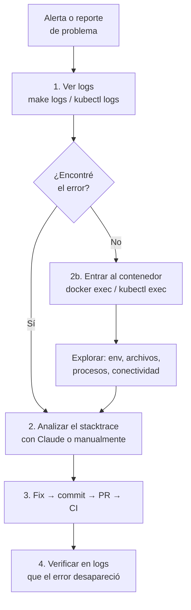
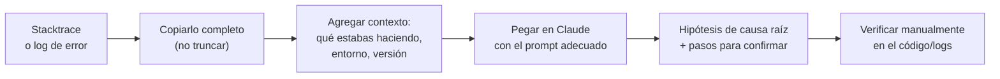
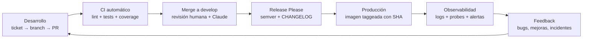

# Operación y observabilidad

### Capítulo 10

← [Volver al temario](../TOC.md)

---

## 1. Introducción: ¿qué es observabilidad?

Hay una diferencia importante entre *monitorear* un sistema y *entenderlo*.

**Monitoring** te dice si algo está mal: el pod está caído, el response time subió, el disco está lleno. Es la alarma.

**Observabilidad** te dice *por qué* algo está mal: qué request disparó el problema, qué componente falló primero, qué datos tenía el sistema en ese momento. Es la capacidad de hacer preguntas arbitrarias sobre el sistema sin tener que instrumentarlo cada vez de nuevo.

La observabilidad se construye sobre tres pilares:

| Pilar | Qué responde | En Betix |
|-------|-------------|----------|
| **Logs** | ¿Qué hizo el sistema, línea a línea? | Winston (Node.js), stderr de Flask |
| **Métricas** | ¿Cómo está el sistema en el tiempo? | Probes de Kubernetes (`/healthz`) |
| **Trazas** | ¿Cómo fluye una request entre componentes? | Correlación manual por `requestId` en logs |

En Betix, la base es **logs**. El principio que rige este capítulo:

> **"Si no está en los logs, no pasó."**

Un error que no deja registro puede reproducirse eternamente sin ser diagnosticado. Un error que sí deja registro puede resolverse en minutos.

---

## 2. Logs estructurados con Winston

### Por qué Winston y no `console.log`

`console.log` produce texto plano. Winston produce **logs estructurados**: cada entrada es un objeto JSON con campos predecibles (`level`, `timestamp`, `message`, metadata). La diferencia importa cuando tenés cientos de líneas por segundo y necesitás filtrar.

```bash
# ❌ console.log — texto plano, difícil de filtrar
Cache MISS — fetching from core

# ✅ Winston — estructura parseable
2026-03-14T18:22:03.147Z info   : Cache MISS [proyectado] — fetching full dataset from core
```

Además, `console.log` no tiene niveles, no tiene transports configurables y no se puede silenciar por entorno. Winston resuelve todo eso.

### La configuración en Betix

El logger vive en [`src/logger.js`](../../../src/logger.js) y se configura con variables de entorno:

```js
const level   = process.env.BETIX_LOG_LEVEL  || 'info';
const output  = process.env.BETIX_LOG_OUTPUT || 'console';
const logFile = process.env.BETIX_LOG_FILE   || 'logs/betix.log';
```

Los transports se activan según `BETIX_LOG_OUTPUT`:

```js
if (output === 'console' || output === 'both') {
  logTransports.push(new transports.Console());
}

if (output === 'file' || output === 'both') {
  logTransports.push(
    new transports.File({ filename: logFile }),
    new transports.File({ filename: logFile.replace('.log', '.error.log'), level: 'error' })
  );
}
```

El formato combina timestamp, colorización en consola y metadata como JSON:

```js
const logger = createLogger({
  level,
  format: format.combine(
    format.timestamp(),
    format.colorize(),
    customFormat         // timestamp + level + message + meta JSON
  ),
  transports: logTransports,
});
```

### Los niveles y cuándo usar cada uno

| Nivel | Cuándo usarlo | Ejemplo en Betix |
|-------|--------------|-----------------|
| `error` | Algo falló y necesita atención | `Redis error: ECONNREFUSED` |
| `warn` | Algo inusual pero no crítico | Timeout que se reintenta |
| `info` | Eventos normales del ciclo de vida | `Betix API corriendo en puerto 3000` |
| `debug` | Detalle útil solo en desarrollo | Payload completo de una request |

En producción, `BETIX_LOG_LEVEL=info` oculta los `debug` automáticamente. No hace falta borrar nada del código — alcanza con cambiar la variable.

### Usar el logger en el código

Cualquier archivo que necesite loggear importa el logger centralizado:

```js
const logger = require('../logger');

// Evento normal
logger.info(`Cache HIT [${CACHE_KEY}]`);

// Error con contexto
logger.error(`getProvinciasJuegos error: ${err.message}`);

// Info con metadata (aparece como JSON adjunto)
logger.info('Request procesada', { ruta: req.path, ms: Date.now() - start });
```

La salida en consola con el formato de Betix:

```
2026-03-14T18:22:03.147Z info   : Cache HIT [proyectado]
2026-03-14T18:22:04.891Z info   : Cache MISS [proyectado] — fetching full dataset from core
2026-03-14T18:22:05.103Z info   : Cache HIT [provincias_juegos]
2026-03-14T18:22:09.442Z error  : Redis error: ECONNREFUSED 127.0.0.1:6379
```

### Leer los logs en local

```bash
# Ver logs de todos los servicios en tiempo real
make logs

# Solo el servicio api
docker compose logs -f api

# Solo el servicio core (Flask)
docker compose logs -f core

# Filtrar por nivel (grep sobre la salida de docker compose)
docker compose logs api | grep error

# Ver las últimas 50 líneas del api
docker compose logs --tail=50 api
```

---

## 3. Debugging en entornos de contenedores

### En local — Docker Compose

El primer comando ante cualquier problema es ver qué dice el contenedor:

```bash
# Ver todos los logs del contenedor api (desde el inicio)
docker compose logs api

# Seguir en tiempo real (Ctrl+C para salir)
docker compose logs -f api

# Ver las últimas 100 líneas de core
docker compose logs --tail=100 core
```

Si los logs no alcanzan, podés **entrar al contenedor** y explorar el sistema de archivos, las variables de entorno, los procesos corriendo:

```bash
# Abrir una shell dentro del contenedor api
docker compose exec api sh

# Una vez adentro, podés:
ls /app/src/           # ver archivos
cat /app/src/config.js # leer un archivo
env | grep BETIX       # ver variables de entorno
ps aux                 # ver procesos corriendo
```

Si el contenedor ya terminó (estado `Exited`) y necesitás ver qué pasó:

```bash
# Ver el ID del contenedor aunque esté detenido
docker compose ps -a

# Ver logs del contenedor detenido
docker compose logs api
```

### En staging / producción — Kubernetes

Los comandos cambian, el concepto es el mismo: logs primero, shell si hace falta.

```bash
# Ver logs del pod api (primero encontrar el nombre)
kubectl get pods -n betix

# Logs del pod
kubectl logs <nombre-del-pod> -n betix

# Seguir en tiempo real
kubectl logs -f <nombre-del-pod> -n betix

# Si el pod tiene varios contenedores, especificar cuál
kubectl logs <nombre-del-pod> -c api -n betix

# Ver logs del pod anterior (útil si el pod crasheó y se reinició)
kubectl logs <nombre-del-pod> --previous -n betix
```

Para entrar al pod:

```bash
kubectl exec -it <nombre-del-pod> -n betix -- sh
```

### Flujo típico de diagnóstico



### Ejercicio: simular y diagnosticar un error

1. Levantá el stack local: `make up`
2. Configurá Redis con una URL inválida para simular una caída:

```bash
# Detener redis
docker compose stop redis

# Ver qué le pasa al api sin redis
docker compose logs -f api
```

3. Vas a ver algo similar a:

```
2026-03-14T18:30:01.234Z error  : Redis no disponible al iniciar: ECONNREFUSED 127.0.0.1:6379
2026-03-14T18:30:01.235Z info   : Betix API corriendo en puerto 3000
```

4. Notar que el api **sigue corriendo** — el cache es degradable, no crítico. Esto es diseño intencional.
5. Restaurar: `docker compose start redis && docker compose logs -f api`

---

## 4. Claude como primer nivel de diagnóstico

### El flujo recomendado

Cuando encontrás un error que no entendés de inmediato, el primer paso es consultarle a Claude antes de pasar horas buscando en Stack Overflow.



### Prompts efectivos

La diferencia entre un prompt útil y uno que da una respuesta genérica está en el contexto que le das:

```
# ❌ Demasiado vago
"Tengo un error en Node.js, ayudame"

# ✅ Con contexto suficiente
"Estoy trabajando en Betix (Node.js 20 + Express, proxy hacia Flask).
Al levantar el servicio api con docker compose, veo este error en los logs:

Error: Redis no disponible al iniciar: ECONNREFUSED 127.0.0.1:6379
    at RedisClient.<anonymous> (src/cache.js:17:13)

El contenedor redis aparece como 'healthy' en docker compose ps.
¿Qué puede estar fallando? ¿Por qué ECONNREFUSED si el contenedor está up?"
```

```
# ✅ Para analizar un stacktrace de Python (Flask/core)
"Tengo este error en el servicio core de Betix (Python 3.12 + Flask):

psycopg2.OperationalError: could not connect to server: Connection refused
    Is the server running on host 'localhost' (127.0.0.1) and accepting
    TCP/IP connections on port 5432?

El servicio core corre dentro de Docker. ¿Puede ser un problema de networking?
¿Cómo le digo a Flask que use el hostname del servicio db en lugar de localhost?"
```

### Qué Claude puede y no puede hacer

| Puede | No puede |
|-------|---------|
| Identificar causas comunes de errores conocidos | Leer los logs de tu instancia en tiempo real |
| Proponer hipótesis ordenadas por probabilidad | Saber si el fix funcionó sin que vos se lo confirmes |
| Explicar un stacktrace línea a línea | Reemplazar el conocimiento del dominio de tu sistema |
| Sugerir comandos para diagnosticar | Garantizar que su hipótesis es correcta |

La regla: Claude es el **primer filtro**, no el último. Siempre verificá manualmente.

---

## 5. Cierre: qué hace a una plataforma "viva"

Una plataforma no es solo código que compila y tests que pasan. Es un sistema **vivo** que cambia, falla, se recupera y mejora.

### Las señales de una plataforma viva

**Retroalimentación constante.** Los logs son señales. Las métricas son señales. El feedback de los usuarios es una señal. Una plataforma viva tiene canales para que esas señales lleguen a las personas que pueden actuar sobre ellas — y esas personas las leen.

**Mejora continua.** Cada incidente deja algo: un test que faltaba, un log que no era suficientemente claro, un health check que detectaba el problema demasiado tarde. Una plataforma viva convierte cada falla en una mejora concreta y versionada.

**Ownership compartido.** "Eso es problema de ops" es una frase que mata plataformas. Si el código está en el repo, el problema es del equipo. Dev, QA y ops comparten responsabilidad sobre la salud del sistema.

**Blameless post-mortems.** Cuando algo falla en producción, el objetivo no es encontrar al culpable — es entender qué falló en el *sistema* (proceso, herramienta, comunicación) para que no vuelva a pasar. Las personas actúan con la información que tienen; los sistemas fallan cuando esa información es incompleta o los procesos no contemplan el caso.

### El ciclo completo



El ciclo no termina en el deploy. El deploy es el comienzo de la operación.

### El mensaje para llevarte

> **Una buena plataforma no es la que nunca falla — es la que falla poco, se recupera rápido y aprende de cada incidente.**

A partir de ahora, cuando veas un log de error o un test que falla, la pregunta no es "¿quién lo rompió?". La pregunta es: **¿cómo hacemos para que el sistema detecte esto antes, lo comunique mejor, y no vuelva a pasar?**

Esa pregunta es la diferencia entre un equipo que opera código y un equipo que construye una plataforma.

---

## Recursos del repositorio

| Recurso | Descripción |
|---------|-------------|
| [`src/logger.js`](../../../src/logger.js) | Configuración de Winston — transports, niveles, formato |
| [`src/cache.js`](../../../src/cache.js) | Ejemplo de logging de errores de Redis |
| [`src/controllers/proyectadoController.js`](../../../src/controllers/proyectadoController.js) | Logging de cache HIT/MISS |
| [`k8s/api-deployment.yaml`](../../../k8s/api-deployment.yaml) | `livenessProbe` y `readinessProbe` en Kubernetes |
| [`docs/principios-fundamentales.md`](../../principios-fundamentales.md) | Los 5 principios que guían cada decisión |

---

← [Capítulo 9](9.md) | [Glosario](../glosario.md) →
