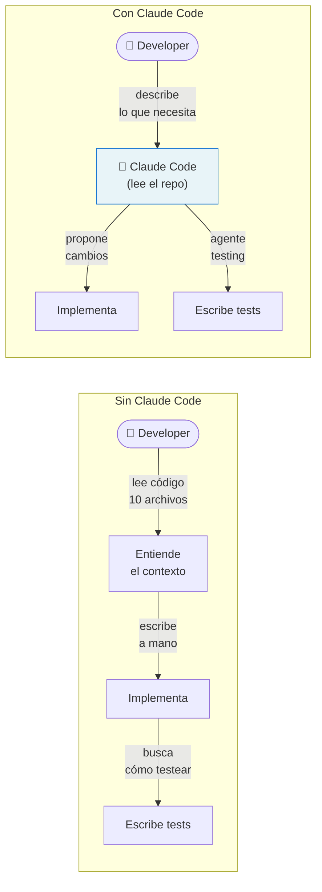
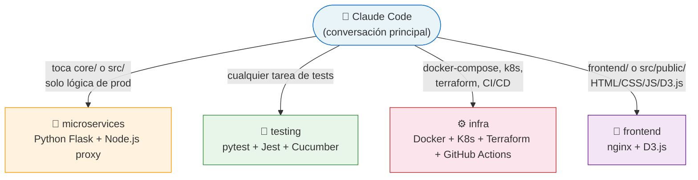
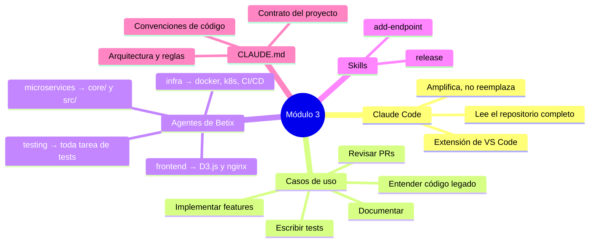

# Módulo 3 — Claude Code como herramienta de SDLC

← [Volver al temario](../TOC.md) | ← [Módulo 2](2.md)

---

## Objetivos de este módulo

Al terminar este módulo vas a poder:
- Entender qué es Claude Code y cómo se integra al flujo de trabajo del equipo
- Usar Claude para explorar código desconocido sin leerlo línea por línea
- Usar Claude para implementar una feature nueva en Betix guiado por el skill `add-endpoint`
- Delegar tareas de testing al agente especializado `testing`
- Entender qué son los agentes de Betix y cuándo usarlos

---

## 1. ¿Qué es Claude Code y qué problema resuelve?

Claude Code es una extensión de VS Code que integra al modelo de lenguaje Claude directamente en el editor, con acceso al contexto completo del repositorio.

La diferencia con un chatbot genérico es que Claude Code **lee el código del proyecto**. No necesitás copiar y pegar fragmentos: Claude puede abrir archivos, navegar el repositorio, ejecutar comandos y proponer cambios directamente en el editor.



El desarrollador sigue siendo responsable de entender y aprobar cada cambio. Claude amplifica la velocidad, no reemplaza el criterio.

---

## 2. Instalación y configuración

### Instalar la extensión en VS Code

1. `Ctrl+Shift+X` → buscar **"Claude Code"**
2. Instalar la extensión de Anthropic
3. Autenticarte con tu cuenta de Anthropic cuando se pida

### Abrir Claude Code

Una vez instalado, tenés tres formas de abrirlo:

| Método | Cómo |
|--------|------|
| Atajo de teclado | `Ctrl+Shift+P` → "Claude: Open Chat" |
| Ícono en la barra lateral | Ícono de Claude en el panel izquierdo |
| Terminal integrada | Ejecutar `claude` desde la terminal de VS Code |

### Lo que ya viene configurado en Betix

Al clonar el repositorio, la carpeta `.claude/` ya trae todo el contexto que Claude necesita para trabajar en Betix:

| Archivo / carpeta | Qué contiene |
|---|---|
| `CLAUDE.md` | Reglas del proyecto: arquitectura, convenciones, comandos |
| `.claude/agents/` | Agentes especializados por área del sistema |
| `.claude/skills/` | Playbooks paso a paso para flujos comunes |
| `.claude/hooks/` | Automatizaciones que se ejecutan en eventos del ciclo de trabajo |

> **Importante:** `CLAUDE.md` es lo primero que Claude lee al iniciar una conversación en este proyecto. Todo lo que está ahí es el "contrato" entre el equipo y la IA.

---

## 3. Casos de uso por etapa del SDLC

### Entender código desconocido

El caso más frecuente para un desarrollador nuevo: necesitás modificar algo que no escribiste y no sabés bien dónde vive la lógica.

En lugar de navegar manualmente varios archivos, podés pedirle a Claude:

```
Leé core/services/geodata_service.py y explicame:
1. Qué datos devuelve y de dónde los obtiene
2. Qué pasa si una provincia no tiene coordenadas definidas
3. Cómo está conectado con el endpoint /geodata de main.py
```

Claude va a leer los archivos relevantes y responderte en el contexto del proyecto, sin que tengas que copiar nada.

---

### Implementar una feature nueva

Para agregar un endpoint nuevo end-to-end (Flask + Node.js proxy + tests), Betix tiene un **skill** (`add-endpoint`) que guía el proceso paso a paso.

Un skill es un playbook reutilizable: una secuencia de pasos que Claude ejecuta con el contexto del proyecto.

```
/add-endpoint
```

Claude va a pedirte los detalles del endpoint (nombre, parámetros, lógica esperada) y va a guiarte por cada paso: implementación en `core/`, proxy en `src/`, tests.

> Los skills disponibles están documentados en `.claude/skills/`. Podés leerlos directamente para entender qué hacen antes de ejecutarlos.

---

### Revisar código

Antes de abrir un Pull Request, podés pedirle a Claude que revise el diff:

```
Revisá los cambios que hice en core/services/sma.py.
¿Hay algún edge case que no estoy cubriendo?
¿Estoy respetando las convenciones del proyecto?
```

Claude va a comparar el código con las reglas de `CLAUDE.md` y señalar problemas concretos: bugs potenciales, violaciones de convenciones, casos borde sin testear.

---

### Escribir tests

En Betix, los tests se delegan al **agente `testing`**. Este agente tiene contexto específico sobre cómo están organizadas las tres suites de tests del proyecto (pytest, Jest, Cucumber).

```
Usando el agente testing:
escribí los tests para el endpoint /ranking que acabo de implementar en core/main.py.
Cubrí el caso base y el caso donde no hay datos para la provincia solicitada.
```

El agente `testing` sabe que:
- Los tests de Python van en `core/tests/`
- Los tests de Node.js usan `nock` para interceptar llamadas HTTP al core
- Los escenarios BDD van en `features/` con keywords en inglés y texto en español

---

### Documentar

Claude puede generar o actualizar documentación técnica con el contexto del repositorio:

```
Leé core/main.py y actualizá la tabla de endpoints en README.md
para incluir el nuevo endpoint /ranking.
```

```
Generá un ADR (Architecture Decision Record) para documentar
por qué elegimos Redis como caché entre el proxy y el core.
```

---

## 4. Los agentes especializados de Betix

Betix define cuatro **agentes** en `.claude/agents/`. Cada agente es un perfil de Claude con contexto específico sobre un área del sistema:



### Cuándo usar cada agente

| Agente | Delegar cuando el cambio toca… | NO delegar para… |
|--------|-------------------------------|-----------------|
| **microservices** | `core/` (Python/Flask), `src/` (proxy Node.js) | tests — eso va a `testing` |
| **testing** | `tests/`, `features/`, `core/tests/` — toda tarea de tests | lógica de producción |
| **infra** | `docker-compose.yml`, `k8s/`, `terraform/`, `.github/workflows/` | código de aplicación |
| **frontend** | `frontend/` (nginx), `src/public/` (HTML/CSS/JS/D3.js) | lógica de negocio |

### Cómo usar un agente

Podés invocar un agente desde la conversación indicando el nombre:

```
Usando el agente microservices:
agregá un endpoint GET /api/ranking en core/main.py que devuelva
las 5 provincias con más tickets vendidos en el último mes.
```

> **Regla clave:** si una tarea toca producción *y* tests, usá primero el agente de producción correspondiente y luego el agente `testing`. Nunca los mezcles en la misma instrucción.

---

## 5. CLAUDE.md — el contrato del proyecto

`CLAUDE.md` es el archivo más importante para entender cómo Claude trabaja en Betix. Define:

- **Arquitectura**: qué vive en cada carpeta y por qué
- **Reglas críticas**: por ejemplo, "la lógica de negocio solo vive en `core/`"
- **Convenciones de código**: comillas, indentación, logging
- **Comandos esenciales**: `make up`, `make test`, etc.
- **Qué agente usar para cada área**

Leelo una vez antes de empezar a trabajar. Cuando Claude parece no entender el contexto del proyecto, la mayoría de las veces alcanza con preguntarle: _"¿Leíste el CLAUDE.md?"_.

---

## 6. Ejercicio — Entender un endpoint sin leer el código manualmente

En este ejercicio vas a usar Claude para entender cómo está implementado el endpoint `/proyectado` de principio a fin, sin abrir manualmente ningún archivo.

### Paso 1: Pedirle el recorrido completo a Claude

```
Usá el agente microservices.
Quiero entender cómo está implementado el endpoint /proyectado en Betix.
Explicame:
1. Qué archivo define el endpoint en el core Flask
2. Qué servicio llama y qué cálculo hace
3. Cómo fluye el request desde el browser hasta que llega a ese endpoint
4. Por qué el primer request puede ser más lento que los siguientes
```

### Paso 2: Ir al detalle del cálculo

Una vez que entendés la estructura:

```
Leé core/services/proyecciones_service.py y explicame
con un ejemplo concreto cómo calcula la proyección SMA.
Si tuviéramos datos de enero a junio y quisiéramos proyectar julio,
¿qué números usaría y cómo llegaría al resultado?
```

### Paso 3: Identificar dónde hacer un cambio

```
Si quisiera cambiar la ventana de SMA de 3 meses a 6 meses por defecto,
¿qué archivos tendría que modificar y qué tests tendrían que actualizarse?
```

### Paso 4: Reflexión

Respondé estas preguntas antes de continuar:

1. ¿En qué archivo vive la lógica del SMA? ¿Por qué está ahí y no en `src/`?
2. ¿Qué componente actúa como caché para este endpoint y cuándo se invalida?
3. Si necesitás cambiar el algoritmo de proyección, ¿qué agente de Betix usarías?

> **Verificá con Claude:** _"Mi respuesta es X. ¿Estoy en lo correcto?"_

---

## Resumen



---

## Recursos del repositorio

| Recurso | Descripción |
|---------|-------------|
| [`CLAUDE.md`](../../../CLAUDE.md) | Contrato del proyecto: reglas, arquitectura, agentes |
| [`.claude/agents/`](../../../.claude/agents/) | Definición de los cuatro agentes especializados |
| [`.claude/skills/`](../../../.claude/skills/) | Playbooks: `add-endpoint`, `release` |
| [`docs/SDLC.md`](../../SDLC.md) | Ciclo de vida completo del desarrollo |

---

← [Volver al temario](../TOC.md) | ← [Módulo 2](2.md) | **Siguiente módulo →** [Módulo 4 — Testing como cultura, no como tarea](4.md)
