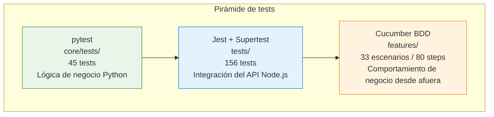
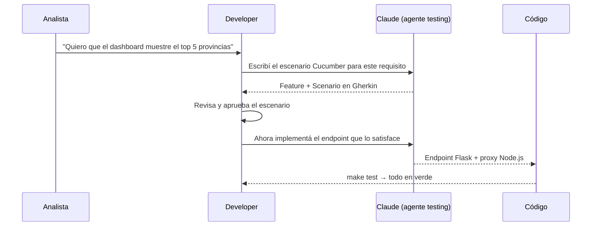
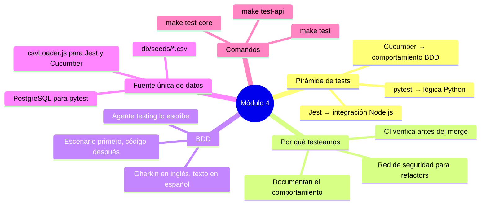

# Módulo 4 — Testing como cultura, no como tarea

← [Volver al temario](../TOC.md) | ← [Módulo 3](3.md)

---

## Objetivos de este módulo

Al terminar este módulo vas a poder:
- Entender la pirámide de tests de Betix y qué cubre cada capa
- Correr la suite completa y leer los resultados
- Escribir un escenario BDD en lenguaje de negocio y convertirlo en un test con Claude
- Entender por qué los tests no son opcionales y cómo usarlos para diseñar antes de codear

---

## 1. Por qué testeamos

En un equipo sin tests, el deploy es un momento de ansiedad. Nadie sabe exactamente qué puede romperse. En Betix, los tests son la red de seguridad que permite:

- **Mergear con confianza**: CI verifica que nada se rompió antes de que el código llegue a `develop`
- **Refactorizar sin miedo**: si los tests pasan, el comportamiento es el mismo
- **Documentar el comportamiento esperado**: un test bien escrito describe qué hace el código mejor que un comentario

> Un test que nunca falla no te da ninguna información. El valor del test es que *podría* fallar — y cuando lo hace, te dice exactamente qué se rompió.

---

## 2. La pirámide de tests de Betix

Betix tiene tres capas de tests que se complementan:



### pytest — tests unitarios del core Python

Los tests de `core/tests/` verifican la lógica de negocio: proyecciones SMA, geodata, CRUD de asignaciones.

```bash
python3 -m pytest core/tests/ -v
```

**Qué cubren:**
- `test_proyecciones.py` — cálculo SMA, casos edge (un solo mes de datos, datos faltantes)
- `test_provincias_juegos.py` — GET/POST/DELETE sobre `/provincias_juegos`

### Jest + Supertest — tests de integración del API Node.js

Los tests de `tests/` verifican el comportamiento HTTP del proxy Node.js. **No necesitan el servidor corriendo** — usan `nock` para interceptar las llamadas al core Flask.

```bash
npm test          # Jest verbose + Cucumber summary
npm run test:ci   # con cobertura (para CI)
REDIS_URL= npm test  # sin Redis (evita timeouts si Redis no está disponible)
```

**Por qué nock y no el servidor real:** permite correr los tests en CI sin levantar el core Python. Cada test controla exactamente qué devuelve el core, haciendo los tests deterministas.

### Cucumber BDD — escenarios funcionales

Los tests de `features/` verifican el comportamiento del sistema desde la perspectiva del negocio, usando lenguaje Gherkin.

```bash
npm run test:functional   # Cucumber en modo pretty (verbose)
```

**Estructura de un escenario:**

```gherkin
Feature: Estadísticas por provincia

  Scenario: El analista consulta los datos del mapa
    When I make a GET request to "/api/datos/geodata"
    Then the response status should be 200
    And the response should have a "data" property
```

> Los keywords van en inglés (`Feature:`, `Scenario:`, `When`, `Then`). El texto de los steps va en español.

---

## 3. BDD — diseñar con el comportamiento primero

BDD (Behaviour-Driven Development) invierte el flujo habitual: primero se escribe el escenario en lenguaje de negocio, luego se implementa el código que lo satisface.



**El escenario Cucumber actúa como contrato**: si el analista lo aprueba antes de que el developer toque código, hay acuerdo sobre qué se va a construir.

---

## 4. La fuente única de datos de test

Los datos de provincias, juegos y tickets viven **exclusivamente** en `db/seeds/`:

| Archivo | Contenido |
|---------|-----------|
| `db/seeds/_provincias.csv` | 10 provincias con lat/lng |
| `db/seeds/_juegos.csv` | 3 juegos (Lotería, Quiniela, Raspadita) |
| `db/seeds/_tickets_mensuales.csv` | 336 registros mensuales |

- **pytest** los carga vía PostgreSQL
- **Jest y Cucumber** los leen con `tests/fixtures/csvLoader.js`

> Para agregar un nuevo caso de prueba (nueva provincia, nuevo juego): editá solo los CSVs. No hay arrays que actualizar en los tests.

---

## 5. Correr los tests y leer los resultados

```bash
make test         # todos: pytest + Jest + Cucumber
make test-core    # solo pytest
make test-api     # solo Jest + Cucumber
make lint         # ESLint
```

### Cómo leer un fallo de Jest

```
FAIL tests/geodata.test.js
  ● GET /api/datos/geodata › should return province data

    expect(received).toHaveProperty(path)

    Expected path: "data.provincias"
    Received object: {"status": "error", "message": "core unavailable"}
```

Lo que te dice: el endpoint devolvió un error del core en lugar de datos. Causas comunes:
1. El nock mock no está configurado para ese endpoint
2. El formato de respuesta del core cambió y el mock está desactualizado

### Cómo leer un fallo de Cucumber

```
✗ Scenario: El analista consulta los datos del mapa
    Step: the response should have a "data" property
    Error: expected undefined to equal "provincias"
```

Primer lugar a revisar: `features/support/hooks.js` — el mock de nock puede tener el formato de respuesta desactualizado.

### Cómo leer un fallo de pytest

```
FAILED core/tests/test_proyecciones.py::test_proyeccion_sma_window
AssertionError: assert 1450.0 == 1380.0
```

El cálculo de SMA devolvió un valor distinto al esperado. Revisar la ventana de meses y los datos de fixture.

---

## 6. Ejercicio — El agente testing escribe un test

En este ejercicio vas a describir un comportamiento en lenguaje natural y el agente `testing` lo va a convertir en un test real de Betix.

### Paso 1: Describir el comportamiento

```
Usando el agente testing:
Quiero agregar un test de Jest para verificar que si el core devuelve
un error 500, el endpoint /api/datos/geodata responde con status 502
y un body que tiene una propiedad "error".

Mirá cómo están escritos los tests existentes en tests/geodata.test.js
y escribí el nuevo test siguiendo el mismo patrón.
```

### Paso 2: Agregar un escenario Cucumber

```
Usando el agente testing:
Escribí un escenario Cucumber en features/ para verificar que
el endpoint /api/datos/proyectado acepta el parámetro ?provincia=Salta
y devuelve datos solo para esa provincia.

Seguí el estilo de los escenarios existentes en features/.
```

### Paso 3: Correr y verificar

```bash
make test-api
```

Si el test falla porque el comportamiento no está implementado todavía, es correcto — estás haciendo BDD.

### Paso 4: Reflexión

1. ¿Por qué los tests de Jest no necesitan que el servidor de Flask esté corriendo?
2. Si cambia el formato de respuesta de `/api/datos/geodata` en el core, ¿qué archivos de test necesitás actualizar?
3. ¿Cuándo usarías pytest en lugar de Jest para testear el comportamiento de un endpoint?

---

## Resumen



---

## Recursos del repositorio

| Recurso | Descripción |
|---------|-------------|
| [`tests/`](../../../tests/) | Suite Jest — tests de integración del API Node.js |
| [`features/`](../../../features/) | Escenarios Cucumber BDD |
| [`core/tests/`](../../../core/tests/) | Suite pytest — tests unitarios Python |
| [`tests/fixtures/csvLoader.js`](../../../tests/fixtures/csvLoader.js) | Carga datos desde db/seeds/ para Jest y Cucumber |
| [`features/support/hooks.js`](../../../features/support/hooks.js) | Configuración de nock para Cucumber |
| [`.claude/agents/testing.md`](../../../.claude/agents/testing.md) | Contexto del agente testing |

---

← [Volver al temario](../TOC.md) | ← [Módulo 3](3.md)
