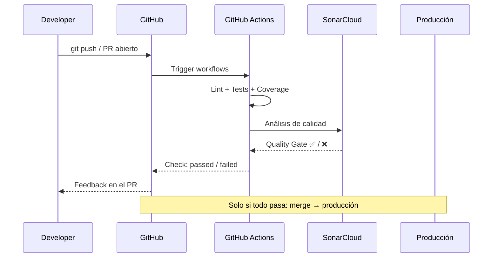
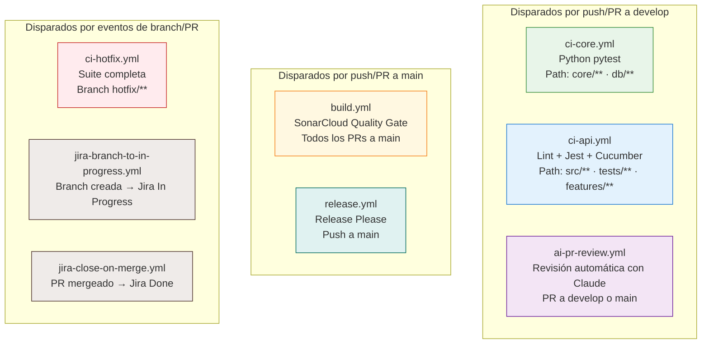
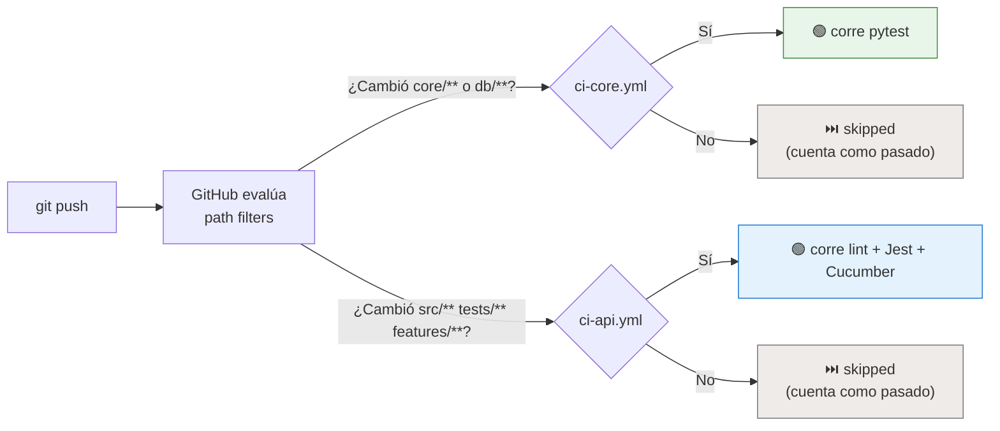
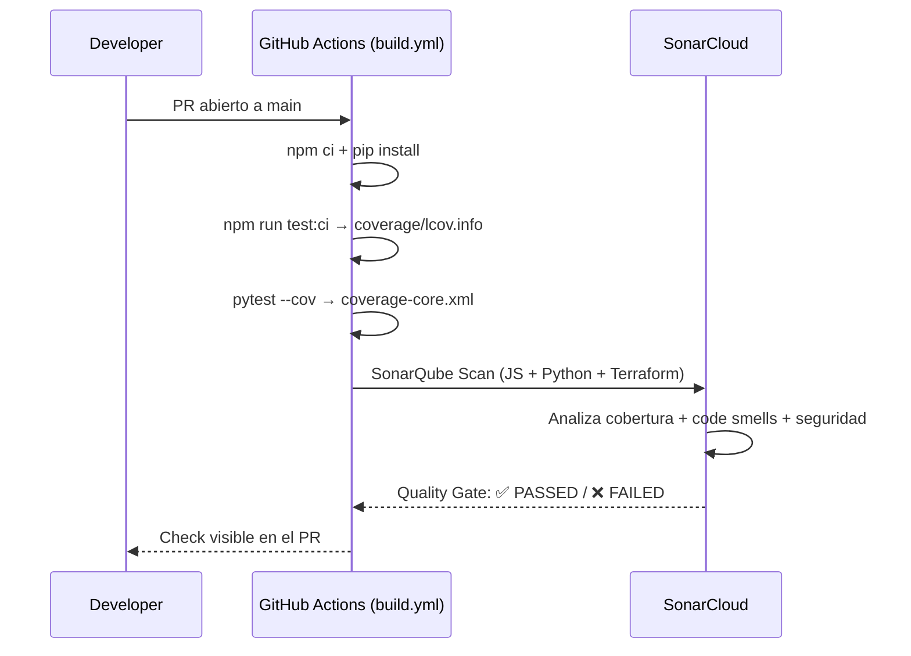
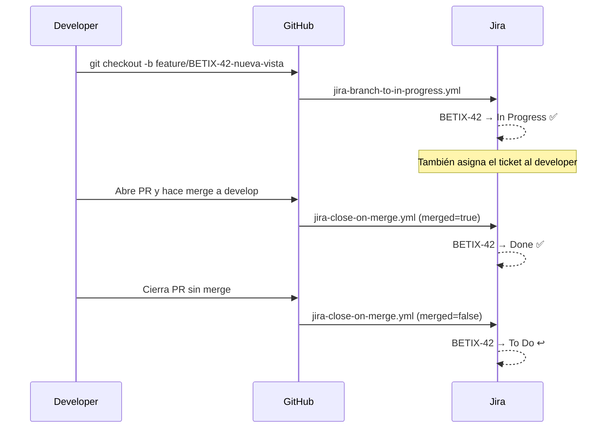
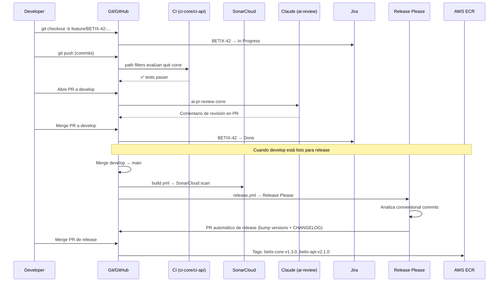
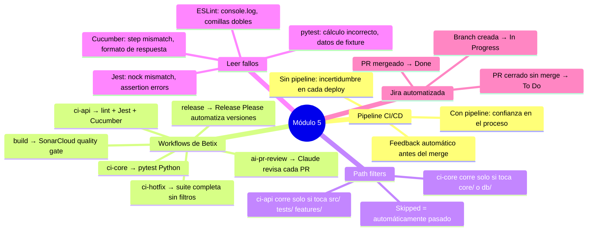

# CI/CD: de commit a producción

### Capítulo 5

← [Volver al temario](../TOC.md)

---

## Objetivos de este capítulo

Al terminar este capítulo vas a poder:
- Entender qué es un [pipeline](../glosario.md#pipeline) de CI/CD y qué problema resuelve
- Navegar los workflows de GitHub Actions de Betix y entender qué hace cada uno
- Comprender cómo funcionan los path filters y cuándo corre cada job
- Leer el resultado de un run de CI sin entrar en pánico
- Diagnosticar un fallo de CI con ayuda de Claude

> **Nota:** Los pipelines de CI/CD son una pieza central de la plataforma de Tecnoaccion. Betix los implementa como proyecto de referencia — los workflows que vas a ver acá son los que están corriendo en producción.

---

## 1. ¿Qué es un pipeline y qué problema resuelve?

Imaginá este escenario: un desarrollador pushea un cambio. Diez minutos después, alguien en producción reporta que un endpoint devuelve 500. El desarrollador que hizo el push no sabía que había un test que verificaba ese comportamiento. Y nadie corría los tests en local antes de pushear.

Un **pipeline de CI/CD** (Continuous Integration / Continuous Delivery) es un proceso automatizado que se ejecuta cada vez que hay un cambio en el código. Su trabajo: verificar que el cambio no rompió nada *antes* de que llegue a producción.



La clave es que el pipeline le da feedback al desarrollador **antes** de que el código llegue a `develop` o `main`. Si algo falla, lo sabe en minutos, con contexto exacto de qué falló.

---

## 2. El ecosistema de workflows de Betix

Betix tiene **ocho [workflows](../glosario.md#workflow)** en `.github/workflows/`, cada uno con una responsabilidad diferente:



No los vas a usar todos al mismo tiempo. En el día a día, los que más vas a ver son `ci-core.yml`, `ci-api.yml` y `ai-pr-review.yml`.

---

## 3. Los workflows de CI: ci-core y ci-api

### El principio de los path filters

El concepto clave de estos dos workflows es que **no siempre corren**. GitHub Actions permite filtrar por paths: si ningún archivo modificado coincide con el filtro, el workflow se saltea y GitHub lo marca automáticamente como pasado.

Esto evita que un cambio en un README espere 5 minutos de CI innecesario.



### ¿Qué corre cada uno?

| Workflow | Paths que lo disparan | Qué hace |
|----------|----------------------|----------|
| `ci-core.yml` | `core/**`, `db/**` | Levanta PostgreSQL, instala deps Python, corre `pytest core/tests/` con cobertura |
| `ci-api.yml` | `src/**`, `tests/**`, `features/**`, `package.json`, `cucumber.js`, `.eslintrc*` | `npm ci`, `eslint`, `jest --coverage`, Cucumber BDD |

### Ejemplos de qué corre y qué no

```
Cambio solo en core/services/geodata_service.py:
  ✅ ci-core.yml — corre (path core/**)
  ⏭️ ci-api.yml  — skipped (no tocaste src/ ni tests/)

Cambio en src/routes/ + tests/geodata.test.js:
  ⏭️ ci-core.yml — skipped (no tocaste core/)
  ✅ ci-api.yml  — corre (paths src/** y tests/**)

Cambio en docs/onboarding/5.md:
  ⏭️ ci-core.yml — skipped
  ⏭️ ci-api.yml  — skipped
  (ningún CI corre — y eso es correcto)
```

### El workflow ci-hotfix: suite completa sin filtros

Para ramas `hotfix/**`, existe un tercer workflow que corre **siempre y en su totalidad**, sin path filters:

```yaml
# .github/workflows/ci-hotfix.yml
on:
  push:
    branches: ['hotfix/**']
```

La lógica: cuando hacés un hotfix en producción, no podés asumir que el bug solo afecta una parte del sistema. La suite completa corre siempre.

---

## 4. Cómo leer un run de CI en GitHub Actions

### Navegar al resultado

1. Abrí el PR en GitHub
2. Scrolleá hasta el final → sección **Checks**
3. Si algún check está en rojo → hacé click en **Details**

Vas a ver algo así:

```
Jobs
└── lint-and-test (ci-api.yml)
    ├── ✅ Checkout código
    ├── ✅ Setup Node.js
    ├── ✅ Instalar dependencias
    ├── ✅ Ejecutar lint
    ├── ❌ Ejecutar tests con cobertura    ← acá falló
    └── ⏭️ Ejecutar tests funcionales (skipped, anterior falló)
```

### Leer un fallo de Jest

Expandí el step fallido. Vas a ver algo como:

```
FAIL tests/geodata.test.js
  ● GET /api/datos/geodata › should return province data

    expect(received).toHaveProperty(path)

    Expected path: "data"
    Received object: {"status": "error", "message": "nock: No match for request..."}

      45 |     const res = await request(app).get('/api/datos/geodata');
      46 |     expect(res.status).toBe(200);
    > 47 |     expect(res.body).toHaveProperty('data');
         |                      ^
      48 | });
```

**Cómo leer este fallo:**
- El error dice `nock: No match for request` → el mock de nock no está interceptando la llamada al core
- La línea exacta del test que falló: `geodata.test.js:47`
- El valor recibido: `{"status": "error", "message": "..."}` en lugar de los datos esperados

Primer lugar a revisar: el nock setup en ese test — ¿está interceptando la URL correcta? ¿El formato de respuesta del mock coincide con lo que el test espera?

### Leer un fallo de Cucumber

```
✗ Scenario: El analista consulta el mapa de provincias
    at features/estadisticas.feature:12

  Step failed: Then the response should have a "data" property
  AssertionError: expected undefined to equal 'provincias'
      at World.<anonymous> (features/step_definitions/estadisticas.steps.js:34)
```

**Cómo leer este fallo:**
- El scenario está en `features/estadisticas.feature:12`
- El step que falló: `Then the response should have a "data" property`
- Primer lugar a revisar: `features/support/hooks.js` — el mock de nock puede tener el formato de respuesta desactualizado

### Leer un fallo de ESLint

```
/home/runner/work/betix/betix/src/controllers/geodata.js
  12:5  error  Unexpected console statement  no-console
  34:1  error  Strings must use singlequote  quotes

✖ 2 problems (2 errors, 0 warnings)
```

**Cómo leer este fallo:**
- Archivo y línea exacta: `src/controllers/geodata.js:12`
- Regla violada: `no-console` (ver [CLAUDE.md — Critical](../../../CLAUDE.md#critical))
- Fix: reemplazar `console.log` por `logger.info()` (Winston)

### Leer un fallo de pytest

```
FAILED core/tests/test_proyecciones.py::test_proyeccion_sma_ventana_3
AssertionError: assert 1450.0 == 1380.0
```

El valor calculado (`1450.0`) difiere del esperado (`1380.0`). Revisar los datos de fixture y la ventana de SMA.

---

## 5. El workflow de calidad: build.yml

El workflow `build.yml` corre en todos los PRs a `main` y en cada push a `main`. A diferencia de `ci-core` y `ci-api`, su responsabilidad es el **análisis de calidad global del proyecto**.



**Lo que analiza SonarCloud:**

| Fuente | Reporte de cobertura |
|--------|---------------------|
| `src/` (Node.js) | `coverage/lcov.info` (generado por Jest `--coverage`) |
| `core/` (Python) | `coverage-core.xml` (generado por pytest `--cov`) |
| `terraform/` | análisis estático (sin cobertura — es [IaC](../glosario.md#iac-infrastructure-as-code), no código de app) |

**Lo que excluye:**
- `src/app.js` — entry point del proxy, sin lógica de negocio testeable
- `node_modules/`, `coverage/`, `__pycache__/`

**Cómo se ve el resultado en el PR:**

```
✅ SonarCloud Quality Gate passed
   Coverage: 84.2% (threshold: 80%)
   0 bugs · 0 vulnerabilities · 3 code smells
```

Si el Quality Gate falla (cobertura baja, bugs nuevos, vulnerabilidades), el PR no debería mergearse hasta resolver los issues. Los code smells son informativos; los bugs y vulnerabilidades son bloqueantes.

> **Tip:** Para ver el detalle completo: [sonarcloud.io](https://sonarcloud.io) → proyecto `Neurus1970_betix`. Los issues de SonarCloud aparecen como anotaciones inline en el diff del PR.

---

## 6. Las automatizaciones de Jira

La plataforma cierra el ciclo entre el código y el proyecto con dos workflows que sincronizan el estado de los tickets automáticamente.



**Cómo funciona la extracción del ticket:**

El workflow extrae el número de ticket del nombre de la rama usando una expresión regular:

```bash
BRANCH="feature/BETIX-42-nueva-vista"
TICKET=$(echo "$BRANCH" | grep -oE '[A-Z]+-[0-9]+' | head -1)
# → BETIX-42
```

Por eso el nombre de la rama **siempre debe incluir el Jira ID**. Sin él, el workflow no puede saber qué ticket mover.

---

## 7. El revisor automático: Claude en el pipeline

Cada PR que se abre contra `develop` o `main` recibe automáticamente una revisión de Claude. El workflow `ai-pr-review.yml`:

1. Corre los tests (con `continue-on-error: true` — no bloquea el merge)
2. Genera el diff del PR: `git diff origin/main...HEAD`
3. Llama a la API de Claude con el diff, los resultados de tests y el contexto del proyecto
4. Publica el reporte como comentario en el PR

**Ejemplo de comentario generado:**

```markdown
## 🤖 Revisión Automática con IA

### Resumen de Cambios
El PR agrega el endpoint GET /api/proyectado con soporte para
filtrado por provincia. La lógica de SMA vive correctamente en core/.

### Análisis de Calidad
✅ Puntos fuertes:
- Tests cubren caso base y caso edge (provincia sin datos)
- No hay lógica de negocio en src/ — respeta la arquitectura

⚠️ Observaciones:
- El nock mock en tests/proyectado.test.js hardcodea 6 meses de datos.
  Considerar leer desde csvLoader para consistencia con los otros tests.

### Resultados de Tests
✅ Jest: 41/41 pasados (84% coverage)
✅ Cucumber: 33/33 scenarios pasados
```

> **Importante:** La revisión de Claude es un *primer filtro*, no un reemplazo. El code review humano sigue siendo necesario — Claude puede equivocarse en el contexto de negocio.

---

## 8. El flujo completo: de commit a producción

Todo lo anterior se integra en un flujo continuo:



---

## 9. Ejercicio — Diagnosticar un fallo de CI con Claude

En este ejercicio vas a simular un fallo de CI y usar Claude para diagnosticarlo.

### Paso 1: Crear una situación de fallo controlada

En tu entorno local, ejecutá:

```bash
make test-api
```

Si todos los tests pasan, simulá un fallo: abrí `tests/geodata.test.js` y modificá el valor esperado en un assertion.

### Paso 2: Leer el error

Cuando el test falle, copiá el output completo del error (incluyendo el stack trace). Vas a ver algo como:

```
FAIL tests/geodata.test.js
  ● GET /api/datos/geodata › debería retornar datos de provincias
    AssertionError: expected 200 to equal 404
    at Object.<anonymous> (tests/geodata.test.js:23:...)
```

### Paso 3: Pedirle diagnóstico a Claude

Abrí Claude en VS Code y pegá el error:

```
El CI falló con este error en tests/geodata.test.js:

[pegar el stack trace completo]

Mirá el archivo tests/geodata.test.js y el setup de nock en ese archivo.
Explicame:
1. Por qué está fallando
2. Qué archivo necesito revisar primero
3. Qué cambio mínimo corregiría el fallo
```

### Paso 4: Ir más profundo

Una vez que Claude te dio el diagnóstico, preguntale sobre la causa raíz:

```
¿Este fallo habría pasado si yo hubiera cambiado el formato de respuesta
del core Python sin actualizar el mock de nock en los tests de Node.js?
¿Cómo puedo prevenir este tipo de desincronización?
```

### Paso 5: Reflexión

Respondé estas preguntas antes de continuar:

1. Si cambio `core/services/geodata_service.py` y la respuesta del endpoint cambia su estructura, ¿qué tests necesito actualizar y cuáles corren automáticamente en CI?
2. Si push a una rama `feature/BETIX-42-nueva-vista` con cambios solo en `tests/`, ¿corre `ci-core.yml`? ¿Por qué?
3. ¿Por qué `ci-hotfix.yml` no tiene path filters?

> **Verificá con Claude:** _"Mi respuesta sobre los path filters es X. ¿Estoy en lo correcto?"_

---

## 10. Caso real — BETIX-9 de ticket a producción

Hasta acá vimos los workflows en abstracto. Esta sección muestra cómo se ven en la práctica, paso a paso, usando un caso real del repositorio: **[BETIX-9 — Implementar stack de observabilidad](https://cristian-f-medrano.atlassian.net/browse/BETIX-9)**.

> Este ticket implementó el logger centralizado con Winston y el endpoint `/healthz` con diagnóstico de dependencias — toca tanto `src/` (Node.js) como `tests/`, disparando `ci-api.yml` y el análisis de SonarCloud.

---

### El ticket en Jira

Antes de escribir una línea de código, el ticket existe en Jira con todos sus criterios de aceptación.

```
┌─────────────────────────────────────────────────────────────────────────┐
│  BETIX  ›  BETIX-9                                         [ Done ✓ ]   │
├─────────────────────────────────────────────────────────────────────────┤
│  Implementar stack de observabilidad (logs, metricas y trazas)          │
│                                                                         │
│  Assignee:  Cristian Fernández Medrano                                  │
│  Priority:  Medium                                                      │
│  Type:      Task                                                        │
│                                                                         │
│  Description                                                            │
│  Como equipo de desarrollo, necesitamos visibilidad en tiempo real      │
│  del comportamiento de los servicios en producción para detectar y      │
│  resolver incidentes más rápido.                                        │
│                                                                         │
│  Criterios de aceptación:                                               │
│  ✓ Logs centralizados con nivel de severidad (ERROR, WARN, INFO)        │
│  ✓ Métricas de latencia y tasa de error por endpoint                    │
│  ✓ Trazas distribuidas entre servicios                                  │
│  ✓ Dashboard básico operativo                                           │
└─────────────────────────────────────────────────────────────────────────┘
```

🔗 **Jira:** [cristian-f-medrano.atlassian.net/browse/BETIX-9](https://cristian-f-medrano.atlassian.net/browse/BETIX-9)

---

### Paso 1: Crear la rama → Jira se mueve a In Progress

El developer crea la rama con el ID del ticket en el nombre:

```bash
git checkout -b feature/BETIX-9-observabilidad
git push -u origin feature/BETIX-9-observabilidad
```

En el momento en que el push llega a GitHub, `jira-branch-to-in-progress.yml` detecta `BETIX-9` en el nombre de la rama y actualiza el ticket automáticamente.

```
┌─────────────────────────────────────────────────────────────────────────┐
│  GitHub Actions                                                         │
│  Jira - Mover a In Progress al crear branch           ✅ completed 6s  │
├─────────────────────────────────────────────────────────────────────────┤
│  ✅  move-to-in-progress                                           6s   │
│      Extracted ticket: BETIX-9                                          │
│      Transition: To Do → In Progress                                    │
│      Assignee updated: Cristian Fernández Medrano                       │
└─────────────────────────────────────────────────────────────────────────┘
```

🔗 **Actions run:** [github.com/Neurus1970/betix/actions/runs/22808614077](https://github.com/Neurus1970/betix/actions/runs/22808614077)

En Jira, el ticket ahora muestra:

```
┌─────────────────────────────────────────────────────────────────────────┐
│  BETIX-9  ·  Implementar stack de observabilidad         [In Progress]  │
│  Assignee: Cristian Fernández Medrano                                   │
└─────────────────────────────────────────────────────────────────────────┘
```

---

### Paso 2: Implementar y commitear

El developer implementa el logger centralizado y el endpoint, y hace el commit siguiendo Conventional Commits:

```
feat(BETIX-9): implementar observabilidad con /healthz y logger centralizado

- Reemplaza GET /health por GET /healthz con diagnóstico de dependencias
- Logger centralizado con Winston, nivel configurable via LOG_LEVEL
- /health redirige con 301 a /healthz para backwards compatibility

Closes BETIX-9
```

> El tipo `feat:` le dice a Release Please que debe hacer un bump MINOR cuando esto llegue a `main`. El footer `Closes BETIX-9` cierra el ticket en Jira cuando se mergea el PR.

---

### Paso 3: Abrir el PR → los workflows entran en acción

El developer abre el Pull Request contra `develop`.

🔗 **PR #14:** [github.com/Neurus1970/betix/pull/14](https://github.com/Neurus1970/betix/pull/14)

GitHub evalúa los path filters de cada workflow y dispara los que corresponden. En segundos, la sección **Checks** del PR se empieza a poblar:

```
┌─────────────────────────────────────────────────────────────────────────┐
│  Checks                                                                 │
├─────────────────────────────────────────────────────────────────────────┤
│  ⏳  CI - Node.js API                (ci-api.yml)       en progreso     │
│  ⏭️  CI - Python Core               (ci-core.yml)       skipped*        │
│  ⏳  Build                          (build.yml)          en progreso     │
│  ⏳  AI - Review & Documentación     (ai-pr-review.yml)  en progreso     │
│  ✅  Jira - Mover a In Progress      (jira-...)          passed          │
│  ⏭️  CI - Hotfix (Full Suite)        (ci-hotfix.yml)     skipped         │
├─────────────────────────────────────────────────────────────────────────┤
│  * ci-core.yml no corre: este PR no modificó core/ ni db/              │
└─────────────────────────────────────────────────────────────────────────┘
```

> **Por qué `ci-core.yml` se saltea:** el PR tocó `src/` y `tests/` (Node.js), no `core/` (Python). El path filter evita correr pytest para cambios que no lo necesitan.

---

### Paso 4: ci-api.yml — lint, Jest y Cucumber

`ci-api.yml` corre los tres pasos del CI de Node.js en secuencia:

```
┌─────────────────────────────────────────────────────────────────────────┐
│  CI - Node.js API  ›  lint-and-test                        ✅  19s      │
├─────────────────────────────────────────────────────────────────────────┤
│  ✅  Checkout código                                              1s     │
│  ✅  Setup Node.js 18                                             3s     │
│  ✅  npm ci                                                       4s     │
│  ✅  Ejecutar lint (ESLint)                                       2s     │
│       No issues found                                                    │
│  ✅  Ejecutar tests con cobertura (Jest)                          6s     │
│       Test Suites: 8 passed, 8 total                                     │
│       Tests:       38 passed, 38 total                                   │
│       Coverage:    95.83%                                                │
│  ✅  Ejecutar tests funcionales (Cucumber)                        3s     │
│       27 scenarios (27 passed)                                           │
│       80 steps (80 passed)                                               │
└─────────────────────────────────────────────────────────────────────────┘
```

---

### Paso 5: build.yml → SonarCloud Quality Gate

En paralelo, `build.yml` genera los reportes de cobertura y los envía a SonarCloud para análisis.

🔗 **Actions run:** [github.com/Neurus1970/betix/actions/runs/22808704418](https://github.com/Neurus1970/betix/actions/runs/22808704418)

```
┌─────────────────────────────────────────────────────────────────────────┐
│  Build  ›  SonarQube                                       ✅  1m 2s    │
├─────────────────────────────────────────────────────────────────────────┤
│  ✅  npm run test:ci → coverage/lcov.info                               │
│  ✅  pytest --cov → coverage-core.xml                                   │
│  ✅  SonarQube Scan (sonar-scanner)                                      │
│       INFO: ANALYSIS SUCCESSFUL                                          │
│       INFO: Quality Gate: PASSED                                         │
└─────────────────────────────────────────────────────────────────────────┘
```

SonarCloud publica automáticamente el resultado como comentario en el PR:

```
┌─────────────────────────────────────────────────────────────────────────┐
│  sonarqubecloud[bot]                                                    │
├─────────────────────────────────────────────────────────────────────────┤
│  ✅ Quality Gate passed                                                  │
│                                                                         │
│  Issues                                                                 │
│  ✅  1 New issue         (informativo — no bloquea)                      │
│  ✅  0 Accepted issues                                                  │
│                                                                         │
│  Measures                                                               │
│  ✅  0 Security Hotspots                                                │
│  ✅  89.7% Coverage on New Code     (threshold: 80%)                    │
│  ✅  0.0% Duplication on New Code                                       │
│                                                                         │
│  See analysis details on SonarQube Cloud →                              │
└─────────────────────────────────────────────────────────────────────────┘
```

🔗 **SonarCloud:** [sonarcloud.io/dashboard?id=Neurus1970_betix&pullRequest=14](https://sonarcloud.io/dashboard?id=Neurus1970_betix&pullRequest=14)

---

### Paso 6: ai-pr-review.yml → Claude revisa el PR

`ai-pr-review.yml` genera el diff del PR, lo analiza con Claude y publica el reporte como comentario:

```
┌─────────────────────────────────────────────────────────────────────────┐
│  github-actions[bot]                                                    │
├─────────────────────────────────────────────────────────────────────────┤
│  🤖 Revisión Automática con IA (Claude)                                 │
│                                                                         │
│  ## 1. Resumen de Cambios                                               │
│  El PR introduce el logger centralizado con Winston y reemplaza         │
│  GET /health por GET /healthz con diagnóstico de dependencias.          │
│  La lógica de negocio está correctamente separada: Node.js actúa       │
│  como proxy y el health check del core se delega al Flask.             │
│                                                                         │
│  ## 2. Análisis de Calidad                                              │
│  ✅ Puntos fuertes:                                                      │
│  - Logger configurable por env var (LOG_LEVEL) — buena práctica        │
│  - Tests cubren caso healthy y caso de fallo del core                  │
│  - Redirect 301 para backwards compatibility                            │
│                                                                         │
│  ⚠️  Observaciones:                                                     │
│  - El timeout de conexión al core en /healthz está hardcodeado.        │
│    Considerar exponerlo como variable de entorno para entornos lentos. │
│                                                                         │
│  ## 3. Resultados de Tests                                              │
│  ✅ Jest:     38/38 pasados (95.83% coverage)                           │
│  ✅ Cucumber: 27/27 scenarios pasados                                   │
└─────────────────────────────────────────────────────────────────────────┘
```

> **Importante:** la revisión de Claude es un primer filtro, no un reemplazo del code review humano. El reviewer aprueba o solicita cambios con el contexto de negocio que Claude no tiene.

---

### Paso 7: Todos los checks en verde → Merge

Con todos los checks en verde y la aprobación del reviewer, el PR se mergea.

```
┌─────────────────────────────────────────────────────────────────────────┐
│  Checks  (all checks have passed)                                       │
├─────────────────────────────────────────────────────────────────────────┤
│  ✅  CI - Node.js API                                                   │
│  ⏭️  CI - Python Core               (skipped — correcto)                │
│  ✅  Build (SonarCloud Quality Gate)                                    │
│  ✅  AI - Review & Documentación de PR                                  │
│  ✅  Jira - Mover a In Progress                                         │
│  ⏭️  CI - Hotfix (Full Suite)        (skipped — correcto)               │
├─────────────────────────────────────────────────────────────────────────┤
│  SonarCloud Code Analysis — ✅ passed                                   │
├─────────────────────────────────────────────────────────────────────────┤
│  This branch has no conflicts with the base branch.                     │
│                                    [ Merge pull request ] ◄─── click   │
└─────────────────────────────────────────────────────────────────────────┘
```

`jira-close-on-merge.yml` detecta el merge y cierra el ticket:

```
┌─────────────────────────────────────────────────────────────────────────┐
│  BETIX-9  ·  Implementar stack de observabilidad              [ Done ]  │
│  Assignee:  Cristian Fernández Medrano                                  │
│  Resolved:  2026-03-07                                                  │
└─────────────────────────────────────────────────────────────────────────┘
```

---

### Retrospectiva: el flujo completo en una línea de tiempo

```
Día 1 — 22:30 hs
  ├── git push origin feature/BETIX-9-observabilidad
  │   └── jira-branch-to-in-progress.yml ✅ (6s) → BETIX-9: In Progress
  │
  ├── PR #14 abierto (feat(BETIX-9): observabilidad)
  │   ├── ci-api.yml ✅ (19s) → 38 tests · 27 scenarios · lint OK
  │   ├── ci-core.yml ⏭️ (skipped — no tocó core/)
  │   ├── build.yml ✅ (1m 2s) → SonarCloud Quality Gate: PASSED 89.7%
  │   └── ai-pr-review.yml ✅ (59s) → Revisión con observaciones menores
  │
  ├── Code review humano → aprobado
  │
  └── Merge a develop ✅
      └── jira-close-on-merge.yml ✅ → BETIX-9: Done

Total: ~4 minutos de automatización, 0 pasos manuales de integración.
```

🔗 **Todos los links de este caso real:**

| Recurso | Link |
|---------|------|
| Jira BETIX-9 | [cristian-f-medrano.atlassian.net/browse/BETIX-9](https://cristian-f-medrano.atlassian.net/browse/BETIX-9) |
| PR #14 en GitHub | [github.com/Neurus1970/betix/pull/14](https://github.com/Neurus1970/betix/pull/14) |
| Jira automation run | [actions/runs/22808614077](https://github.com/Neurus1970/betix/actions/runs/22808614077) |
| Build (SonarCloud) run | [actions/runs/22808704418](https://github.com/Neurus1970/betix/actions/runs/22808704418) |
| SonarCloud análisis | [sonarcloud.io/dashboard — PR #14](https://sonarcloud.io/dashboard?id=Neurus1970_betix&pullRequest=14) |

---

## Resumen



---

## Recursos del repositorio

| Recurso | Descripción |
|---------|-------------|
| [`.github/workflows/ci-core.yml`](../../../.github/workflows/ci-core.yml) | Workflow de CI para Python — path filters, pytest |
| [`.github/workflows/ci-api.yml`](../../../.github/workflows/ci-api.yml) | Workflow de CI para Node.js — lint, Jest, Cucumber |
| [`.github/workflows/ci-hotfix.yml`](../../../.github/workflows/ci-hotfix.yml) | Workflow para hotfixes — suite completa sin filtros |
| [`.github/workflows/build.yml`](../../../.github/workflows/build.yml) | SonarCloud — análisis de calidad en cada PR a main |
| [`.github/workflows/ai-pr-review.yml`](../../../.github/workflows/ai-pr-review.yml) | Revisión automática con Claude en cada PR |
| [`.github/workflows/release.yml`](../../../.github/workflows/release.yml) | Release Please — versiones y CHANGELOG automáticos |
| [`docs/monorepo-guide.md`](../../monorepo-guide.md) | Path filters, versionado independiente, Makefile |
| [`docs/SDLC.md`](../../SDLC.md) | Ciclo de vida completo del desarrollo |
| [`docs/principios-fundamentales.md`](../../principios-fundamentales.md) | Principio 3: la calidad se automatiza y se enforcea — nunca se sugiere |

---

← [Módulo 4](4.md) | [Módulo 6](6.md) →
