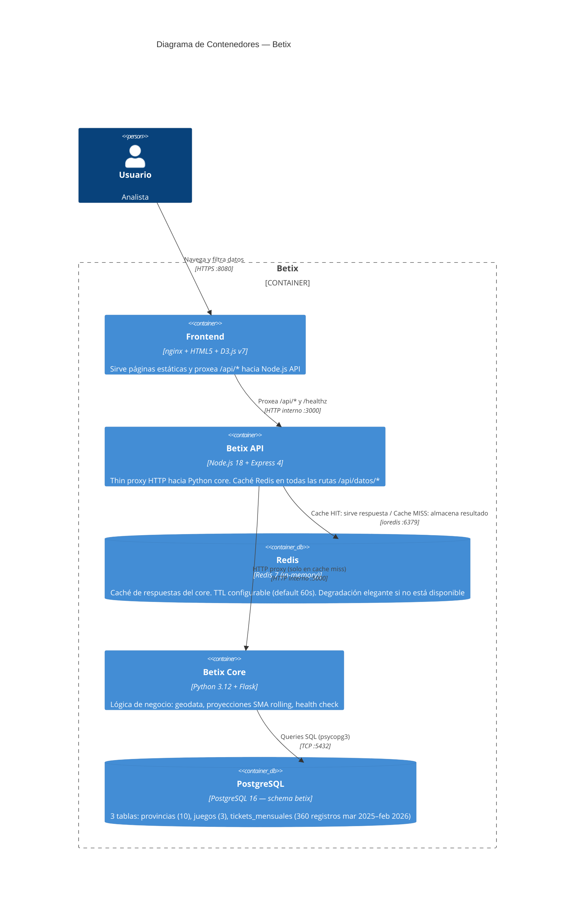
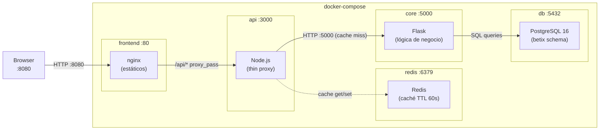
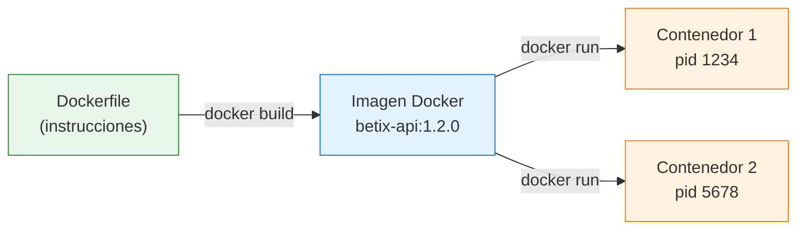
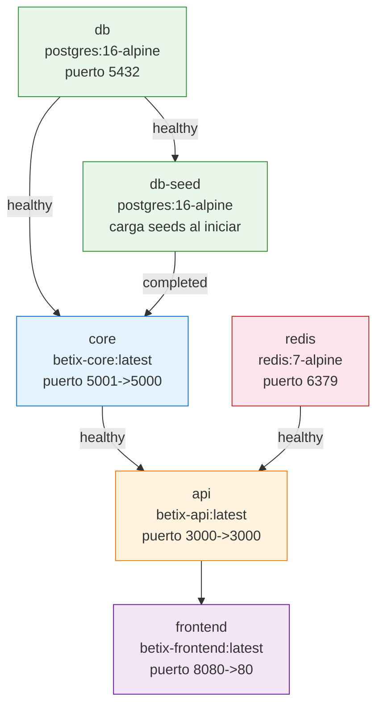
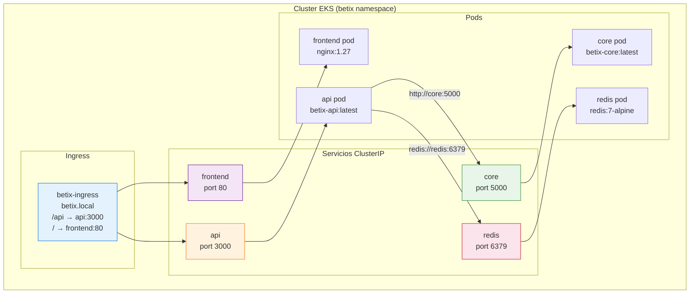
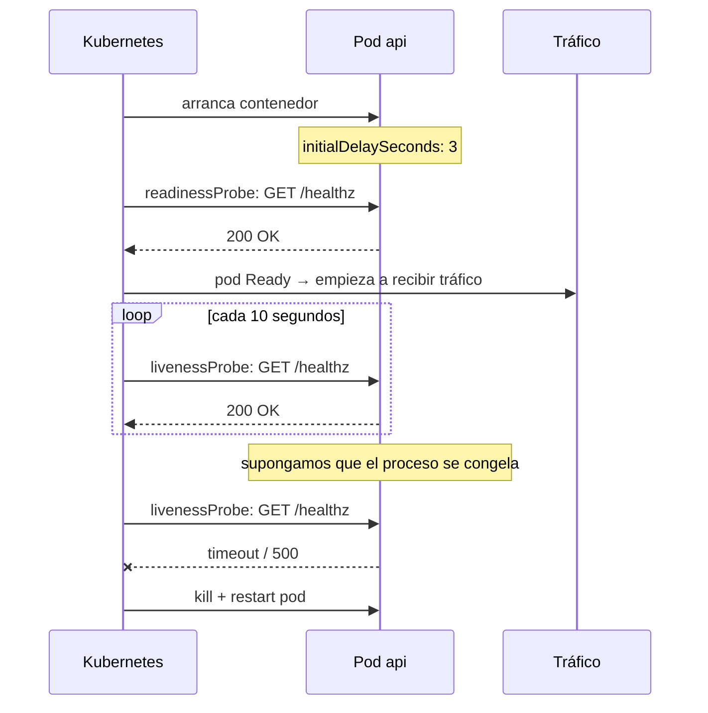
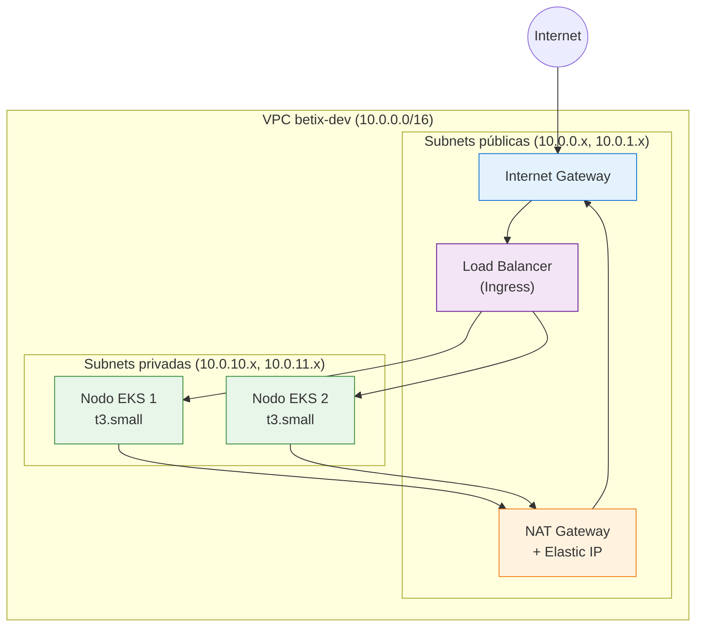
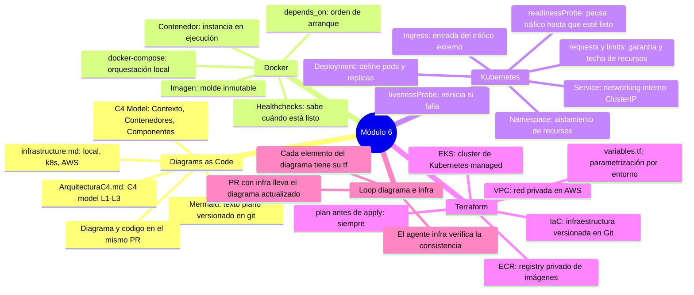

# Infraestructura como código

### Capítulo 6

← [Volver al temario](../TOC.md)

---

## Objetivos de este capítulo

Al terminar este capítulo vas a poder:
- Explicar por qué la plataforma exige que toda infraestructura sea código versionado, y cómo Betix lo implementa con Docker, Kubernetes y Terraform
- Interpretar los diagramas de arquitectura de Betix como fuente de verdad versionada, y entender su relación con los archivos que los generan
- Navegar el `docker-compose.yml` de Betix y entender qué levanta, en qué orden y por qué
- Leer manifiestos de Kubernetes y entender deployments, services, ingress, probes y resource limits
- Usar el agente `infra` de Claude para interpretar manifiestos, comparar entornos y verificar consistencia entre diagramas e infraestructura

---

## Nota: plataforma vs Betix

A lo largo de este módulo vas a ver dos cosas distintas:

- **La plataforma de Tecnoacción** establece el principio: toda infraestructura debe ser código versionado, revisable y reproducible. Ningún paso de configuración existe solo en la cabeza de alguien.
- **Betix** es el proyecto de referencia que implementa ese principio. Docker, Kubernetes, Terraform y los diagramas Mermaid son las herramientas concretas que Betix usa para cumplirlo.

Cuando este módulo diga "la plataforma exige X", se refiere al estándar. Cuando diga "Betix lo implementa con Y", se refiere a cómo ese estándar se ve en el código real del repo.

---

## 1. Diagrams as Code: documentación que vive en el repo

### Por qué la plataforma lo exige

La plataforma exige que los diagramas de arquitectura e infraestructura sean **texto plano versionado en Git**, no capturas de pantalla ni archivos binarios de Visio o Draw.io.

Las razones son las mismas que para cualquier otro código:
- Un diagrama como imagen no pasa por code review — nadie puede ver qué cambió entre versiones.
- Una imagen desactualizada es peor que no tener diagrama: da información falsa.
- Un diagrama en texto puede abrirse, diffarse y actualizarse igual que un `.yaml` o un `.tf`.

Betix implementa esto con [Mermaid](../glosario.md#mermaid): un lenguaje de texto que se renderiza automáticamente en GitHub. No hace falta ninguna herramienta adicional.

### Los dos archivos de diagramas en Betix

Betix tiene dos fuentes de diagramas como código:

| Archivo | Qué documenta |
|---------|---------------|
| [`docs/ArquitecturaC4.md`](../../ArquitecturaC4.md) | Arquitectura del sistema en tres niveles (C4 model): Contexto, Contenedores, Componentes |
| [`docs/diagrams/infrastructure.md`](../../diagrams/infrastructure.md) | Infraestructura concreta: flujos de datos en local (docker-compose), Kubernetes y AWS |

### El C4 model: tres niveles de zoom

Betix usa el [C4 Model](../glosario.md#c4-model) para documentar su arquitectura. La idea es simple: igual que un mapa tiene distintos niveles de zoom, la arquitectura tiene distintos niveles de detalle para distintas audiencias.

El diagrama más útil para entender Betix como conjunto de servicios es el **Nivel 2 — Contenedores**. Mostrá este bloque en tu editor para verlo renderizado:



La sintaxis `C4Container` es una extensión de Mermaid específica para el modelo C4. Cada `Container(...)` representa un proceso ejecutable independiente — no necesariamente un contenedor Docker, aunque en este caso todos lo son.

El Nivel 1 (Contexto) muestra Betix como caja negra con sus sistemas externos (Jira, SonarCloud, GitHub Actions). El Nivel 3 (Componentes) abre el `core/` Flask y muestra sus endpoints, services y `db.py`. Los tres niveles están en [`docs/ArquitecturaC4.md`](../../ArquitecturaC4.md).

### El diagrama de infraestructura local

El archivo [`docs/diagrams/infrastructure.md`](../../diagrams/infrastructure.md) tiene tres flowcharts: local (docker-compose), Kubernetes y AWS. El diagrama local muestra exactamente cómo fluye una request en tu máquina:



Este diagrama y el `docker-compose.yml` son la misma fuente de verdad, expresada de dos formas distintas: una para que la lea la máquina, otra para que la lea una persona.

### Por qué el diagrama va en el mismo PR que el código

La regla de la plataforma es clara: **cualquier PR que cambia infraestructura debe incluir la actualización del diagrama correspondiente**. El reviewer verifica que el diagrama refleje lo que el código crea.

Esto tiene una implicación concreta: el agente `infra` puede leer ambos archivos y decirte si hay inconsistencias. La sección 5 de este módulo muestra exactamente ese mapeo.

---

## 2. Docker: imágenes, contenedores y docker-compose

### ¿Qué es una imagen vs un contenedor?

Una **imagen** es como un molde: una snapshot inmutable del sistema de archivos con el código, las dependencias y la configuración necesaria para correr un proceso. Un **contenedor** es una instancia en ejecución de esa imagen — como arrancar un programa desde el molde.



La misma imagen puede correr múltiples contenedores. En Kubernetes eso es exactamente lo que pasa con las réplicas.

### docker-compose: orquestación local

La plataforma exige que el entorno de desarrollo local sea reproducible con un solo comando. Betix lo implementa con [`docker-compose.yml`](../../../docker-compose.yml), que levanta seis servicios:



### El orden de arranque importa

El `depends_on` de docker-compose garantiza que los servicios arranquen en el orden correcto. Pero hay dos condiciones distintas:

| Condición | Qué significa |
|-----------|---------------|
| `condition: service_healthy` | El healthcheck del servicio pasó — está listo para recibir conexiones |
| `condition: service_completed_successfully` | El servicio terminó de correr (exit 0) — útil para procesos de inicialización |

`db-seed` usa `service_completed_successfully` porque es un proceso que corre una vez, carga los datos y termina. `core` espera que `db-seed` termine exitosamente antes de arrancar — si el seed falla, el core no arranca.

### Healthchecks: cómo sabe docker que un servicio está listo

Cada servicio que importa tiene definido un healthcheck:

```yaml
# db — verifica que PostgreSQL acepte conexiones
healthcheck:
  test: ["CMD-SHELL", "pg_isready -U betix -d betix"]
  interval: 5s
  timeout: 3s
  retries: 10

# redis — verifica que responda al comando PING
healthcheck:
  test: ["CMD", "redis-cli", "ping"]
  interval: 10s
  timeout: 3s
  retries: 3

# core — verifica que el endpoint /healthz responda
healthcheck:
  test: ["CMD", "python3", "-c", "import urllib.request; urllib.request.urlopen('http://localhost:5000/healthz')"]
  interval: 30s
  timeout: 3s
  retries: 3
```

Sin healthchecks, docker-compose solo sabe que el proceso arrancó — no que está listo para recibir tráfico. Con healthchecks, el `api` espera hasta que `core` realmente esté respondiendo.

### Variables de entorno del servicio api

El servicio `api` recibe toda su configuración por variables de entorno — sin secretos hardcodeados en el código:

```yaml
environment:
  NODE_ENV:   production
  BETIX_PORT: "3000"
  CORE_URL:   "http://core:5000"    # nombre del servicio como hostname
  REDIS_URL:  "redis://redis:6379"  # ídem para redis
  CACHE_TTL:  "60"                  # segundos de cache en Redis
```

El hostname `core` funciona porque docker-compose crea una red interna donde cada servicio es resolvible por su nombre. No hace falta IP fija ni DNS externo.

### Comandos del día a día

```bash
make up      # docker-compose up --build (construye imágenes y levanta todo)
make down    # docker-compose down (baja y elimina contenedores)
make logs    # tail -f de los logs de todos los servicios
make build   # construye las 3 imágenes sin levantarlas
```

---

## 3. Kubernetes: de desarrollo a producción

### La diferencia fundamental

docker-compose es para desarrollo local. Kubernetes es para producción. Las razones principales:

| Característica | docker-compose | Kubernetes |
|----------------|---------------|------------|
| Autorecovery | No — si un contenedor cae, queda caído | Sí — reinicia pods automáticamente |
| Escalado | Manual — no tiene replicas nativas | Declarativo — `replicas: 3` y listo |
| Rolling updates | No | Sí — actualiza sin downtime |
| Health checks activos | Solo para `depends_on` | Liveness + readiness continuas |
| Secrets | Variables de entorno en el archivo | Kubernetes Secrets (separados del manifiesto) |

### La arquitectura en Kubernetes

La plataforma exige que la infraestructura de despliegue sea código revisable en PRs. Betix lo implementa con los manifiestos en `k8s/`. Todos los recursos viven en el [Namespace](../glosario.md#namespace-kubernetes) `betix`:



### El namespace

```yaml
# k8s/namespace.yaml
apiVersion: v1
kind: Namespace
metadata:
  name: betix
```

El [Namespace](../glosario.md#namespace-kubernetes) es un espacio de aislamiento dentro del cluster. Todos los recursos de Betix viven en `betix` — pods, services, ingress, secrets. Nunca en `default`.

### El Deployment de api: diseccionado

El manifiesto [`k8s/api-deployment.yaml`](../../../k8s/api-deployment.yaml) es el más representativo para entender cómo funciona un Deployment:

```yaml
apiVersion: apps/v1
kind: Deployment
metadata:
  name: api
  namespace: betix
spec:
  replicas: 1
  selector:
    matchLabels:
      app: api
  template:
    spec:
      containers:
        - name: api
          image: betix-api:latest
          imagePullPolicy: Always
          ports:
            - containerPort: 3000
          env:
            - name: CORE_URL
              value: "http://core:5000"
            - name: REDIS_URL
              value: "redis://redis:6379"
            - name: CACHE_TTL
              value: "60"
          resources:
            requests:
              cpu: "100m"
              memory: "128Mi"
            limits:
              cpu: "500m"
              memory: "256Mi"
          livenessProbe:
            httpGet:
              path: /healthz
              port: 3000
            initialDelaySeconds: 5
            periodSeconds: 10
          readinessProbe:
            httpGet:
              path: /healthz
              port: 3000
            initialDelaySeconds: 3
            periodSeconds: 5
```

Hay cuatro conceptos clave en este manifiesto:

#### 1. Probes: liveness vs readiness

Las [Probes](../glosario.md#probe-kubernetes) son el mecanismo que usa Kubernetes para saber si un pod está sano y si puede recibir tráfico:



- **readinessProbe**: determina si el pod está listo para recibir tráfico. Mientras falla, Kubernetes no le manda requests aunque el proceso esté corriendo.
- **livenessProbe**: determina si el pod sigue vivo. Si falla, Kubernetes lo reinicia.

#### 2. Resource requests y limits

```
requests:           limits:
  cpu: "100m"         cpu: "500m"
  memory: "128Mi"     memory: "256Mi"
```

- **requests**: lo que el pod *pide garantizado* al scheduler. Kubernetes usa esto para decidir en qué nodo ubicar el pod.
- **limits**: el máximo que puede usar. Si supera el límite de memoria, el pod se reinicia (`OOMKilled`).

`100m` de CPU = 0.1 de un core. Un nodo `t3.small` (2 vCPUs) puede correr hasta 20 pods con 100m de requests cada uno.

#### 3. Secrets vs plain env vars

El `api-deployment.yaml` usa variables de entorno planas. El `core-deployment.yaml` muestra el patrón con Secrets de Kubernetes:

```yaml
env:
  - name: BETIX_DB_URL
    valueFrom:
      secretKeyRef:
        name: betix-db-secret
        key: url
```

El valor nunca está en el manifiesto — está en un Kubernetes Secret que se crea por separado (y nunca se commitea al repo).

#### 4. imagePullPolicy: Always

`imagePullPolicy: Always` significa que Kubernetes siempre va a intentar descargar la imagen del registry antes de arrancar el pod. Así se garantiza que el tag `latest` siempre refleja la imagen más nueva. Sin esto, podría correr una versión cacheada del nodo.

### El Ingress: routing de entrada

[`k8s/ingress.yaml`](../../../k8s/ingress.yaml) define cómo entra el tráfico externo al cluster. El [Ingress](../glosario.md#ingress-kubernetes) actúa como reverse proxy: una sola IP pública que rutea a distintos servicios según el path:

```yaml
spec:
  rules:
    - host: betix.local
      http:
        paths:
          - path: /api
            pathType: Prefix
            backend:
              service:
                name: api
                port:
                  number: 3000
          - path: /healthz
            pathType: Exact
            backend:
              service:
                name: api
                port:
                  number: 3000
          - path: /
            pathType: Prefix
            backend:
              service:
                name: frontend
                port:
                  number: 80
```

`betix.local` es el hostname local para minikube. En AWS, el Ingress se mapea a un ALB (Application Load Balancer) con una IP pública real.

### Comandos de Kubernetes

```bash
make k8s-apply    # kubectl apply -f k8s/ (aplica todos los manifiestos)
make k8s-status   # kubectl get all -n betix (estado de pods y servicios)
make k8s-delete   # kubectl delete -f k8s/ (elimina todos los recursos)
```

---

## 4. Terraform: infraestructura AWS como código

> **Importante:** Terraform gestiona infraestructura real en AWS. Los archivos en `terraform/` son de solo lectura para el onboarding — modificar o ejecutar `terraform apply` sin aprobación puede generar costos o interrumpir servicios.

### ¿Qué problema resuelve Terraform?

Sin [IaC](../glosario.md#iac-infrastructure-as-code), la infraestructura se configura manualmente en la consola de AWS. Nadie sabe exactamente qué hay creado, cómo se configura o cómo reproducirlo si hay que hacer una nueva cuenta o un entorno de staging. Con Terraform, toda la infraestructura es un archivo `.tf` que se puede revisar en un PR igual que cualquier cambio de código.

La plataforma exige que no existan "pasos manuales en la consola que solo alguien de infra sabe hacer". Betix lo implementa con los archivos en `terraform/`.

### Los archivos de Terraform en Betix

```
terraform/
├── vpc.tf       — VPC, subnets públicas/privadas, IGW, NAT Gateway, rutas
├── eks.tf       — Cluster EKS, IAM roles, Security Groups, node group
├── ecr.tf       — 3 repositorios ECR con lifecycle policy
├── rds.tf       — RDS PostgreSQL 16
├── variables.tf — Variables parametrizables (región, entorno, tipos de instancia)
└── outputs.tf   — Valores exportados (endpoint del cluster, URLs de ECR)
```

### La VPC: red privada en AWS

`vpc.tf` define la red donde vive todo. La [VPC](../glosario.md#vpc-virtual-private-cloud) `betix-dev` aísla todos los recursos de Betix:



- Los **nodos EKS** viven en subnets **privadas** — no son accesibles directamente desde internet.
- El **Load Balancer** (Ingress) vive en subnets **públicas** — es el único punto de entrada.
- El **NAT Gateway** permite que los nodos privados salgan a internet (para descargar imágenes de ECR) sin ser accesibles desde afuera.

### El EKS: el cluster de Kubernetes en AWS

`eks.tf` define el cluster que va a correr los pods:

```hcl
# El cluster
resource "aws_eks_cluster" "betix" {
  name    = "betix-${var.environment}"
  version = var.eks_cluster_version   # "1.31"

  vpc_config {
    subnet_ids             = concat(aws_subnet.private[*].id, aws_subnet.public[*].id)
    endpoint_private_access = true
    endpoint_public_access  = true
  }
}

# El node group (los servidores donde corren los pods)
resource "aws_eks_node_group" "betix" {
  cluster_name   = aws_eks_cluster.betix.name
  instance_types = [var.eks_node_instance_type]  # "t3.small"

  scaling_config {
    desired_size = var.eks_node_desired  # 2
    min_size     = var.eks_node_min      # 1
    max_size     = var.eks_node_max      # 3
  }
}
```

El autoscaling define que el cluster puede tener entre 1 y 3 nodos, con 2 como punto de partida. Si la carga aumenta, puede escalar automáticamente hasta 3.

### Los repositorios ECR: el registry de imágenes

`ecr.tf` crea un repositorio Docker privado en AWS para cada servicio:

```hcl
locals {
  ecr_repos = ["betix-core", "betix-api", "betix-frontend"]
}

resource "aws_ecr_repository" "betix" {
  for_each             = toset(local.ecr_repos)
  name                 = each.key
  image_tag_mutability = "MUTABLE"

  image_scanning_configuration {
    scan_on_push = true  # escaneo de vulnerabilidades en cada push
  }
}

# Lifecycle policy: mantiene solo las últimas 10 imágenes por repo
resource "aws_ecr_lifecycle_policy" "betix" {
  for_each   = aws_ecr_repository.betix
  repository = each.value.name

  policy = jsonencode({
    rules = [{
      rulePriority = 1
      selection    = { tagStatus = "any", countType = "imageCountMoreThan", countNumber = 10 }
      action       = { type = "expire" }
    }]
  })
}
```

`scan_on_push = true` activa el escaneo automático de vulnerabilidades de seguridad cada vez que se pushea una imagen nueva. La lifecycle policy evita que los repositorios crezcan indefinidamente — cuando hay más de 10 imágenes, las más viejas se eliminan automáticamente.

### Variables: parametrización sin hardcodear

`variables.tf` define todos los valores que pueden cambiar entre entornos:

```hcl
variable "environment" {
  default = "dev"
  validation {
    condition     = contains(["dev", "uat", "pro"], var.environment)
    error_message = "El entorno debe ser dev, uat o pro."
  }
}

variable "eks_node_instance_type" {
  default = "t3.small"  # 2 vCPUs, 2GB RAM — suficiente para demo
}
```

Con variables, el mismo código de Terraform crea entornos `dev`, `uat` y `pro` con distintos tamaños de instancia o cantidad de nodos, sin duplicar archivos.

### El workflow de Terraform (solo lectura en onboarding)

```bash
terraform init    # descarga los providers (AWS) — solo la primera vez
terraform plan    # muestra qué va a crear/modificar/destruir — SIEMPRE antes de apply
terraform apply   # aplica los cambios — solo con aprobación explícita del equipo
```

`terraform plan` es la etapa de revisión. Muestra un diff de lo que va a cambiar:

```
+ aws_eks_cluster.betix       (nuevo)
+ aws_eks_node_group.betix    (nuevo)
~ aws_ecr_repository.betix    (modificado: scan_on_push: false → true)
- aws_security_group.old_sg   (a destruir)
```

Nunca se corre `terraform apply` sin haber revisado el plan. Destruir un cluster de EKS o una base de datos RDS en producción no tiene vuelta atrás inmediata.

---

## 5. El loop diagrama ↔ infraestructura

Hasta acá viste los archivos de infraestructura y los diagramas por separado. Esta sección muestra la relación concreta entre ellos — y el flujo de trabajo que la plataforma impone.

### Mapeo: diagrama AWS ↔ archivos Terraform

Cada elemento del diagrama AWS en [`docs/diagrams/infrastructure.md`](../../diagrams/infrastructure.md) tiene su definición exacta en un archivo `.tf`:

| Elemento en el diagrama AWS | Archivo Terraform |
|-----------------------------|-------------------|
| VPC betix-dev (10.0.0.0/16) | `terraform/vpc.tf` |
| Subnets públicas (AZ-1, AZ-2) | `terraform/vpc.tf` |
| Subnets privadas (AZ-1, AZ-2) | `terraform/vpc.tf` |
| NAT Gateway + EIP | `terraform/vpc.tf` |
| EKS betix-dev k8s 1.31 | `terraform/eks.tf` |
| Node Group t3.small desired=2 | `terraform/eks.tf` |
| IAM Roles (cluster + nodes) | `terraform/eks.tf` |
| ECR betix-core / betix-api / betix-frontend | `terraform/ecr.tf` |
| lifecycle: keep 10 images | `terraform/ecr.tf` |
| RDS PostgreSQL 16 betix schema | `terraform/rds.tf` |

### Mapeo: diagrama local ↔ docker-compose.yml

Lo mismo aplica para el diagrama local:

| Service en docker-compose.yml | Nodo en el diagrama local |
|-------------------------------|---------------------------|
| `frontend` (port 8080:80) | `nginx (estáticos)` en subgraph `frontend :80` |
| `api` (port 3000:3000) | `Node.js (thin proxy)` en subgraph `api :3000` |
| `redis` (port 6379:6379) | `Redis (caché TTL 60s)` en subgraph `redis :6379` |
| `core` (port 5001:5000) | `Flask (lógica de negocio)` en subgraph `core :5000` |
| `db` (port 5432:5432) | `PostgreSQL 16 (betix schema)` en subgraph `db :5432` |
| `depends_on: core healthy` | Flecha `HTTP :5000 (cache miss)` desde Node.js hacia Flask |

### El flujo de trabajo: cambio en terraform → actualizar diagrama en el mismo PR

Si agregás un servicio nuevo — por ejemplo, una ElastiCache en AWS para reemplazar el Redis local — el flujo es:

1. Agregás el recurso en el archivo `.tf` correspondiente
2. Corrés `terraform plan` para ver el diff antes de aplicar
3. Actualizás el diagrama en `docs/diagrams/infrastructure.md` en el **mismo PR**
4. El PR se revisa con ambos cambios juntos — el reviewer puede verificar que el diagrama refleja lo que el código crea

Un PR que cambia `terraform/` sin actualizar el diagrama está incompleto. La plataforma trata el diagrama como parte del artefacto, no como documentación opcional.

El agente `infra` puede leer ambos archivos y verificar la consistencia. Si el diagrama menciona un servicio que no existe en el `.tf`, o viceversa, el agente puede detectarlo.

---

## 6. Ejercicio — Interpretar y actualizar con el agente infra

### Parte 1: anatomía de un Deployment

Abrí Claude en VS Code y pedile al agente `infra` que analice el manifiesto del api:

```
Actúa como agente infra. Leé el archivo k8s/api-deployment.yaml y explicame:

1. Qué imagen despliega y de dónde viene (no está en el repo — ¿de dónde la trae el cluster?)
2. Cómo sabe Kubernetes que el pod está listo para recibir tráfico — diferencia entre
   liveness y readiness probe
3. Qué pasa si el core no está disponible (CORE_URL apunta a http://core:5000 —
   qué ocurre con el pod de api si ese servicio no responde?)
4. Qué recursos (CPU y memoria) tiene asignados y por qué importa definir
   tanto requests como limits
```

Leé la respuesta y verificá que coincide con lo que aprendiste en este módulo.

### Parte 2: verificar consistencia diagrama ↔ docker-compose

Una vez que tenés el análisis del Deployment, pedile al agente que verifique la consistencia entre el diagrama local y el docker-compose:

```
Actúa como agente infra. Leé docs/diagrams/infrastructure.md (sección "Local — docker-compose")
y docker-compose.yml.

Verificá que:
1. Cada servicio del docker-compose tiene su representación en el diagrama
2. Los puertos en el diagrama coinciden con los puertos en docker-compose.yml
3. Las dependencias (depends_on) del docker-compose se reflejan en las flechas del diagrama

Si encontrás alguna inconsistencia, describila. Si todo coincide, confirmalo.
```

Esto te da una idea concreta de cómo el agente puede actuar como guardián de la consistencia entre documentación e implementación.

### Parte 3: reflexión

Respondé estas preguntas antes de continuar:

1. Si el `core` pod falla en producción (Kubernetes), ¿el pod de `api` se reinicia automáticamente? ¿Por qué?
2. En docker-compose, si el healthcheck de `core` falla de forma permanente, ¿qué le pasa al servicio `api`?
3. El manifiesto de `core` usa `secretKeyRef` para `BETIX_DB_URL`. ¿Por qué no está la URL de la base de datos directamente en el YAML?
4. Si querés escalar el `api` a 3 réplicas en Kubernetes, ¿qué campo del manifiesto modificás?
5. Si agregás un nuevo servicio en `docker-compose.yml`, ¿qué más tenés que actualizar para que el repositorio quede consistente?

> **Verificá con Claude:** _"Mis respuestas son X, Y, Z. ¿Estoy en lo correcto?"_ — el agente `infra` tiene el contexto completo del repo para validarte.

---

## Resumen



---

## Recursos del repositorio

| Recurso | Descripción |
|---------|-------------|
| [`docs/ArquitecturaC4.md`](../../ArquitecturaC4.md) | C4 model en Mermaid: Contexto (L1), Contenedores (L2), Componentes del core (L3) |
| [`docs/diagrams/infrastructure.md`](../../diagrams/infrastructure.md) | Diagramas de infraestructura: local, Kubernetes y AWS |
| [`docker-compose.yml`](../../../docker-compose.yml) | Orquestación local: 6 servicios con healthchecks y depends_on |
| [`k8s/`](../../../k8s/) | Manifiestos de Kubernetes (namespace, deployments, services, ingress) |
| [`k8s/api-deployment.yaml`](../../../k8s/api-deployment.yaml) | Deployment del api: probes, resources, env vars |
| [`k8s/ingress.yaml`](../../../k8s/ingress.yaml) | Routing de entrada: /api, /healthz, / |
| [`terraform/`](../../../terraform/) | Infraestructura AWS como código |
| [`terraform/eks.tf`](../../../terraform/eks.tf) | Cluster EKS + node group + IAM roles |
| [`terraform/ecr.tf`](../../../terraform/ecr.tf) | Repositorios ECR con lifecycle policy y scan_on_push |
| [`.claude/agents/infra.md`](../../../.claude/agents/infra.md) | Agente infra — contexto y reglas para tareas de infraestructura |
| [`docs/monorepo-guide.md`](../../monorepo-guide.md) | Path filters, versionado independiente por servicio, Makefile |

---

← [Capítulo 5](5.md) | [Capítulo 7](7.md) →
