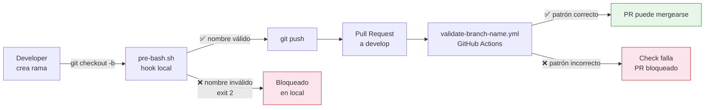
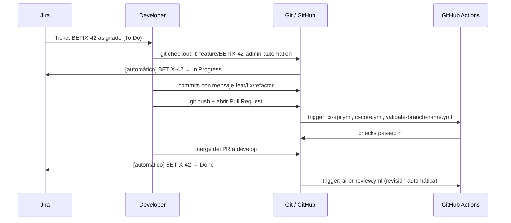
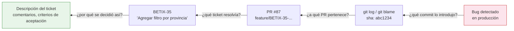
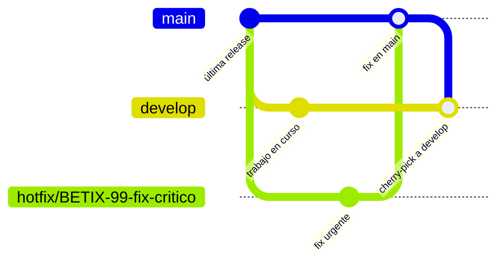
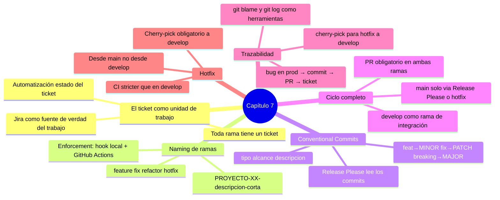

# Gestión de tickets con Jira + Git

### Capítulo 7

← [Volver al temario](../TOC.md)

---

## Objetivos de este capítulo

Al terminar este capítulo vas a poder:
- Explicar por qué la plataforma exige que cada cambio al código tenga un ticket asociado, y cómo esa trazabilidad funciona en la práctica
- Crear una rama con el nombre correcto a partir de un ticket de Jira, entendiendo el patrón y el motivo detrás de cada parte
- Escribir mensajes de commit en Conventional Commits format y explicar por qué el mensaje importa más allá del historial
- Seguir el ciclo completo de un cambio: ticket → rama → commit → PR → merge → cierre automático del ticket
- Usar las automatizaciones de la plataforma para rastrear hacia atrás desde un bug en producción hasta el ticket que lo introdujo

---

## Nota: plataforma vs Betix

A lo largo de este capítulo vas a ver dos cosas distintas:

- **La plataforma de Tecnoaccion** establece el principio: toda unidad de trabajo tiene un ticket. Toda rama lleva ese ticket en el nombre. Todo commit describe qué cambió y por qué. La trazabilidad no es opcional.
- **Betix** es el proyecto de referencia que implementa ese principio. Jira como gestor de tickets, GitHub como host del repo, y el proyecto `BETIX` como identificador son los valores concretos que aparecen en los ejemplos.

En tu proyecto, el prefijo del ticket podría ser otro (`CORE-`, `FRONT-`, `API-`). El patrón es el mismo.

---

## 1. El ticket como unidad de trabajo

### Por qué la plataforma lo exige

La plataforma exige que **cada cambio al código tenga un ticket asociado**. No como burocracia, sino como la única forma de que el equipo sepa *por qué* existe ese código.

Sin un ticket:
- Nadie sabe quién tomó la decisión de hacer ese cambio
- No hay contexto de negocio para entender por qué se implementó de esa manera
- Si el cambio introduce un bug, no hay forma de entender el requerimiento original
- En tres meses, el autor no recuerda por qué lo hizo

Con un ticket:
- Hay un registro del requerimiento, la discusión y las decisiones de diseño
- El PR puede linkear al ticket, y el ticket puede linkear al PR
- El historial de Git es rastreable hasta el requerimiento de negocio

> [**Principio 4 en acción:**](../../principios-fundamentales.md#una-sola-fuente-de-verdad--cero-estado-implícito) una sola fuente de verdad. El estado del trabajo vive en Jira. El estado del código vive en Git. La trazabilidad entre ambos es el contrato.

### Tipos de ticket en Betix

La plataforma usa cuatro prefijos de [rama](../glosario.md#branch), cada uno con una semántica clara:

| Prefijo | Tipo de cambio | Base desde |
|---------|----------------|------------|
| `feature/` | Nueva funcionalidad | `develop` |
| `fix/` | Corrección de un bug | `develop` |
| `refactor/` | Reestructuración sin cambio de comportamiento | `develop` |
| `hotfix/` | Fix urgente en producción | `main` |

Cada prefijo corresponde a un tipo de ticket en Jira. El tipo de ticket determina el prefijo de la rama, que a su vez determina qué CI corre y cómo se versiona.

---

## 2. Del ticket a la rama

### El patrón obligatorio

El nombre de una rama en la plataforma sigue este patrón:

```
<prefijo>/<PROYECTO>-<número>-<descripción-corta>
```

Ejemplos válidos:
```
feature/BETIX-41-platform-rules-enforcement
fix/BETIX-42-endpoint-bug
refactor/BETIX-43-cleanup-proxy
hotfix/BETIX-44-prod-fix
```

Cada parte tiene una razón:

| Parte | Propósito |
|-------|-----------|
| `<prefijo>/` | Define el tipo de cambio y determina el comportamiento del CI y del versionado automático |
| `<PROYECTO>-<número>` | ID único del ticket en Jira — permite trazabilidad directa entre rama y requerimiento |
| `<descripción-corta>` | Hace legible el nombre sin tener que ir a Jira — [kebab-case](../glosario.md#kebab-case), máximo 4-5 palabras |

### Por qué el Jira ID va en el nombre de la rama

Tener el ID del ticket en la rama activa dos automatizaciones que la plataforma configura en cada repo:

1. **Apertura automática de ticket**: cuando se pushea una rama con `BETIX-XX` en el nombre, el workflow `jira-branch-in-progress.yml` mueve el ticket a _In Progress_ en Jira automáticamente.
2. **Cierre automático**: cuando el PR se mergea a `develop`, el workflow `jira-close-on-merge.yml` mueve el ticket a _Done_.

El desarrollador no tiene que hacer nada manual en Jira — el estado del ticket refleja el estado real del código.

### Enforcement automático

La plataforma no confía en que todos recuerden el patrón. Lo enforcea:

- **Claude Code hook** (`pre-bash.sh`): bloquea la creación de una rama con nombre inválido cuando Claude corre el comando.
- **GitHub Actions** (`validate-branch-name.yml`): valida el nombre de la rama en cada PR. Si no cumple el patrón, el check falla y el PR no puede mergearse.

Esto implementa el [Principio 3](../../principios-fundamentales.md#la-calidad-se-automatiza-y-se-enforcea--nunca-se-sugiere): un estándar que se puede saltear no es un estándar.



El hook local da feedback inmediato antes del push. El workflow de CI es el guardián final en GitHub, independientemente de cómo se creó la rama.

### Cómo crear la rama correctamente

```bash
# Primero, asegurarse de estar actualizado desde develop
git checkout develop
git pull

# Crear la rama con el patrón correcto
git checkout -b feature/BETIX-42-admin-automation
```

Si usás Claude para crear la rama, el hook valida el nombre antes de ejecutar el comando.

---

## 3. Conventional Commits

### Por qué el mensaje del commit importa

El mensaje de un commit es el único lugar donde el autor puede explicar *por qué* hizo ese cambio — no qué archivos tocó (eso lo muestra el diff), sino la intención detrás.

La plataforma usa [Conventional Commits](../glosario.md#conventional-commits): un formato estructurado que hace los mensajes legibles por humanos *y* por máquinas.

Legibles por máquinas porque [**Release Please**](../glosario.md#release-please) — la herramienta de versionado automático de la plataforma — lee los commits para determinar si hace falta [bump de versión](../glosario.md#bump-de-versión) y qué entra en el [CHANGELOG](../glosario.md#changelog).

### El formato

```
<tipo>(<alcance>): <descripción corta>

[cuerpo opcional — explica el por qué, no el qué]

[footer opcional — referencias a tickets]
```

Tipos válidos y su efecto en el versionado:

| Tipo | Semántica | Bump de versión |
|------|-----------|-----------------|
| `feat` | Nueva funcionalidad | [MINOR](../glosario.md#minor--major--patch) (1.X.0) |
| `fix` | Corrección de bug | [PATCH](../glosario.md#minor--major--patch) (1.0.X) |
| `refactor` | Reestructuración sin cambio de comportamiento | Ninguno |
| `docs` | Solo documentación | Ninguno |
| `chore` | Tareas de mantenimiento | Ninguno |
| `test` | Agregar o corregir tests | Ninguno |
| `feat!` o [`BREAKING CHANGE`](../glosario.md#breaking-change) | Cambio que rompe compatibilidad | [MAJOR](../glosario.md#minor--major--patch) (X.0.0) |

### Ejemplos

```bash
# Nuevo endpoint — dispara bump MINOR
feat(core): add monthly sales projection endpoint

# Bug fix — dispara bump PATCH
fix(api): correct status code on empty province response

# Refactor — no dispara bump
refactor(core): extract geodata logic to dedicated service

# Documentación — no dispara bump
docs(onboarding): add chapter 7 on Jira+Git workflow

# Breaking change — dispara bump MAJOR
feat(api)!: replace province code with UUID in all responses

BREAKING CHANGE: clients using numeric province codes need to migrate to UUIDs
```

### El alcance es opcional pero recomendado

El `(<alcance>)` identifica qué parte del sistema cambia. En Betix:

| Alcance | Qué cubre |
|---------|-----------|
| `core` | `core/` — lógica de negocio Python |
| `api` | `src/` — proxy Node.js |
| `frontend` | `src/public/` o `frontend/` |
| `k8s` | Manifiestos de Kubernetes |
| `ci` | Workflows de GitHub Actions |
| `scripts` | Scripts de automatización |

---

## 4. El ciclo completo: de ticket a producción

### El flujo de trabajo estándar



Los pasos automáticos (movimientos de ticket en Jira) no requieren intervención manual. La plataforma los configura en cada repo con `init-repo.sh`.

### Las ramas permanentes

La plataforma maneja dos ramas que nunca se eliminan:


| Rama | Propósito | Quién hace PR aquí |
|------|-----------|--------------------|
| `develop` | Integración continua — todos los cambios llegan acá primero | `feature/`, `fix/`, `refactor/` |
| `main` | Producción — refleja exactamente lo que está corriendo | Solo Release Please (merge automático) y `hotfix/` |

**No se commitea directamente en `develop` ni en `main`.** Todo cambio llega a través de un [PR](../glosario.md#pull-request-pr). Las branch protection rules lo garantizan.

### Los Pull Requests: qué revisar

Un [PR](../glosario.md#pull-request-pr) es la oportunidad de que otro par del equipo (o Claude) valide el cambio antes de que llegue a `develop`. La plataforma configura revisión automática con Claude vía `ai-pr-review.yml` en cada PR.

Qué revisar en un PR:

| Categoría | Preguntas |
|-----------|-----------|
| **Corrección** | ¿El código hace lo que dice el ticket? ¿Hay casos borde no cubiertos? |
| **Tests** | ¿Hay tests para el cambio? ¿Los existentes siguen pasando? |
| **Estándares** | ¿El código sigue las convenciones del proyecto? ¿Pasó ESLint/pytest? |
| **Trazabilidad** | ¿El título del PR referencia el ticket? ¿Los commits tienen formato correcto? |
| **Documentación** | ¿Si cambió infraestructura, se actualizó el diagrama? ¿Si cambió un endpoint, se actualizó la doc? |

Qué **no** bloquear en un PR:
- Diferencias de estilo subjetivas que no violan las convenciones acordadas
- Mejoras que van más allá del scope del ticket (abrir un ticket nuevo)
- Micro-optimizaciones sin evidencia de problema de performance

---

## 5. Trazabilidad: de un bug en producción al ticket

Una de las ventajas más concretas del flujo Jira + Git es la trazabilidad inversa. Ante un bug en producción, el camino completo es reconstruible:



### Herramientas de trazabilidad

```bash
# Encontrar quién cambió una línea y cuándo
git blame src/app.js

# Ver todos los commits que tocaron un archivo
git log --oneline src/routes/estadisticas.js

# Buscar el commit que introdujo una función específica
git log -S "funcionProblem" --oneline

# Ver los cambios de un commit específico (SHA)
git show abc1234

# Encontrar el PR de un commit (en GitHub CLI)
gh pr list --search "sha:abc1234"
```

Con el ID del ticket en el nombre de la rama y en los commits, cualquier miembro del equipo puede ir de un comportamiento inesperado en producción al contexto de negocio que motivó ese código. Ver [SHA](../glosario.md#sha-commit-hash) y [Pull Request](../glosario.md#pull-request-pr) en el glosario.

---

## 6. Hotfix: el flujo de emergencia

Un [`hotfix/`](../glosario.md#hotfix) es para cuando hay un bug crítico en producción que no puede esperar el flujo normal de `develop → main`.



El flujo de hotfix:

1. Crear la rama desde `main` (no desde `develop`)
2. Hacer el fix mínimo necesario
3. PR directamente a `main`
4. Después del merge a `main`, [cherry-pick](../glosario.md#cherry-pick) del commit a `develop` para evitar regresión

```bash
# Crear hotfix desde main
git checkout main
git pull
git checkout -b hotfix/BETIX-99-fix-critico

# Hacer el fix, commit, push
git commit -m "fix(core): correct null pointer on empty province list"
git push -u origin hotfix/BETIX-99-fix-critico

# Después del merge a main, cherry-pick a develop
git checkout develop
git cherry-pick <sha-del-fix>
git push
```

El [CI](../glosario.md#cicd) de hotfix (`ci-hotfix.yml`) corre la suite completa sin path filters — es el escenario de mayor riesgo y el que más validación necesita.

---

## 7. Ejercicio — El ciclo completo con un ticket ficticio

### Setup

Para este ejercicio, vas a trabajar con un ticket ficticio de Jira. Si tenés acceso al proyecto BETIX, podés crearlo. Si no, usá los valores del enunciado y ejecutá los pasos de Git de todas formas.

**Ticket:** `BETIX-50`
**Título:** "Como analista, quiero ver el total de tickets vendidos por juego en el mes actual"
**Tipo:** feature

### Paso 1: crear la rama

Pedile a Claude que te ayude a crear la rama:

```
Tengo el ticket BETIX-50 que dice:
"Como analista, quiero ver el total de tickets vendidos por juego en el mes actual"

¿Cómo debería llamarse la rama para este ticket? ¿Desde qué rama base debo crearla?
```

Verificá que la respuesta cumple el patrón de la plataforma, luego:

```bash
git checkout develop
git pull
git checkout -b feature/BETIX-50-total-tickets-por-juego
```

### Paso 2: hacer un commit inicial

Antes de implementar nada, hacé un commit vacío (o con un archivo de notas) para marcar el inicio del trabajo:

```bash
# Crear el archivo de notas
echo "# Notas de implementación BETIX-50" > docs/notas-betix-50.md

git add docs/notas-betix-50.md
git commit -m "feat(docs): start BETIX-50 implementation notes"
```

Observá el formato: `feat(docs):` — tipo `feat` porque es una nueva funcionalidad, alcance `docs` porque por ahora solo toca documentación.

### Paso 3: escribir el commit message con Claude

Supongamos que ya implementaste el endpoint. Pedile a Claude que te ayude a escribir el commit:

```
Actúa como desarrollador senior de Betix. Implementé estas cosas para BETIX-50:
- Nuevo endpoint Flask en core/: GET /api/tickets-por-juego?mes=YYYY-MM
- Proxy en Node.js: GET /api/tickets-por-juego
- Test Jest para el proxy

¿Cuál sería el commit message correcto en Conventional Commits format?
¿Debería ser uno o varios commits?
```

### Paso 4: reflexión sobre trazabilidad

Con el ticket, la rama y los commits en su lugar, respondé:

1. Si en tres meses alguien ve el endpoint `/api/tickets-por-juego` y quiere entender *por qué* existe, ¿cuál es el camino más corto para llegar al contexto original?
2. Si este endpoint introduce un bug en producción en seis meses, ¿cómo se llega desde el síntoma hasta el ticket?
3. ¿Por qué la plataforma exige que el ID del ticket esté en el nombre de la rama *y* los commits sean Conventional Commits, en lugar de ser solo uno de los dos?

> **Verificá con Claude:** _"Mis respuestas son X, Y, Z. ¿Estoy en lo correcto?"_

---

## Resumen



---

## Recursos del repositorio

| Recurso | Descripción |
|---------|-------------|
| [`CLAUDE.md`](../../../CLAUDE.md) | Reglas de branching y convenciones de commit del proyecto |
| [`.claude/hooks/scripts/pre-bash.sh`](../../../.claude/hooks/scripts/pre-bash.sh) | Hook que valida el nombre de rama antes de crearla |
| [`.github/workflows/validate-branch-name.yml`](../../../.github/workflows/validate-branch-name.yml) | [Workflow](../glosario.md#workflow) de CI que bloquea PRs con nombre de rama inválido |
| [`.github/workflows/jira-close-on-merge.yml`](../../../.github/workflows/jira-close-on-merge.yml) | Cierra el ticket en Jira automáticamente al mergear el [PR](../glosario.md#pull-request-pr) |
| [`scripts/init-repo.sh`](../../../scripts/init-repo.sh) | Script que configura branch protection y labels en un repo nuevo |
| [`docs/setup-inicial-repos.md`](../../setup-inicial-repos.md) | Guía para administradores: cómo inicializar un repo con las políticas de la plataforma |

---

← [Capítulo 6](6.md) | [Capítulo 8](8.md) →
