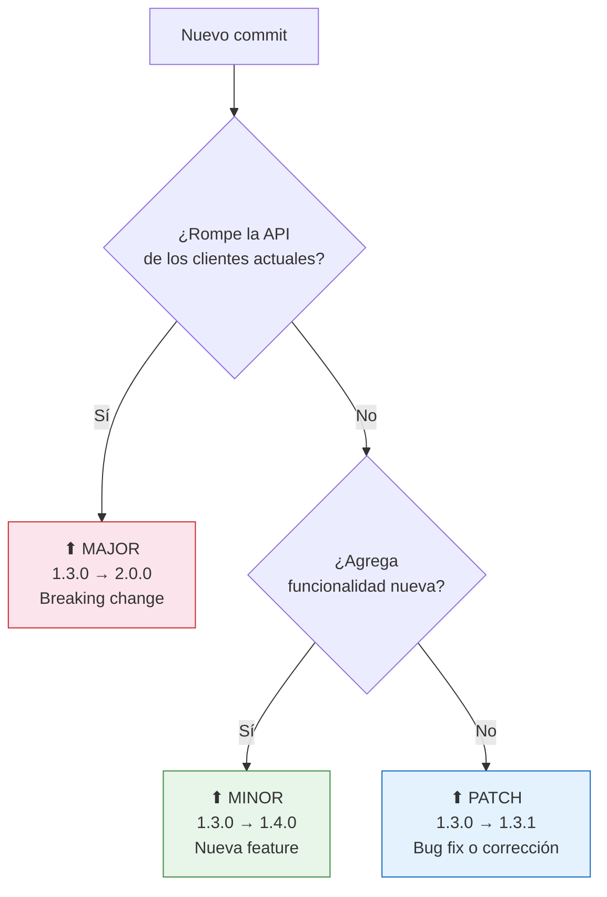
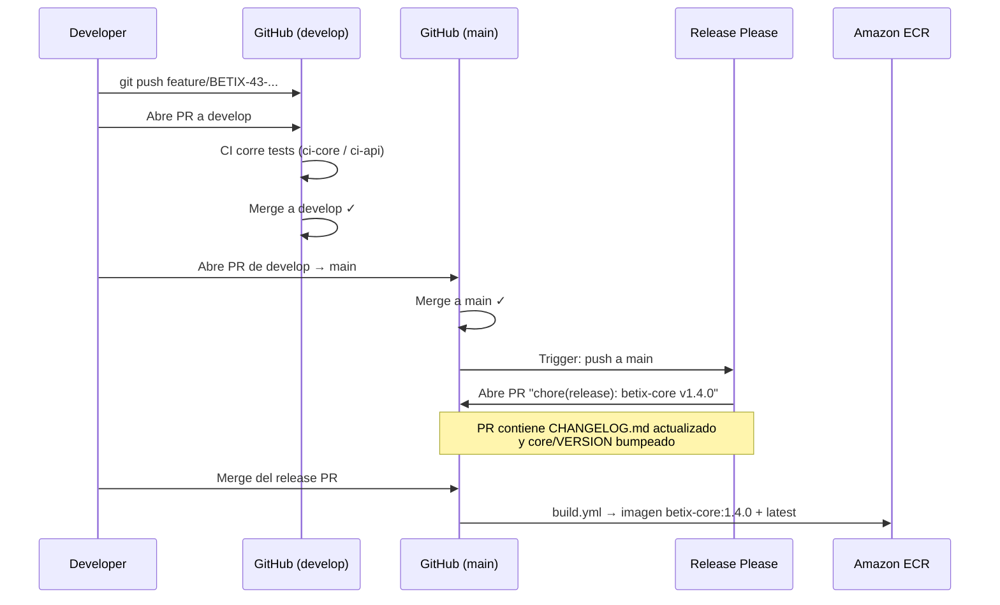
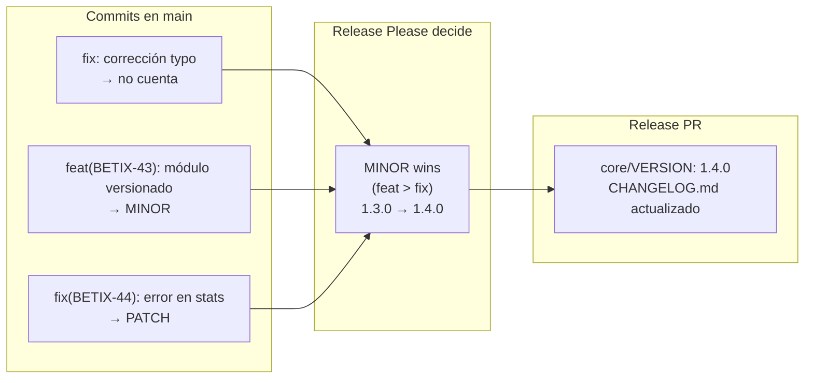
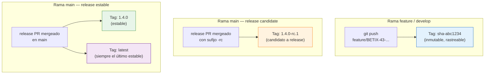
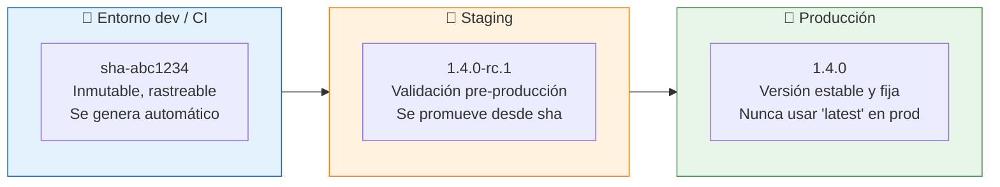
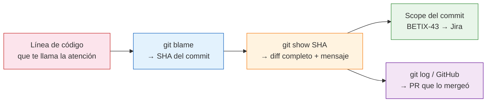
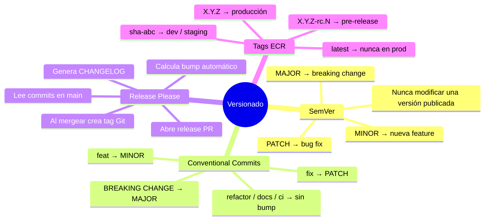

# Versionado y releases

### Capítulo 8

← [Volver al temario](../TOC.md)

---

## Objetivos de este capítulo

Al terminar este capítulo vas a poder:
- Leer un número de versión semver y saber exactamente qué tipo de cambio introdujo
- Escribir commits que Release Please entienda para calcular la versión correcta automáticamente
- Entender qué tag de ECR corresponde a cada entorno (dev / staging / prod)
- Trazar un release de Betix de punta a punta: commit → CHANGELOG → tag → imagen

> **Nota:** El sistema de versionado que describimos aquí (semver + Release Please + conventional commits) es el estándar de la plataforma Tecnoaccion — lo vas a encontrar en todos los proyectos del equipo.

---

## 1. Semantic Versioning (SemVer)

Betix usa **SemVer**: cada servicio tiene tres números separados por puntos.

```
MAJOR . MINOR . PATCH
  1   .   3   .   0
```

Hoy los servicios están en:

| Servicio | Versión actual |
|----------|---------------|
| `betix-core` (Python/Flask) | **1.3.0** |
| `betix-api` (Node.js proxy) | **1.4.0** |
| `betix-frontend` (nginx) | **1.2.0** |

Cada número tiene una regla clara:



### Ejemplos reales de Betix

| Versión | Qué cambió | Por qué ese bump |
|---------|-----------|-----------------|
| `betix-core` 1.0.0 → 1.1.0 | Se agregó el endpoint `/proyectado` | Feature nueva, compatible |
| `betix-core` 1.1.0 → 1.2.0 | Migración a PostgreSQL + endpoint `/provincias_juegos` | Feature nueva, compatible |
| `betix-core` 1.2.0 → 1.3.0 | Tabla `provincias_juegos`, caché por provincia | Features nuevas, compatible |
| `betix-api` 1.3.0 → 1.4.0 | Proxy actualizado para los nuevos endpoints | Feature nueva compatible |

> **Por qué no hay un 2.0.0 todavía:** Todos los cambios del historial de Betix han sido backwards-compatible. Un MAJOR ocurriría si, por ejemplo, el formato de respuesta de `/stats` cambiara de forma que rompiera clientes existentes.

### La especificación oficial

La especificación completa está en [semver.org](https://semver.org/lang/es/) (disponible en español).

Puntos clave de la spec que aplican en Betix:
1. Una vez publicada una versión, el contenido de esa versión **no se modifica**. Si hay un error, se publica una versión nueva.
2. La versión `0.y.z` es para desarrollo inicial — todo puede cambiar. Cuando se llega a `1.0.0` se declara una API pública estable.
3. `PATCH` se incrementa cuando se hacen correcciones de errores compatibles hacia atrás.
4. `MINOR` se incrementa cuando se añade funcionalidad compatible hacia atrás. Implica resetear `PATCH` a 0.
5. `MAJOR` se incrementa cuando se hacen cambios incompatibles en la API pública. Implica resetear `MINOR` y `PATCH` a 0.

---

## 2. Conventional Commits + Release Please

En Betix, **nadie bumpea la versión manualmente** (salvo emergencias). El proceso es:

1. El developer escribe un commit con el formato correcto
2. Release Please lee los commits en `main` y calcula automáticamente la próxima versión
3. Release Please abre un PR con el CHANGELOG actualizado y el nuevo número de versión
4. Al mergear ese PR, se crea el tag y se dispara el build de la imagen Docker



### El formato Conventional Commits

```
<tipo>(<scope opcional>): <descripción en imperativo>

[cuerpo opcional]

[footer opcional — BREAKING CHANGE: ...]
```

**Tipos que usamos en Betix y su efecto en semver:**

| Tipo | Descripción | Bump semver |
|------|------------|------------|
| `feat` | Nueva funcionalidad | **MINOR** |
| `fix` | Corrección de bug | **PATCH** |
| `refactor` | Restructuración sin cambio de comportamiento | ninguno |
| `chore` | Tareas de mantenimiento, dependencias | ninguno |
| `docs` | Solo documentación | ninguno |
| `ci` | Cambios en workflows de GitHub Actions | ninguno |
| `perf` | Mejora de rendimiento | **PATCH** |
| `test` | Agregar o corregir tests | ninguno |
| `BREAKING CHANGE` | Footer o `!` tras el tipo | **MAJOR** |

> **Importante:** `refactor`, `chore`, `docs`, `ci` y `test` **no generan release**. Solo `feat`, `fix`, `perf` y `BREAKING CHANGE` disparan un bump de versión.

> **No confundir con los prefijos de rama.** Los tipos de la tabla de arriba van en el *mensaje del commit*, no en el nombre de la rama. Los prefijos de rama son solo 4 (`feature/`, `fix/`, `refactor/`, `hotfix/`) y están enforceados por el hook de Git. Por ejemplo, un commit de documentación se hace sobre una rama `feature/BETIX-43-...` y el commit lleva `docs(BETIX-43): ...` — la rama sigue siendo `feature/`.
>
> | Contexto | Valores posibles |
> |----------|-----------------|
> | Prefijo de rama | `feature/` `fix/` `refactor/` `hotfix/` |
> | Tipo de commit | `feat` `fix` `refactor` `chore` `docs` `ci` `perf` `test` |

### Ejemplos reales del historial de Betix

```bash
# → MINOR bump (feature nueva)
feat(BETIX-32): agregar tabla provincias_juegos y endpoint /provincias_juegos

# → PATCH bump (bug fix)
fix(BETIX-32): restaurar fila (1,1) tras test de delete para evitar polución de estado

# → PATCH bump (mejora de diagnóstico)
fix(BETIX-17): mejorar endpoints /healthz con diagnóstico detallado de dependencias

# → sin bump (refactor)
refactor(BETIX-38): extraer json_parse a librería compartida de hooks

# → MAJOR bump (hipotético — cambio de API pública)
feat(BETIX-99)!: redefinir formato de respuesta /stats a v2

# equivalente con footer:
feat(BETIX-99): redefinir formato de respuesta /stats a v2

BREAKING CHANGE: el campo "data" ahora es un objeto en lugar de un array
```

### ¿Qué hace Release Please exactamente?

Release Please analiza todos los commits desde el último release en `main` y:

1. **Determina el bump**: si hay algún `feat` → MINOR; si solo hay `fix` → PATCH; si hay `BREAKING CHANGE` → MAJOR
2. **Genera el CHANGELOG**: agrupa los commits por tipo bajo el número de versión nuevo
3. **Actualiza el VERSION file**: escribe el nuevo número en `core/VERSION`, `src/VERSION` o `frontend/VERSION`
4. **Abre el release PR**: un PR automático etiquetado `autorelease: pending`
5. **Al hacer merge del release PR**: crea el tag Git (`betix-core-v1.4.0`) y dispara el build



> **Path filters importan:** Si tus commits solo tocan `docs/` o `src/`, Release Please no bumpea `betix-core`. Cada servicio tiene su propio VERSION file y solo se bumpea si sus paths cambiaron.

---

## 3. Tags de ECR — qué imagen corre dónde

Amazon ECR (Elastic Container Registry) almacena las imágenes Docker. Cada build genera uno o más tags según la rama de origen:



### Tabla de referencia rápida

| Tag | Ejemplo | Cuándo se genera | Uso |
|-----|---------|-----------------|-----|
| `sha-<commit>` | `sha-abc1234` | Cada push a `develop` o rama de feature | **Dev / staging** — traza exactamente qué código corre |
| `X.Y.Z-rc.N` | `1.4.0-rc.1` | Release candidate antes de estabilizar | **Staging pre-release** — validación final |
| `X.Y.Z` | `1.4.0` | Merge del release PR en `main` | **Producción** — versión estable e inmutable |
| `latest` | `latest` | Con cada release estable | Solo conveniente para exploración local |

### Reglas del equipo por entorno



> **¿Por qué no usar `latest` en producción?** El tag `latest` apunta a la última imagen publicada y puede cambiar sin aviso. Si un pod en producción reinicia y descarga `latest`, puede correr código que nunca fue validado para ese entorno. Siempre fijar la versión explícita: `betix-core:1.4.0`.

---

## 4. Ejercicio práctico guiado

### Objetivo

Observar el flujo de CI en acción: crear una rama, hacer cambios reales en `core/`, hacer push y analizar qué jobs corren y cuáles no.

### Pasos

**1. Checkout de develop**

```bash
git checkout develop
git pull origin develop
```

**2. Crear una rama con tu nombre**

```bash
git checkout -b feature/<tu-nombre>-<tu-apellido>-semver
# Ejemplo: feature/ana-garcia-semver
```

> Esta rama **no sigue** el patrón `BETIX-XX` porque es un ejercicio personal — no está vinculada a un ticket real. En trabajo normal siempre se usa el ID de Jira.

**3. Hacer un cambio pequeño en `core/`**

Abrí cualquier archivo de `core/` y hacé un cambio mínimo que no rompa los tests. Algunas ideas:
- Agregar un comentario explicativo en un servicio
- Cambiar el mensaje de un `logger.info()` en `core/main.py`
- Agregar un campo de metadata en una respuesta (si sabés Python)

```bash
# Verificar que los tests siguen pasando
python3 -m pytest core/tests/ -v
```

**4. Hacer commits siguiendo Conventional Commits**

```bash
git add core/<archivo-que-modificaste>

# Elegí el tipo correcto según lo que hiciste:
git commit -m "docs(core): agregar comentario explicativo en servicio de estadísticas"
# o
git commit -m "refactor(core): mejorar mensaje de log en endpoint /stats"
```

**5. Hacer push y abrir PR hacia `develop`**

```bash
git push origin feature/<tu-nombre>-<tu-apellido>-semver
```

Abrí el PR en GitHub. Observá:
- ¿Qué workflows aparecen en el tab "Checks"?
- ¿Qué jobs corren dentro de cada workflow?

### Preguntas de autoevaluación

Respondé estas preguntas mirando los resultados en GitHub Actions:

1. **¿Se ejecutó el job de `ci-core`?** ¿Por qué sí o por qué no?

2. **¿Se ejecutó el job de `ci-api` (Jest + Cucumber)?** ¿Por qué sí o por qué no?

3. **¿Qué tag tendría la imagen generada** si el CI hace build en esta rama? ¿`sha-`, `-rc.`, o `1.X.Y`?

4. **¿Se generaría un release PR de Release Please** si este PR se mergeara a `main`? ¿Por qué?

5. **¿Qué bump semver correspondería** al commit que hiciste? (`MAJOR` / `MINOR` / `PATCH` / ninguno)

<details>
<summary>Ver respuestas</summary>

1. **`ci-core` sí corre** — porque modificaste archivos en `core/` y ese workflow tiene path filter `core/**`.

2. **`ci-api` no corre** — no tocaste `src/`, `tests/` ni `features/`, así que el path filter no se activa. GitHub lo marca automáticamente como pasado para no bloquear branch protection.

3. **`sha-<commit>`** — en ramas de feature el CI tagea con el SHA corto del commit. Los tags `X.Y.Z` solo se generan al mergear el release PR en `main`.

4. **No se generaría release PR todavía.** Release Please solo actúa cuando hay un merge a `main`. Mergear a `develop` no dispara Release Please.

5. **Depende de tu commit:** `docs:` y `refactor:` → **ningún bump**. `fix:` → PATCH. `feat:` → MINOR. El tipo tiene que ser `feat` o `fix` para que Release Please genere versión.

</details>

### Opcional: observar un release real

Si tenés tiempo, mirá el historial de PRs del repo y encontrá un "release PR" de Release Please (están etiquetados `autorelease: pending` o tienen título como `chore(main): release betix-core v1.3.0`). Observá:

- ¿Qué commits incluyó?
- ¿Qué cambió en `CHANGELOG.md`?
- ¿Qué tag Git se creó después del merge?

Podés consultar el CHANGELOG real en [`core/CHANGELOG.md`](../../../core/CHANGELOG.md).

---

## 5. Trazabilidad con `git blame` y `git log`

Una vez que dominás semver y conventional commits, podés usar `git blame` y `git log` para responder la pregunta más frecuente en un equipo: **¿quién cambió esto, cuándo y por qué?**

### `git blame` — quién tocó cada línea

`git blame <archivo>` muestra, línea por línea, el SHA del commit que la introdujo, el autor y la fecha.

```bash
# Ver quién escribió cada línea del módulo 8
git blame docs/onboarding/modulos/8.md
```

Salida típica:

```
8eb6c5d9 (Cristian Fernández Medrano 2026-03-14 22:46:44 +0000   1) # Versionado y releases
8eb6c5d9 (Cristian Fernández Medrano 2026-03-14 22:46:44 +0000   2)
8eb6c5d9 (Cristian Fernández Medrano 2026-03-14 22:46:44 +0000   3) ### Capítulo 8
79f914b5 (Cristian Fernández Medrano 2026-03-14 23:26:47 +0000  42)     COMMIT["Nuevo commit"] --> Q1{"¿Rompe la API<br/>de...
```

- El SHA `8eb6c5d9` corresponde al commit inicial del módulo (`docs(BETIX-43): crear Módulo 8`)
- El SHA `79f914b5` corresponde al commit de fix (`fix(BETIX-43): reemplazar \n por <br/>`)

Podés pasar cualquier SHA a `git show` para ver el diff completo:

```bash
git show 79f914b5
```

### `git log` — historial de un archivo

```bash
# Todos los commits que tocaron el módulo 8
git log --oneline docs/onboarding/modulos/8.md
```

Salida del PR #104:

```
a45eadc fix(BETIX-43): reemplazar \n por <br/> en diagramas Mermaid — módulos 3-7
79f914b fix(BETIX-43): reemplazar \n por <br/> en labels de diagramas Mermaid
96365f7 docs(BETIX-43): aclarar distinción entre prefijos de rama y tipos de commit
8eb6c5d docs(BETIX-43): crear Módulo 8 — Versionado y releases
```

Cada línea es trazable: el prefijo `docs` y `fix` en los mensajes te dicen qué tipo de cambio fue, y el scope `(BETIX-43)` te lleva directamente al ticket de Jira.

### El ciclo completo de trazabilidad



> **Por qué esto importa:** En un equipo con conventional commits + Jira IDs en los mensajes, `git blame` no solo te dice *quién* tocó una línea — te lleva directamente al ticket que justificó ese cambio y al PR donde se discutió. La trazabilidad es un subproducto natural de respetar las convenciones.

---

## Resumen visual



---

---

## Recursos del repositorio

| Recurso | Descripción |
|---------|-------------|
| [`docs/monorepo-guide.md`](../../monorepo-guide.md) | Versionado independiente por servicio, convención de tags ECR, Makefile |
| [`docs/SDLC.md`](../../SDLC.md) | Ciclo de vida completo: cómo los releases se integran con el flujo de trabajo |
| [`CLAUDE.md — Versioning`](../../../CLAUDE.md#versioning) | Convención de tags ECR y comandos de emergencia `bump-*` |
| [`.github/workflows/release.yml`](../../../.github/workflows/release.yml) | Workflow de Release Please — build y push de imágenes a ECR al crear el tag |
| [`core/CHANGELOG.md`](../../../core/CHANGELOG.md) | Historial de versiones generado automáticamente — ejemplo real de lo que produce Release Please |
| [**Glosario de términos técnicos**](../glosario.md) | Definiciones de semver, bump, SHA, RC, CHANGELOG, Release Please y más |

---

← [Capítulo 7 — Gestión de tickets con Jira + Git](7.md) | [Volver al temario](../TOC.md)
