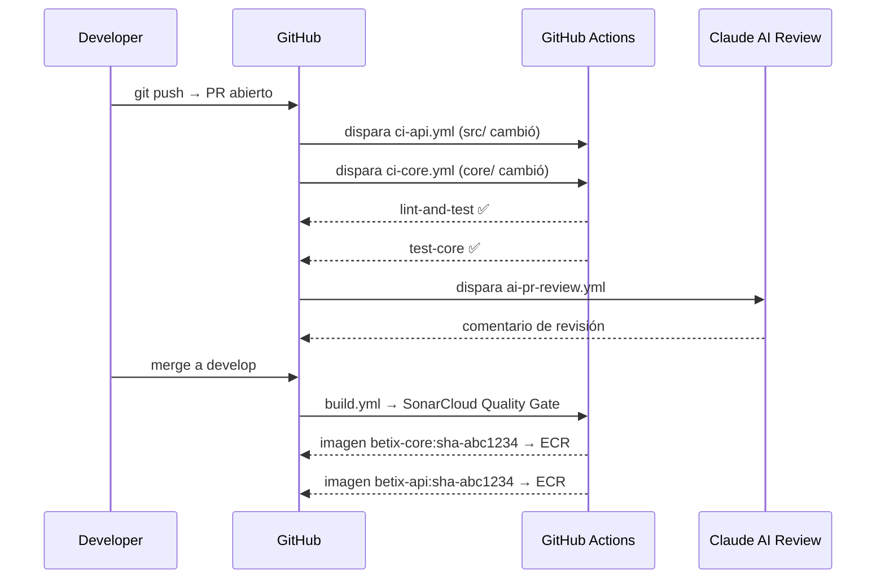
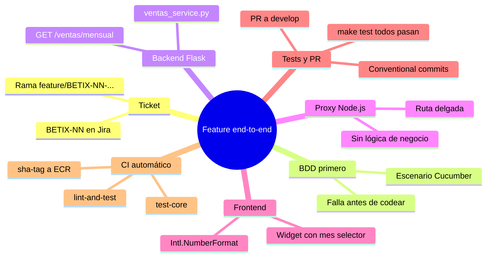

# Hands-on: construir un requisito de punta a punta

### Capítulo 9

← [Volver al temario](../TOC.md)

---

## Qué vas a construir — y por qué importa cómo lo construís

Este capítulo no introduce herramientas nuevas. Integra todo lo que aprendiste en los capítulos anteriores en un flujo real, de principio a fin.

El escenario:

> **User Story BETIX-\<NN\>:** *"Como analista de negocio, quiero ver el total de ingresos de un mes a elección en el dashboard de Betix, para tener una visión rápida del rendimiento mensual sin navegar a múltiples reportes."*

Al terminar, vas a haber:

- Creado un ticket ficticio en Jira y una rama con el naming correcto
- Escrito un escenario de aceptación (BDD/Cucumber) *antes* de escribir una línea de código
- Implementado el endpoint en Flask (`core/`) — donde vive toda la lógica de negocio
- Conectado el proxy Node.js (`src/`) — la capa de transporte
- Actualizado el dashboard en el frontend (`src/public/`)
- Pasado todos los tests con `make test`
- Abierto un PR a `develop` con commits convencionales que disparan el flujo automático de CI

```mermaid
flowchart LR
    TICKET["Ticket<br>BETIX-&lt;NN&gt;"] --> RAMA["Rama<br>feature/BETIX-&lt;NN&gt;-..."]
    RAMA --> BDD["Escenario<br>Cucumber"]
    BDD --> FLASK["Endpoint<br>Flask core/"]
    FLASK --> PROXY["Proxy<br>Node.js src/"]
    PROXY --> FRONT["Widget<br>Dashboard"]
    FRONT --> TEST["make test<br>✅ todos pasan"]
    TEST --> PR["PR a develop<br>conventional commits"]
    PR --> CI["CI corre<br>sha-abc1234 → ECR"]

    style TICKET fill:#e3f2fd,stroke:#1976D2
    style CI fill:#e8f5e9,stroke:#388E3C
```



> **Nota plataforma vs Betix:** este capítulo usa Betix como ejemplo concreto. En tu proyecto real, los archivos y rutas serán distintos, pero el flujo es el mismo: ticket → BDD → backend → proxy → frontend → test → PR.

---

## Paso 1 — Crear el ticket y la rama

### El ticket en Jira

Si tenés acceso al proyecto BETIX, creá el ticket. Si no, usá los valores del enunciado.

**Tipo:** Story
**Clave:** BETIX-\<NN\> (el siguiente número disponible en el proyecto)
**Título:** `Mostrar total de ingresos mensuales en dashboard`
**Descripción:** la user story del encabezado
**Acceptance Criteria:**
- Dado un mes válido (ej: `2026-03`) → el dashboard muestra el total de ingresos de ese mes
- El valor incluye todas las provincias y juegos
- Formato: número con dos decimales (ej: `1.234.567,89`)

### La rama

```bash
git checkout develop
git pull
git checkout -b feature/BETIX-<NN>-ventas-mes-dashboard
```

El nombre sigue el patrón obligatorio `<prefijo>/BETIX-XX-<descripción-corta>`. Si configuraste el hook local (`pre-bash.sh`), te bloqueará si el nombre no es válido. El workflow `validate-branch-name.yml` lo vuelve a validar en el PR.

---

## Paso 2 — Escribir el escenario de aceptación (BDD)

Antes de escribir una sola línea de código de producción, escribís el escenario en Gherkin. Esto no es formalismo: te obliga a pensar en el comportamiento esperado desde la perspectiva del usuario, no desde la implementación.

Creá el archivo `features/ventas_mensuales.feature`:

```gherkin
Feature: Total de ingresos mensuales en el dashboard

  Como analista de negocio
  Quiero ver el total de ingresos de un mes específico
  Para evaluar el rendimiento mensual sin navegar entre reportes

  Scenario: El endpoint retorna el total de ingresos para un mes con datos
    When hago GET a "/api/datos/ventas/mensual?mes=2025-03"
    Then el código de respuesta es 200
    And el campo "status" es "ok"
    And "data" tiene los campos "mes,total_ingresos,cantidad_tickets"

  Scenario: El total de ingresos es un número positivo
    When hago GET a "/api/datos/ventas/mensual?mes=2025-03"
    Then el campo "data.total_ingresos" es mayor a 0

  Scenario: Sin parámetro mes devuelve el mes actual
    When hago GET a "/api/datos/ventas/mensual"
    Then el código de respuesta es 200
    And el campo "status" es "ok"

  Scenario: Mes con formato inválido devuelve error 400
    When hago GET a "/api/datos/ventas/mensual?mes=fecha-invalida"
    Then el código de respuesta es 400
    And el campo "status" es "error"
```

Este escenario falla ahora porque el endpoint no existe. Eso es correcto — es el contrato que vamos a satisfacer.

**Commit:**
```bash
git add features/ventas_mensuales.feature
git commit -m "test(bdd): add acceptance scenarios for monthly sales endpoint"
```

---

## Paso 3 — Implementar el endpoint en Flask (`core/`)

Toda la lógica de negocio vive en `core/`. El [Principio 1](../../principios-fundamentales.md#las-fronteras-entre-componentes-son-contratos-estructurales-no-convenciones-voluntarias) lo expresa sin ambigüedad: *"Business logic lives in `core/` only. Never duplicate in Node.js."*

### El service

Creá `core/services/ventas_service.py`:

```python
from datetime import datetime
from ..db import get_connection


def get_total_ingresos_mes(mes: str) -> dict:
    """
    Retorna el total de ingresos y cantidad de tickets para un mes dado.

    Args:
        mes: string en formato 'YYYY-MM' (ej: '2026-03')

    Returns:
        dict con keys: mes, total_ingresos, cantidad_tickets

    Raises:
        ValueError: si el formato de mes es inválido
    """
    try:
        datetime.strptime(mes, "%Y-%m")
    except ValueError:
        raise ValueError(f"Formato de mes inválido: '{mes}'. Usar YYYY-MM")

    with get_connection() as conn:
        with conn.cursor() as cur:
            cur.execute("""
                SELECT
                    TO_CHAR(fecha, 'YYYY-MM')   AS mes,
                    SUM(ingresos)               AS total_ingresos,
                    SUM(cantidad)               AS cantidad_tickets
                FROM betix.tickets_mensuales
                WHERE TO_CHAR(fecha, 'YYYY-MM') = %s
                GROUP BY TO_CHAR(fecha, 'YYYY-MM')
            """, (mes,))
            row = cur.fetchone()

    if not row:
        return {
            "mes": mes,
            "total_ingresos": 0.0,
            "cantidad_tickets": 0,
        }

    return {
        "mes": row[0],
        "total_ingresos": float(row[1]),
        "cantidad_tickets": int(row[2]),
    }
```

### El endpoint en `core/main.py`

Agregá el import y el endpoint al final de los routes, antes del bloque `if __name__ == "__main__"`:

```python
from .services.ventas_service import get_total_ingresos_mes
```

```python
@app.get("/ventas/mensual")
def ventas_mensual():
    from datetime import datetime
    mes = request.args.get("mes") or datetime.utcnow().strftime("%Y-%m")
    try:
        data = get_total_ingresos_mes(mes)
        return jsonify({"status": "ok", "data": data})
    except ValueError as e:
        return jsonify({"status": "error", "message": str(e)}), 400
```

**Testeá manualmente que el core funciona:**
```bash
# Con docker-compose corriendo:
curl "http://localhost:5001/ventas/mensual?mes=2025-03"
# Esperado: {"status":"ok","data":{"mes":"2025-03","total_ingresos":...,"cantidad_tickets":...}}
```

**Commits:**
```bash
git add core/services/ventas_service.py
git commit -m "feat(core): add ventas_service with monthly income aggregation"

git add core/main.py
git commit -m "feat(core): expose GET /ventas/mensual endpoint"
```

---

## Paso 4 — Conectar el proxy Node.js (`src/`)

Node.js es un proxy delgado. Su única responsabilidad: recibir la request del frontend, reenviarla al core y devolver la respuesta. Sin lógica de negocio.

### La ruta

Creá `src/routes/ventasMensuales.js`:

```javascript
'use strict';

const express = require('express');
const fetch   = require('node-fetch');
const logger  = require('../logger');
const { CORE_URL } = require('../config');

const router = express.Router();

router.get('/ventas/mensual', async (req, res) => {
  try {
    const { mes } = req.query;
    const url = mes
      ? `${CORE_URL}/ventas/mensual?mes=${encodeURIComponent(mes)}`
      : `${CORE_URL}/ventas/mensual`;

    logger.info(`Proxy → core: GET ${url}`);
    const upstream = await fetch(url);
    const body = await upstream.json();

    res.status(upstream.status).json(body);
  } catch (err) {
    logger.error(`Error proxying /ventas/mensual: ${err.message}`);
    res.status(502).json({ status: 'error', message: 'Core service unavailable' });
  }
});

module.exports = router;
```

### Registrar la ruta en `src/app.js`

```javascript
const ventasMensualesRouter = require('./routes/ventasMensuales');
// ...
app.use('/api/datos', ventasMensualesRouter);
```

**Testeá que el proxy funciona:**
```bash
curl "http://localhost:3000/api/datos/ventas/mensual?mes=2025-03"
# Mismo resultado que antes, ahora pasando por Node.js
```

**Commit:**
```bash
git add src/routes/ventasMensuales.js src/app.js
git commit -m "feat(proxy): expose /api/datos/ventas/mensual forwarding to core"
```

---

## Paso 5 — Actualizar el widget en el dashboard (`src/public/`)

El frontend consume el endpoint del proxy y muestra el total en el dashboard. En Betix, el dashboard vive en `src/public/dashboard.html`.

Encontrá la sección del dashboard donde agregar el widget y añadí el siguiente bloque HTML + JS:

```html
<!-- Widget: total de ingresos mensuales -->
<div id="ventas-mensuales-widget" class="widget">
  <h3>Ingresos del mes</h3>
  <label for="mes-selector">Mes:</label>
  <input type="month" id="mes-selector" />
  <div id="ventas-total" class="widget-value">—</div>
  <div id="ventas-tickets" class="widget-sub">tickets vendidos: —</div>
</div>
```

```javascript
// En el bloque <script> del dashboard
(function initVentasWidget() {
  const input  = document.getElementById('mes-selector');
  const total  = document.getElementById('ventas-total');
  const tickets = document.getElementById('ventas-tickets');

  // Inicializar con el mes actual
  const hoy = new Date();
  const mesActual = `${hoy.getFullYear()}-${String(hoy.getMonth() + 1).padStart(2, '0')}`;
  input.value = mesActual;

  function cargarVentas(mes) {
    total.textContent = 'Cargando…';
    fetch(`/api/datos/ventas/mensual?mes=${mes}`)
      .then(r => r.json())
      .then(({ status, data }) => {
        if (status !== 'ok') { total.textContent = 'Error'; return; }
        total.textContent = new Intl.NumberFormat('es-AR', {
          style: 'currency',
          currency: 'ARS',
        }).format(data.total_ingresos);
        tickets.textContent = `tickets vendidos: ${data.cantidad_tickets.toLocaleString('es-AR')}`;
      })
      .catch(() => { total.textContent = 'Sin datos'; });
  }

  input.addEventListener('change', e => cargarVentas(e.target.value));
  cargarVentas(mesActual);
})();
```

**Commit:**
```bash
git add src/public/dashboard.html
git commit -m "feat(frontend): add monthly income widget to dashboard"
```

---

## Paso 6 — Validar con `make test` y preparar el PR

### Correr los tests completos

```bash
make test
```

Salida esperada (resumen):

```
pytest ...
27 passed ✅

Jest ...
41 tests passed ✅

Cucumber ...
33 scenarios (33 passed) ✅
```

Si algún test falla, arreglalo antes de continuar. Un PR con CI en rojo no puede mergearse — las branch protection rules lo bloquean.

### Verificar commits convencionales

```bash
git log --oneline feature/BETIX-<NN>-ventas-mes-dashboard
```

Deberías ver algo como:

```
a1b2c3d feat(frontend): add monthly income widget to dashboard
d4e5f6g feat(proxy): expose /api/datos/ventas/mensual forwarding to core
g7h8i9j feat(core): expose GET /ventas/mensual endpoint
j0k1l2m feat(core): add ventas_service with monthly income aggregation
n3o4p5q test(bdd): add acceptance scenarios for monthly sales endpoint
```

Cada `feat(...)` va a disparar un bump **MINOR** cuando se mergee a `main`. El prefijo entre paréntesis es el *alcance* — ayuda a entender qué capa cambió sin leer el diff.

### Abrir el PR

```bash
git push -u origin feature/BETIX-<NN>-ventas-mes-dashboard
gh pr create --title "feat(BETIX-<NN>): monthly income widget in dashboard" \
  --body "Closes BETIX-<NN>. Adds GET /ventas/mensual endpoint (core + proxy + frontend widget)." \
  --base develop
```

---

## Paso 7 — Observar el flujo automático de CI/CD

Una vez abierto el PR, la plataforma toma el control:



### Qué chequeás en el PR antes de mergear

| Check | Qué significa si falla |
|-------|----------------------|
| `lint-and-test` | ESLint, Jest o Cucumber fallaron — revisar output del job |
| `test-core` | pytest falló — revisar `core/tests/` |
| `SonarQube` | Cobertura bajó del umbral o hay issues críticos |
| Revisión de Claude | El agente `ai-pr-review.yml` dejó comentarios — revisarlos |

### Después del merge: los tags de ECR

El [CI](../glosario.md#cicd) de `develop` construye imágenes taggeadas con el [SHA](../glosario.md#sha-commit-hash) corto del commit:

```
betix-core:sha-a1b2c3d
betix-api:sha-a1b2c3d
```

Esto garantiza trazabilidad total: podés ir de cualquier imagen corriendo en producción hasta el commit exacto que la generó. Ver [Semver](../glosario.md#semver-semantic-versioning) y [Tag (Git)](../glosario.md#tag-git) en el glosario para el flujo de release a `main`.

---

## Retrospectiva: qué demostró este ejercicio

Repasá los [5 principios fundacionales](../../principios-fundamentales.md) y compará con lo que acabás de hacer:

| Principio | Cómo lo aplicaste |
|-----------|-------------------|
| **0. Todo el estado es código versionado** | El ticket define el requerimiento. El código, los tests y el feature file son el estado del sistema. No hay nada en Slack ni en un doc externo. |
| **1. Fronteras como contratos estructurales** | La lógica de negocio vive *solo* en `core/`. El proxy reenvía, el frontend presenta. Nadie invade la responsabilidad del otro. |
| **2. La plataforma se clona** | Cualquier miembro del equipo puede clonar el repo y correr `make test` para reproducir exactamente el mismo resultado. |
| **3. Calidad automatizada, sin bypass** | Los tests pasan o el PR no mergea. No hay forma de saltear el CI. El hook local te avisa antes del push. |
| **4. Una sola fuente de verdad** | `db/seeds/_tickets_mensuales.csv` es la única fuente de datos para Jest, Cucumber y pytest. No hay datos hardcodeados en los tests. |

---

## Resumen



---

## Recursos del repositorio

| Recurso | Descripción |
|---------|-------------|
| [`core/main.py`](../../../core/main.py) | Donde agregar nuevos endpoints Flask |
| [`core/services/`](../../../core/services/) | Donde agregar lógica de negocio |
| [`src/routes/`](../../../src/routes/) | Donde agregar rutas proxy en Node.js |
| [`src/public/dashboard.html`](../../../src/public/dashboard.html) | Dashboard principal del frontend |
| [`features/`](../../../features/) | Escenarios Cucumber/BDD |
| [`db/seeds/`](../../../db/seeds/) | Fuente canónica de datos de test |
| [`docs/principios-fundamentales.md`](../../principios-fundamentales.md) | Los 5 principios que guían cada decisión |
| [`docs/claude-en-betix.md`](../../claude-en-betix.md) | Sub-agentes disponibles y cómo delegarles partes del trabajo en un ejercicio end-to-end |
| [`docs/caching.md`](../../caching.md) | Estrategia de caché — relevante si el nuevo endpoint necesita cache |
| [`docs/database.md`](../../database.md) | Schema y seeds — fuente de verdad de los datos que consultará el nuevo endpoint |
| [`.claude/skills/add-endpoint.md`](../../../.claude/skills/add-endpoint.md) | Playbook reutilizable para agregar un endpoint completo |

---

← [Capítulo 8](8.md) | [Capítulo 10](10.md) →
